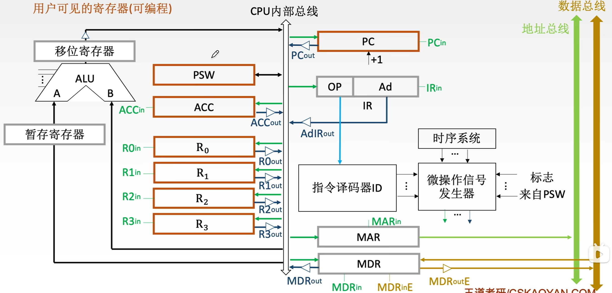
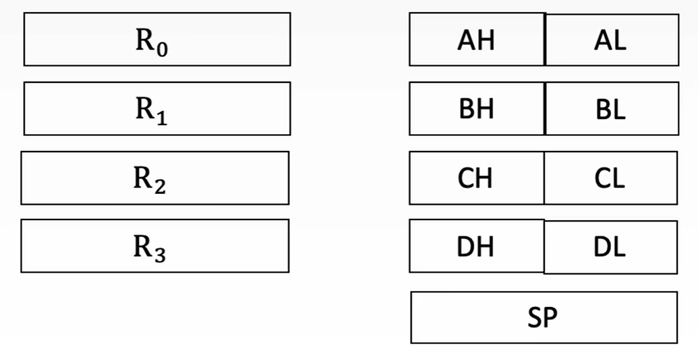
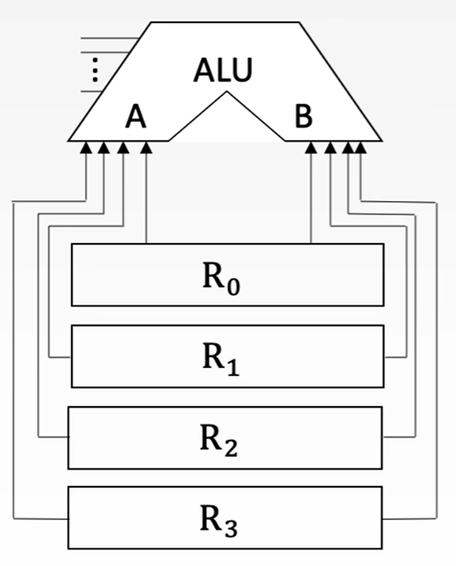
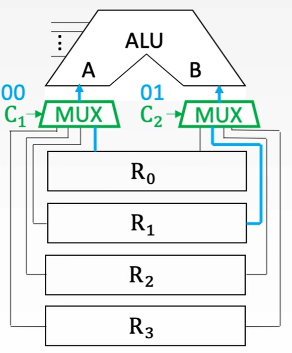
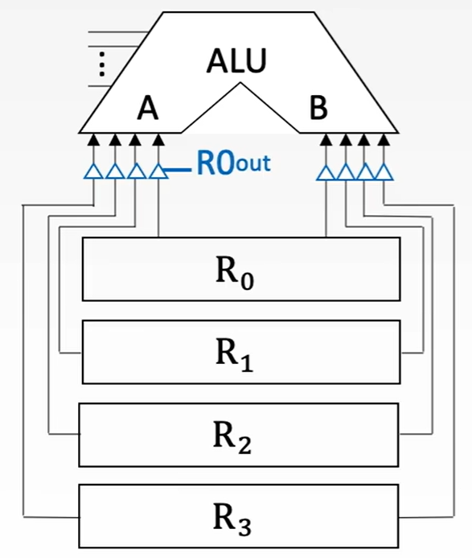
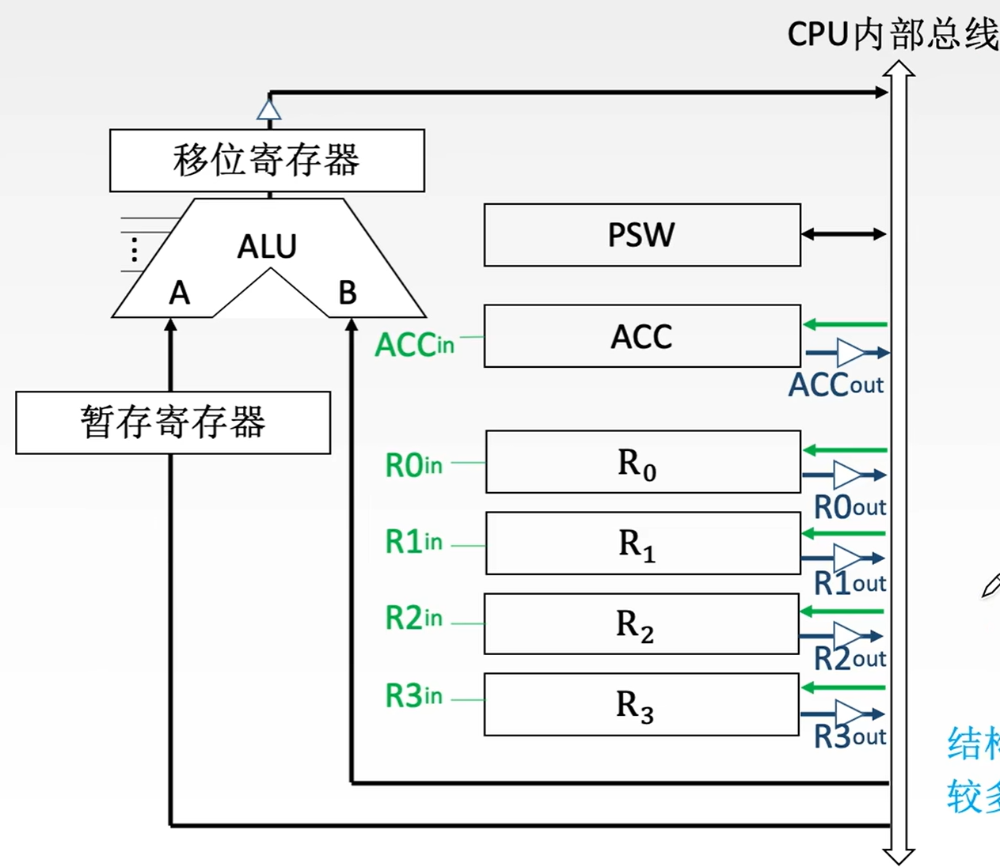
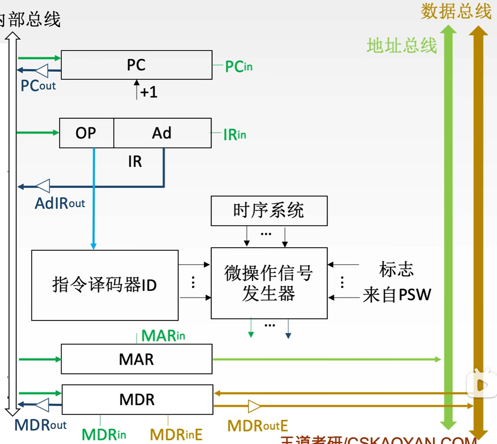

$$CPU 的功能和基本结构$$

# 一、CPU 的功能

CPU 的具体功能包括：

1. **指令控制**：完成取指令（取指）、分析指令、执行指令的操作，即程序的顺序控制。

2. **操作控制**：一条指令的功能往往是由若干操作信号的组合来实现。CPU 管理并产生，由内存取出的每条指令所需的操作信号，把各种操作信号送往相应的部件，从而控制这些部件按指令的要求正确执行。

3. **时间控制**：严格控制各种操作信号的出现时间、持续时间及出现的时间顺序。

4. **数据加工**：对数据进行算术和逻辑运算。

5. **中断处理**：对计算机运行过程中出现的异常情况和中断请求进行处理。

# 二、CPU 的基本结构

**中央处理器（CPU）** 由 **运算器** 和 **控制器** 组成。
- **控制器** 负责协调并控制计算机各部件执行程序的指令序列。
  - 基本功能包括取指令、分析指令、执行指令。
  - **取指令**：自动形成指令地址；自动发出取指令的命令。
  - **分析指令**：操作码译码（分析本条指令要完成什么操作）；产生操作数的有效地址。
  - **执行指令**：根据分析指令得到的 “操作命令” 和 “操作数地址”，形成操作信号控制序列，控制运算器、存储器、I/O 设备完成相应的操作。
  - **中断处理**：管理总线及输入输出；处理异常情况和特殊情况。

- **运算器** 负责对 **数据** 进行 **加工**。

{width=700}

- CPU 中的寄存器按汇编语言（机器语言）程序是否可访问，分为 **用户可见寄存器**、**用户不可见寄存器**。

## （一）运算器的基本结构

1. **算术逻辑单元（ALU）**：进行算术/逻辑运算。

2. **通用寄存器组（GPRs）**：用于存放操作数（包括源操作数、目的操作数、中间结果）和各种地址信息等。
   - SP 是堆栈寄存器，保存堆栈指针，指示栈顶的地址。
    

    {width=400}
    

- 数据通路设计方式：
  - **专用数据通路方式**：根据指令执行过程中的数据和地址的流动方向安排连接线路。
    

    {width=300}
    

    - 问题：如果直接用导线连接，相当于多个寄存器同时且一直向 ALU 传输数据。
      - 解决方法 1：使用多路选择器，根据控制信号选择一路输出。
        

        {width=300}
        

      - 解决方法 2：使用三态门，控制每一路是否输出。
        - R0out 为 1 时，$R_0$ 中的数据输出到 A 端。
        - R0out 为 0 时，$R_0$ 中的数据无法输出到 B 端。
        

        {width=300}
        

    - **优点**：性能较高，基本不存在数据冲突现象。
    - **缺点**：结构复杂，硬件量大，不易实现。
  - **CPU 内部单总线方式**：将所有寄存器的输入端和输出端都连接到一条公共的通路上。
    

    {width=500}
    

    1. **暂存寄存器**：用于暂存从数据总线或通用寄存器送来的数据，这个数据不能存放在通用寄存器中，否则会破坏其原有内容。
       - 如果两个操作数分别来自主存和 $R_0$，最后结果存回 $R_0$，那么从主存中取来的操作数直接放入暂存器，就不会破坏运算前 $R_0$ 的内容。
       - 对应用程序员透明。
    2. **累加寄存器（ACC）**：是一个通用寄存器，用于暂时保存 ALU 运算的结果信息，用于实现加法运算。
    3. **程序状态字寄存器（PSW，标志寄存器）**：保留由算术逻辑运算指令或测试指令的结果而建立的各种状态信息。
    4. **移位寄存器（SR）**：可以存放操作数，还可以对运算结果进行移位运算。
    5. **计数器（CT）**：控制乘除运算的操作步数。
    - **优点**：结构简单，容易实现。
    - **缺点**：数据传输存在较多的冲突的现象，性能较低。

## （二）控制器的基本结构

{width=500}

1. **程序计数器（PC）**：用于指出下一条指令在主存中的存放地址。
   - CPU 根据 PC 的内容区主存中取指令。
   - 程序中指令（通常）是顺序执行的，所以 PC 有自增功能。
   - 若 PC 与主存储器均按字节编址，则 PC 的位数等于主存储器地址位数。

2. **指令寄存器（IR）**：用于保存当前正在执行的那条指令。
   - IR 的位数等于指令字长。

3. **指令译码器（ID）**：仅对于操作码字段进行译码，向控制器提供特定的操作信号。

4. **微操作信号发生器**：根据 IR 的内容（指令）、PSW 的内容（状态信息）及时序信号，产生控制整个计算机系统所需的各种控制信号。
   - 其结构有组合逻辑型和存储逻辑型两种。

5. **时序系统**：用于产生各种时序信号，它们都是由统一时钟（CLOCK）分频得到。

6. **存储器地址寄存器（MAR）**：用于存放所以访问的主存单元的地址。

7. **存储器数据寄存器（MDR）**：用于存放向主存写入的信息或从主存中读出的信息。