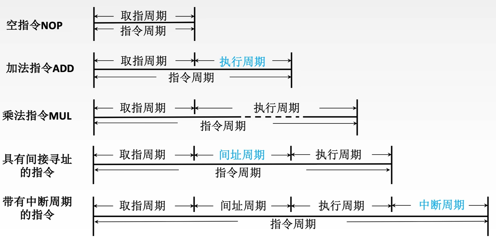

$$指令执行过程$$

# 一、指令周期

**指令周期**：CPU 从主存中每 **取出** 并 **执行** 一条指令所需的 **全部时间**。

- **取指周期（取指阶段）**：完成 **取指令** 和 **分析指令**。

- **执行周期（执行阶段）**：完成 **执行指令** 的操作。

{width=300}

- 指令周期常常用若干 **机器周期（CPU 周期）** 来表示。

- 一个机器周期又包含若干 **时钟周期（节拍、T 周期、CPU 时钟周期）**。
  - **时钟周期** 是 CPU 操作的 **最基本单位**。

{width=500}

**注意**：每个 **指令周期** 内 **机器周期数** **可以不等**，每个 **机器周期内** 的 **节拍数** 也 **可以不等**。

{width=600}

# 二、指令周期流程

- 把一系列机器周期细化为：**取指周期**、**间址周期**、**执行周期**、**中断周期**。

- 四个 **标志触发器** 可以 **标志当前指令的执行处于哪个阶段**。

{width=700}

# 三、指令周期的数据流

**数据流**：根据指令要求 **依次访问** 的 **数据序列**。

## （一）取指周期

1. 当前指令地址送至存储器。即，**$(PC) \rightarrow MAR \rightarrow 地址总线 \rightarrow 存储器$**。

2. CU 发出控制信号，经控制总线传到主存。即，**$1（假设读信号为 1） \rightarrow 控制总线 \rightarrow 存储器$**。

3. 将 MAR 所指主存中的内容经数据总线送入 MDR。即，**$M(MAR) \rightarrow 数据总线 \rightarrow MDR$**。

4. 将 MDR 中的内容（此时是指令）送入指令寄存器 IR。即，**$(MDR) \rightarrow IR$**。

5. CU 发出控制信号，形成下一条指令地址。即，**$(PC) + 1 \rightarrow PC$**。

{width=600}

## （二）间址周期

1. 将指令的地址码送入 MAR，即，**$Ad(IR) \rightarrow MAR \rightarrow 地址总线 \rightarrow 主存储器$** 或 **$Ad(MDR) \rightarrow MAR \rightarrow 地址总线 \rightarrow 主存储器$**。
   - **$Ad（IR）$** 表示取出 IR 中存放的指令字的 **地址字段**。
   - IR 中的指令是由 MDR 送入的，所以 MDR 中也有指令字。

2. CU 发出控制信号，启动主存做读操作。即，**$1 \rightarrow 控制总线 \rightarrow 主存储器$**。

3. 将 MAR 所指主存中的内容经数据总线送入 MDR。即，**$M(MAR) \rightarrow 数据总线 \rightarrow MDR$**。

- 还可以多一步：将有效地址送至指令的地址码字段。即，**$(MDR) \rightarrow Ad(IR)$**。

{width=600}

## （三）执行周期

- 执行周期的任务是根据 IR 中的指令字的操作码和操作数通过 ALU 操作产生执行结果。

- **不同指令的执行周期操作不同**，因此 **没有统一的数据流向**。

## （四）中断周期

**中断**：暂停当前任务去完成其他任务。

- 为了 **能够恢复当前任务**，需要 **保存断点**。
- 一般使用 **堆栈** 来 **保存断点**。用 **SP** 表示 **栈顶地址**，假设 **SP 指向栈顶元素**，进栈操作是 **先修改指针，后存入数据**。

1. CU 控制将 SP 减 1，指向新栈顶，将修改后的地址送入 MAR。即，**$(SP) - 1 \rightarrow SP$**，**$(SP) \rightarrow MAR \rightarrow 地址总线 \rightarrow 主存储器$**。

2. CU 发出控制信号，启动主存做写操作。即，**$0 \rightarrow 控制总线 \rightarrow 主存储器$**。

3. 将断点（PC 内容）送入主存储器。即，**$(PC) \rightarrow MDR \rightarrow 数据总线 \rightarrow 主存储器$**。

4. CU 控制将中断服务程序的入口地址（由向量地址形成部件产生）送入 PC。即，**$CU(中断服务程序的入口地址) \rightarrow PC$**。

{width=600}

# 四、指令执行方案

一个指令周期通常要包括几个执行步骤，每个步骤完成指令的一部分功能，几个依次执行的步骤完成这条指令的全部功能。

- 不同处理器采用不同的方案来安排指令的执行步骤。

## （一）单周期处理器

**单周期处理器** 对所有指令都选用 **相同的执行时间** 来完成。
- 每条指令都在 **一个时钟周期内完成**（CPI = 1）。
- 指令之间 **串行执行**。即，下一条指令只能在前一条指令执行结束后才能启动。
- **指令周期** 取决于 **执行时间最长** 的指令的执行时间。
  - 对于本可以在更短时间内完成的指令，要使用这个较长的周期来完成，会降低整个系统的运行速度。

## （二）多周期处理器

**多周期处理器** 对不同类型的指令选用 **不同的执行步骤** 来完成。

- 指令 **需要几个周期** 就为其 **分配几个周期**。
- 指令之间 **串行执行**。
- 需要更复杂的硬件设计。

## （三）流水线处理器

**流水线处理器** 采用 **指令之间并行执行** 的方案。

- 在 **每一个时钟周期启动一条指令**，尽量让多条指令同时运行，但各自处在不同的执行步骤中。

- 指令之间 **并行执行**。