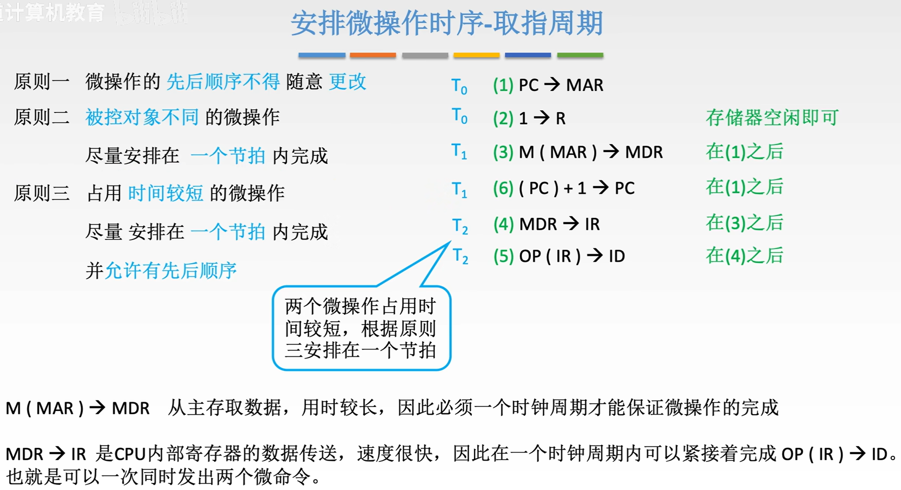
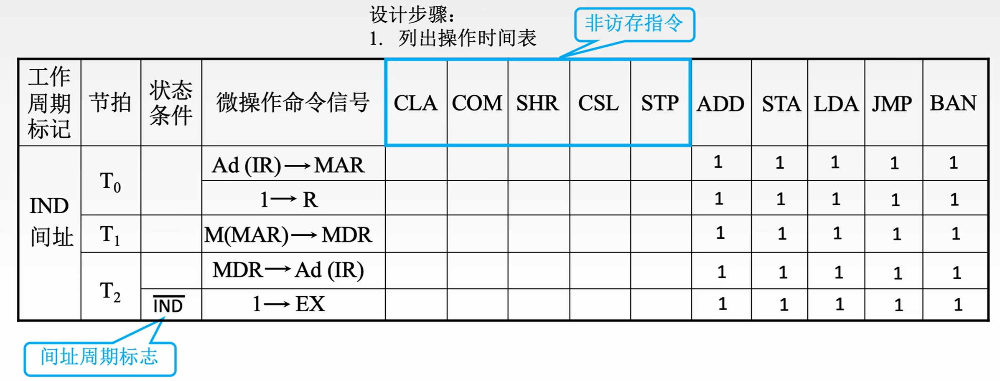

$$控制器的功能和工作原理$$

根据控制器产生微操作控制信号的方式不同，控制器可分为 **硬布线控制器** 和 **微程序控制器**。

# 一、控制器的功能

1. 从主存中取出一条指令，并指出下一条指令在主存中的位置。

2. 对指令进行译码或测试，产生相应的操作控制信号，以便启动规定的动作。

3. 指挥并控制 CPU、主存、输入设备和输出设备之间的数据流动方向。

# 二、硬布线控制器

**硬布线控制器（组合逻辑控制器）**：由复杂的组合逻辑门电路和触发器构成。

- 根据 **指令操作码**、**目前的机器周期**、**节拍信号**、**机器状态条件**，即可确定现在这个节拍下 **应该发出哪些“微命令”**。

- 所有指令的取指周期的 $T_0$ 节拍下一定要完成 $(PC) \rightarrow MAR$，即 $C_1 = FE · T_0$

## （一）硬布线控制器的框架

{width=700}

## （二）硬布线控制器的设计

1. **分析每个阶段的微操作序列**（取指 FE、间址 IND、执行 EX、中断 INT 四个周期）。
   - **确定** 哪些 **指令** 在什么阶段、在什么条件下会使用到的 **微操作**。

2. **选择 CPU 的控制方式**。
   - 采用定长机器周期还是不定长机器周期。
   - 每个机器周期安排几个节拍。

3. **安排微操作时序**。
   - 如何在规定节拍数内完成整个机器周期内的所有微操作。
   - **原则**：
     - 微操作的 **先后顺序不得** 随意 **更改**。
     - **被控对象不同** 的微操作尽量安排在 **一个节拍** 内完成。
     - 占用 **时间较短** 的微操作尽量安排在 **一个节拍** 内完成，并 **允许有先后顺序**。

4. **电路设计**。
   - 确定每个微操作命令的逻辑表达式，并用电路实现。
   - **步骤**：
     - **列出时间表**
       - 取出在取指、间址、执行、中断周期，$T_0、T_1、T_2$ 节拍内有可能用到的所有微操作。
     - **写出微操作命令的最简表达式**。
     - **画出逻辑图**。

**例子**：

1. 分析每个阶段的微操作序列

{width=700}

2. 选择 CPU 的控制方式：采用同步控制方式（定长机器周期），一个机器周期内安排 3 个节拍。

3. 安排微操作时序
   - 取指周期
        

        {width=700}
        

   - 间址周期
        

        {width=300}
        

   - 执行周期
        

        {width=700}
        

4. 电路设计
   1. 列出操作时间表
      - 取指 FE 阶段
        

        {width=700}
        

      - 间址 IND 阶段
        

        {width=700}
        

      - 执行 EX 阶段
        

        {width=700}
        

   2. 写出微操作命令的时间表达式
        

        {width=700}
        

   3. 画出逻辑图
        

        {width=700}
        

## （三）硬布线控制器的特点

- **优点**：
  - 由于使用纯硬件实现控制，因此执行速度很快。微操作信号由组合逻辑电路即时产生。

- **缺点**：
  - 指令越多，设计和实现就越复杂，因此一般用于 RISC（精简指令集系统）。
  - 如果扩充一条新的指令，则控制器的设计就需要大改，因此扩充指令较困难。

# 三、微程序控制器

## （一）微程序控制器的设计思路

**设计思路**：采用“存储程序”的思想，CPU 出厂前将所有指令的“微程序”存入“控制器存储器”中。

**微程序**：由微指令序列组成，**每一种指令对应一个微程序**。

- **指令** 是对程序执行步骤的描述。
  - 指令是对微指令功能的封装。
- **微指令**：是对指令执行步骤的描述。
  - 微指令中可能包含 **多个微操作（微命令）**。

- **微周期（微指令周期）**：从控制器存储器取出一条微指令并执行相应微操作所需的时间。

{width=700}

## （二）微程序控制器的基本结构

- **微地址形成部件**：通过指令操作码形成对应微程序的第一条微指令的存放地址。
  - **微地址**：微指令在 CM 中存放的位置。

- **顺序逻辑**：根据某些机器标志和时序信息确定下一条微指令的存放地址。

- **CMAR（$\mu$PC）**：指明接下来要执行的微指令的存放地址。

- **地址译码器**：将 CMAR 内的地址信息译码为电信号，控制 CM 读出微指令。

- **控制存储器（CM）**：存放所有机器指令对应的微程序（微指令序列）。
  - 用 ROM 实现，通常在 CPU 出厂时就把所有微程序写入。
  - 按地址寻访。

- **CMDR（$\mu$IR）**：微指令寄存器，用于存放当前要执行的微指令。
  - $CM(\mu PC) \rightarrow \mu IR$

{width=700}

## （三）微程序控制器的工作原理

{width=700}

- 指令周期 = 取指周期 $\rightarrow$ 间址周期 $\rightarrow$ 执行周期 $\rightarrow$ 中断周期
  - 间址周期、中断周期根据情况可有可无。

- 所有指令的取指周期、间址周期、中断周期所对应的微指令序列都一样，可以共享使用。

- **取指周期微程序** 通常是 **公用的**。
  - 所以 **如果某指令系统中有 n 条机器指令，则 CM 中微程序的个数至少是 n + 1 个**。
  - 一些早期的 CPU 、物联网设备的 CPU 可以不提供间接寻址和中断功能，所以这类 CPU 可以不包含间址周期、中断周期的微程序段。

**注意**：**一条指令对应一个微程序**。

## （四）微指令的设计

- 微命令与微操作一一对应，一个微命令对应一根输出线。

- 有的微命令可以并行执行，因此一条微指令可以包含多个微命令。

- **相容性微命令**：可以并行完成的微命令。

- **互斥性微命令**：不允许并行完成的微命令。

### 1. 微指令的格式

1. **水平型微指令**：一条微指令能定义 **多个** 可并行的微命令。
   - 基本格式
        

        {width=300}
        

   - **优点**：**微程序短，执行速度快**。
   - **缺点**：**微指令长，编写微程序较麻烦**。

2. **垂直型微指令**：一条微指令只能定义 **一个** 微命令，由微操作码字段规定具体功能。
   - 基本格式
        

        {width=400}
        

   - **优点**：**微指令短、简单、规整，便于编写微程序**。
   - **缺点**：**微程序长，执行速度慢，工作效率低**。

3. **混合型微指令**：在垂直型的基础上增加一些不太复杂的并行操作。
   - 微指令较短，仍便于编写。
   - 微程序也不长，执行速度加快。

### 2. 微指令的编码方式（控制方式）

**微指令的编码方式（控制方式）** 指如何对微指令的控制字段进行编码，以形成控制信号。

- 编码的目标是在保证速度的情况下，尽量缩短微指令字长。

编码方式主要有：**直接编码（直接控制）方式**、**字段直接编码方式**、**字段间接编码方式**。

1. **直接编码（直接控制）方式**：在微指令的操作控制字段中，**每一位代表一个微操作命令**。
   - 某位为 **1** 表示该控制信号有效。
   - **优点**：简单、直观，执行速度快，操作并行性好。
   - **缺点**：微指令字长过长，n 个微命令就要求微命令的控制字段有 n 位，造成空存容量极大。
    

    {width=400}
    

2. **字段直接编码方式**：将微指令的控制字段分成若干“段”，**每段经译码后发出控制信号**。
   - 微命令字段分段的 **原则**：
     - **互斥性** 微命令分在 **统一段内**，**相容性** 微命令分在 **不同段内**。
     - **每个小段** 中包含的 **信息位不能太多**，否则将增加译码路线的复杂性和译码时间。
     - 一般 **每个小段还要留出一个状态**，表示本字段不发出任何微命令。
       - **通常用全 0 表示不操作**。
   - **优点**：可以缩短微指令字长。
   - **缺点**；要通过译码电路后再发出微命令，因此比直接编码方式慢。
    

    {width=400}
    

3. **字段间接编码方式（隐式编码）**：一个字段的某些微命令需由另一个字段中的某些微命令来解释。
   - **优点**：可进一步缩短微指令字长。
   - **缺点**：削弱了微指令的并行控制能力。所以通常作为字段直接编码方式的一种辅助手段。

### 3. 微指令的地址形成方式

1. 微指令的 **下地址字段** 指出。（**断定方式**）
   - 微指令格式中设置一个下地址字段，由微指令的下地址字段直接指出后继微指令的地址。

2. 根据机器指令的 **操作码** 形成。
   - 当机器指令取至指令寄存器后，微指令的地址由操作码经微地址形成部件形成。

3. 增量 **计数器法**。
   - $(CMAR) + 1 \rightarrow CMAR$

4. 分支转移
   - 转移方式：指明判别条件。
   - 转移地址：指明转移成功后的去向。
    

    {width=400}
    

5. 通过测试网络
   - 类似与顺序逻辑（借助标志位）。

6. 由硬件产生微程序入口地址
   - **第一条微指令地址**：由专门 **硬件** 产生。（用专门的硬件记录取指周期微程序首地址）
   - 中断周期：由 **硬件** 产生 **中断周期微程序首地址**（用专门的硬件记录）

## （五）微程序设计的分类

1. **静态微程序设计**：微程序无需改变。采用 ROM。

2. **动态微程序设计**：通过改变微指令和微程序改变机器指令。有利于仿真，采用 EPROM。

3. **毫微程序设计**：用毫微程序解释微程序。

# 四、硬布线与微程序的比较

{width=700}

