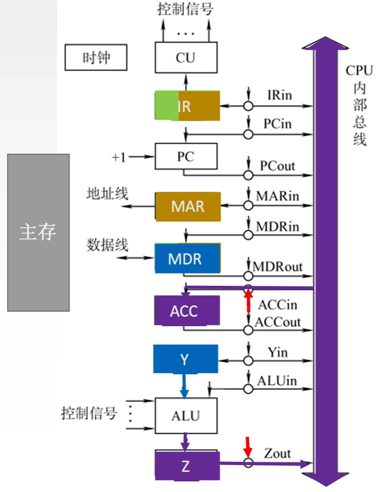
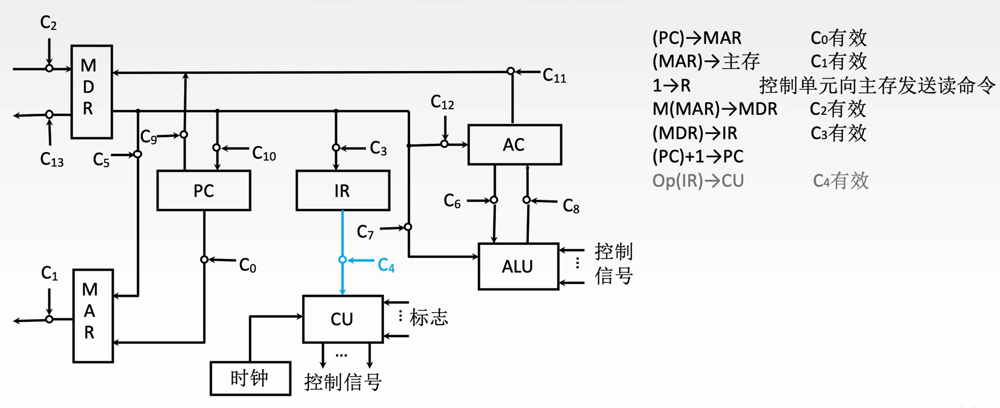

$$数据通路的功能和基本结构$$

**数据通路**：数据在指令执行过程中所经过的路径，包括路径上的部件。

- 数据通路由 **控制部件** 控制，控制部件根据每条指令功能的不同，生成对数据通路的控制信号。

# 一、数据通路的功能

数据通路描述了 **信息从哪里开始，中间经过哪些部件，最后被传送到哪里**。

# 二、数据通路的基本结构

数据通路的基本结构主要有：**CPU 内部单总线方式**、**CPU 内部多总线方式**、**专用数据通路方式**。

## （一）CPU 内部单总线方式

**单总线结构的数据通路** 将 ALU 及所有寄存器都连接到一条内部总线上。

- **内部总线**：同一部件，如 CPU 内部连接各寄存器及运算部件之间的总线。

- **系统总线**：同一台计算机系统的各部件，如 CPU、内存、通道和各类 I/O 接口间相互连接的总线。

{width=400}

- ALU 需要配合暂存器使用。

1. **寄存器之间的数据传送**
例如把 PC 内容送至 MAR，实现传送操作的流程及控制信号为：
   - **$(PC) \rightarrow Bus$**  （PCout 有效，PC 内容送总线）
   - **$Bus \rightarrow MAR$**  （MARin 有效，总线内容送 MAR）

2. **主存与 CPU 之间的数据传送**
例如 CPU 从主存读取指令，实现传送操作的流程及控制信号为：
   - **$(PC) \rightarrow Bus \rightarrow MAR$** （PCout 和 MARin 有效，现行指令地址 $\rightarrow$ MAR）
   - **$1 \rightarrow R$** （CU 通过控制总线发出读命令）
   - **$MEM(MAR) \rightarrow MDR$** （MDRin 有效）
   - **$MDR \rightarrow Bus \rightarrow IR$** （MDRout 和 IRin 有效，现行指令 \rightarrow IR）

3. **执行算术或逻辑运算**
例如一条加法指令，微操作序列及控制信号为：
   - **$Ad(IR) \rightarrow Bus \rightarrow MAR$** （MDRout 和 MARin 有效）
   - **$1 \rightarrow R$** （CU 发读命令）
   - **$MEM(MAR) \rightarrow 数据线 \rightarrow MDR$** （MDRin 有效）
   - **$MDR \rightarrow Bus \rightarrow Y$** （MDRout 和 Yin 有效，操作数 $\rightarrow$ Y）
   - **$(ACC) + (Y) \rightarrow Z$** （ACCout 和 ALUin 有效，CU 向 ALU 发送加命令）
   - **$Z \rightarrow ACC$** （Zout 和 ACCin 有效，结果 $\rightarrow$ ACC）

- **优点**：结构比较简单。

- **缺点**：输出传输存在较多的冲突现象，性能较低。

**注意**：**单周期处理器（CPI = 1）不能采用单总线方式**。因为单总线将所有寄存器都连接到一条各个总线上，一个时钟周期只允许一次操作，无法完成一条指令的所有操作。

## （二）CPU 内部多总线方式

**双总线结构（多总线结构）**：CPU 内部有两条或更多的总线。

- 将所有寄存器的输入端和输出端都连接到多条公共通路上。

- **优点**：能够同时在多个总线上传送不同的数据，提高效率。

## （三）专用数据通路方式

**专用数据通路** 根据指令执行过程中的数据和地址的流动方向安排连接电路。

- **优点**：性能较高，避免使用共享的总线。

- **缺点**：硬件量大。

- **取指周期**
    

    {width=700}
    
