$$主存储器$$

**主存储器（Main Memory，MM，内存储器/主存）** 是 CPU 能够直接访问的存储器。

- 主存储器的 **工作方式** 是按存储单元的地址进行存取，这种存取方式称为 **按地址存取方式**。

# 一、主存储器的基本组成

1. **存储体（存储矩阵、存储阵列）**：由许多存储单元组成，用来存放二进制信息。
   - 是存储器的 **核心部件**。
   - 每个 **存储单元** 包含若干个存储元件。
   - 每个 **存储元件（存储元）** 可以存储一位二进制代码“0”或“1”。
   - **存储字（word）**：存储单元存储的一串二进制代码。
   - **存储字长**：存储单元存储的这串二进制代码的位数。
   - 存储字长可以是 1B（8 bit）或是字节的偶数倍。
   - 数据在存储体内按地址存储。

2. **存储器地址寄存器（MAR）**：存放访存地址。经过地址译码后找到所选的存储单元。
   - MAR 用于寻址，其位数反映最多可寻址的存储单元的个数。
   - **MAR 的长度与 PC 的长度相等**。

3. **存储器数据寄存器（MDR）**：暂存要从存储器中读或写的信息。
   - **MDR 的位数通常等于存储字长**。一般为字节的 2 次幂的整数倍。

4. **时序控制逻辑**：用于产生存储器操作所需的各种时序信号。

**注意**：MAR 与 MDR 虽然是存储器的一部分，但在现代计算机中 MAR 与 MDR 存在于 CPU 中。

{width="300"}

# 二、主存储器的核心部件

**主存储器** 的 **核心部件** 是由一个个存储 0 或 1 的 **存储元件** 构成的 **存储单元** 构成的 **存储体（存储矩阵/存储阵列）**。

## （一）基本的元件及其原理

**存储元件（存储元）** 主要是由 **MOS 管** 和 **栅级电容** 组成。

1. **MOS 管** 是一个半导体元件，作为通电“开关”。
   - 输入电压达到某个阈值时，MOS 管就可以接通。

2. **栅级电容**：存储电荷。即，存储二进制 0/1。

- 如果接通电路，给电容接上高电平电压，即可给电容充电，在其中保存一定的电荷，即为 **二进制 1**。
- 如果接通电路，给电容接上低电平电压，由于电压差小，所以电容不会充电，不会保存电荷。即为 **二进制 0**。

- **读取**：给 MOS 管输入阈值电压，使电路接通，电容里的电荷即可随导线移动，可在另一端检测到电荷，即读出了 二进制 1。若未检测到则读出的是 0。
  - 是 **破坏性读出**，电容放电后信息被破坏。
  - 读出后应有 **重写（再生）** 操作。

- **写入**：在输入端接上高电平电压，再给 MOS 管输入阈值电压，接通电路，即可给电容充电，最后让 MOS 管断开，电荷保留其中，即写入了二进制 1。

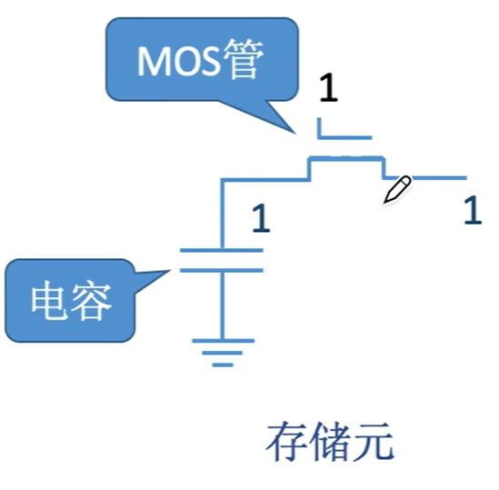{width=300px}

## （二）存储器芯片的结构

1. **存储体**

   

   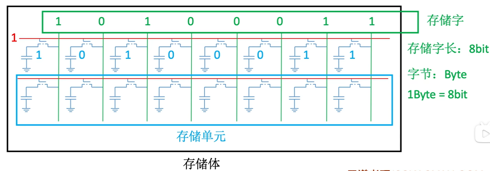{width=600}
   

2. **存储器芯片**
存储器芯片由 **存储体**、**I/O 写电路**、**地址译码器**、**控制电路** 等部分组成。

   

   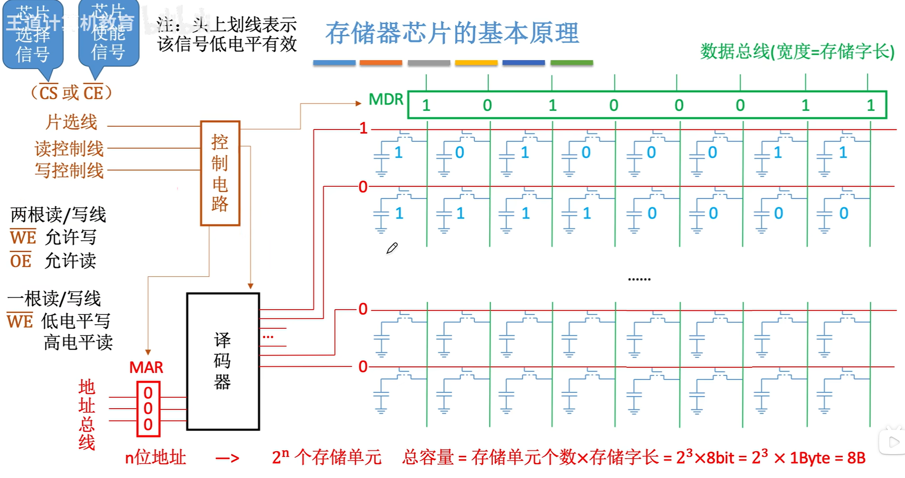{width=700}
   

   - **译码驱动电路**：译码器将地址信号转化为字选通线的高低电平。
   - **存储矩阵（存储体）**：由多个存储单元构成，每个存储单元又由多个存储元构成。
   - **读写电路**：每次读/写一个存储字。
   - **地址线、数据线、片选线、读写控制线（可能分开两根，也可能只有一根）**

   - 封装
      

      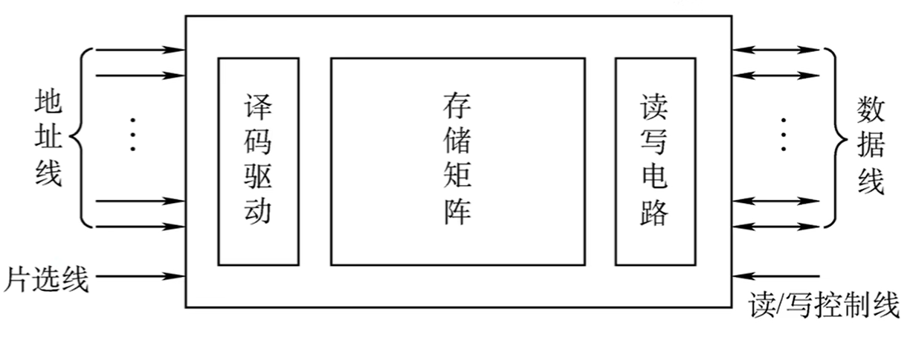{width=700}
      

    - **存储器芯片总容量 = 存储单元个数 $\times$ 存储字长**
    - **n 位地址** 即有 **$2^n$ 个存储单元**。

- **主存的存储器芯片是 DRAM 芯片**，使用 **栅级电容** 存储信息。

- 一块内存条可能有多块存储芯片。

- 现代计算机通常 **按字节编址**，即每个字节对应一个地址。
  - 可以 **按字节寻址**、**按字寻址**、**按半字寻址**、**按双字寻址**。

# 三、主存储器与 CPU 的连接

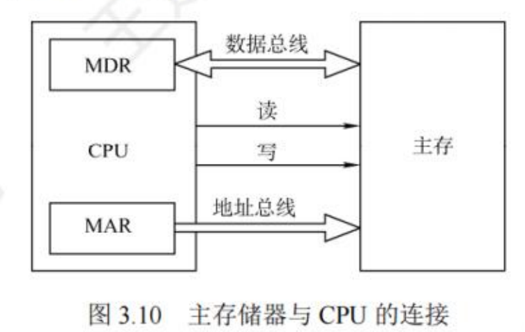{width=400}

- CPU 中的 **MDR** 通过 **数据总线** 与 **主存** 进行 **数据交换**。

- CPU 中的 **MAR** 通过 **地址总线** 把 **地址数据** 送给 **主存**。

- CPU 通过 **控制总线** 向主存发出读/写控制信息。

- 主存中会采用 **存储器芯片扩展技术**，将多个芯片集成在一个内存条上，然后由多个内存条及主板上的 ROM 芯片组成计算机所需的主存空间，再通过总线与 CPU 相连。

**注意**：现代计算机的 MAR、MDR 通常集成在 CPU 内部。存储芯片内只需要一个普通的寄存器（暂存输入、输出数据）。

## （一）单块存储芯片与 CPU 的连接

### 1. 单块存储芯片

{width=700}

### 2. 一块存储芯片与 CPU 的连接

一块 8K 1位的存储芯片与 CPU 的连接：

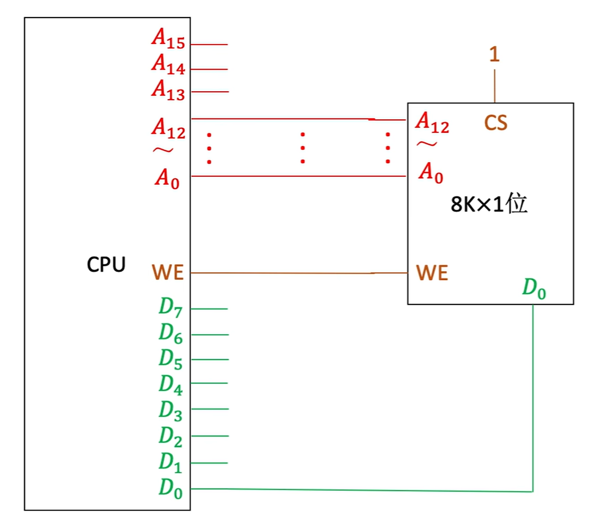{width=400}

## （二）多块存储芯片与 CPU 的连接

单个存储芯片的容量有限，需要在字和位两方面进行扩充才能满足实际存储器的容量要求。即进行 **位扩展法**、**字扩展法**、**字位同时扩展法**。

### 1. 位扩展法（增加主存的存储字长）

**位扩展** 是对字长进行扩展（增加存储字长）。

- 当 CPU 的系统数据线多于存储芯片的数据位数时，必须对存储芯片扩位，使其数据位数与 CPU 的数据线数相等。

- 位扩展的 **连接方式**：
  - 各芯片的地址线、片选控制线、读/写控制线与系统总线相应并并联；
  - 各芯片的数据线单独引出，分别连接系统数据线。
  - 各芯片同时工作。

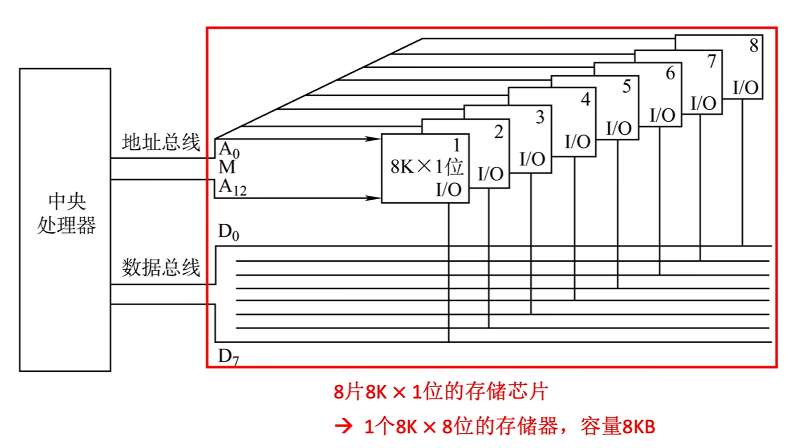{width=600}

### 2. 字扩展法（增加主存的存储字数）

**字扩展** 是对存储字的数量进行扩展。

- 字扩展时，**存储字的位数（字长）满足系统要求**。即系统数据线位数等于芯片数据线位数，系统地址线位数多于芯片地址线位数。

- 字扩展的 **连接方式**：
  - 各芯片的地址线与系统地址线的低位对应相连；
  - 芯片的数据线和读/写控制线与系统总线相应并联；
  - 由系统地址线的高位译码器得到各芯片的片选信号。
  - 各芯片分时工作。

片选时，有两种方法：**线选法**、**译码片选法**。

#### （1）线选法

**线选法** 用 **除片内寻址外** 的 **高位地址线** **直接连接** 至各个存储芯片的片选端。

- **n 条地址线，对应 n 个片选信号**。

- 当某位地址线信息为 1 时，就选中与之对应的存储芯片。

- 片选地址线每次寻址时，**只能一位有效**，不允许同时有多位有效，才能保证每次只选中一个芯片（或芯片组）。

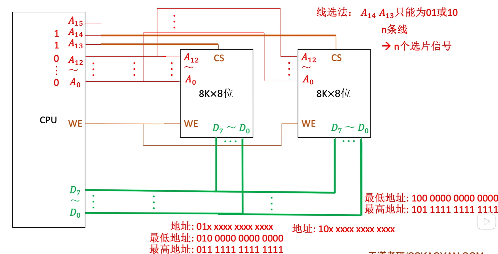{width=600}

- **优点**：不需要地址译码器，线路简单。
- **缺点**：地址空间不连续，当多位同时为有效时的地址无法使用，造成地址资源浪费。

#### （2）译码片选法

**译码片选法** 用 **除片内寻址外** 的 **高位地址线** 通过 **地址译码器** 产生片选信号。

- **译码器**：利用非门使一条地址线可以表示两种数据（二进制 0、二进制 1）。如：
  - **1 - 2 译码器**：有一条片选地址线，对应 2 个片选信号。
      

      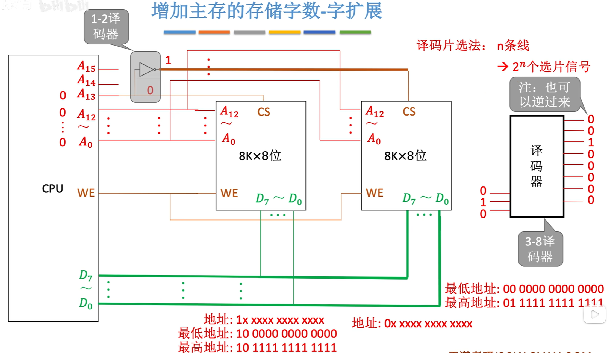{width=700}
      

  - **2 - 4 译码器**：有两条片选地址线，对应 4 个片选信号。
      

      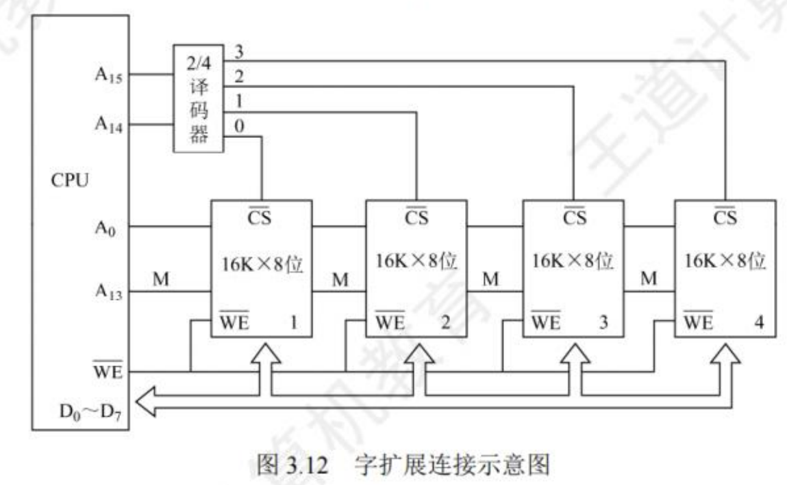{width=700}
      

  - **3 - 8 译码器**：有三条片选地址线，对应 8 个片选信号。

- **优点**：地址空间连续。

- **缺点**：电路复杂。

**注意**：译码器结构分为多种：

1. **适和高电平有效芯片配合使用的译码器**
   

   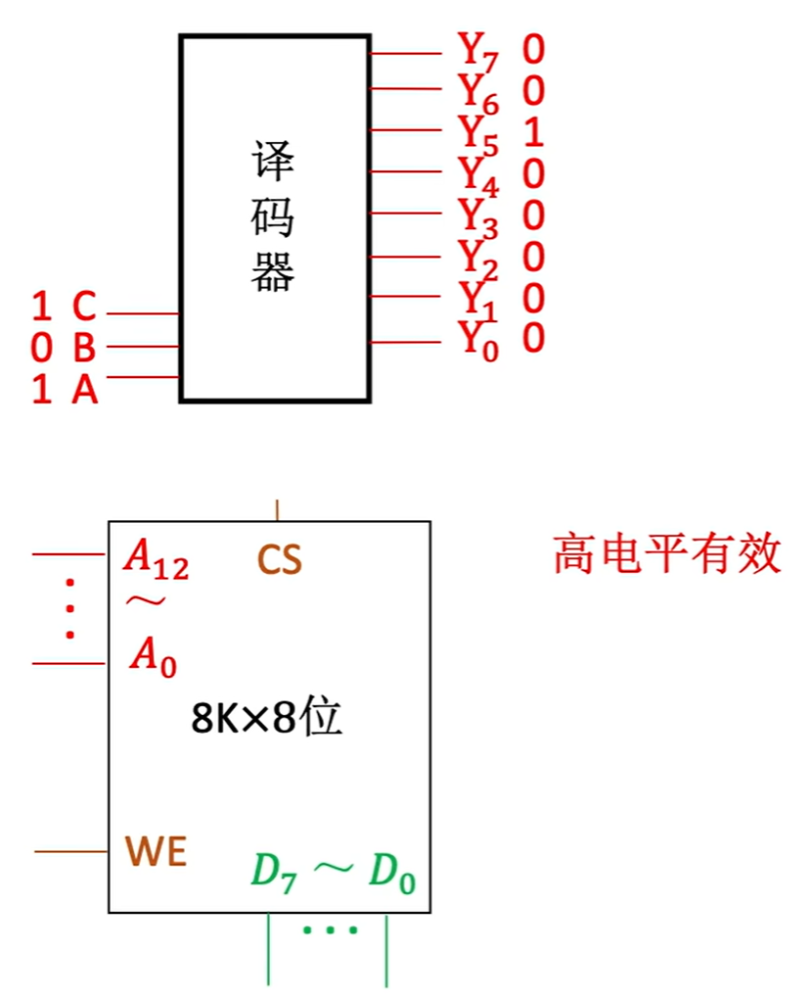{width=300}
   

2. **适合低电平有效芯片配合使用的译码器**
   

   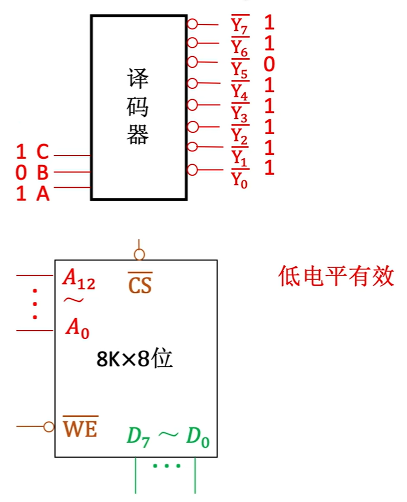{width=300}
   

3. **74ls138 型号译码器**
   - **$\overline {MREQ}$**：主存储器请求信号。低电平有效。
   - CPU 先送出地址信号，然后译码器先不进行片选。
   - CPU 等地址信号稳定后，再发出存储器请求信号，通过译码器的使能端控制片选信号生效。
   

   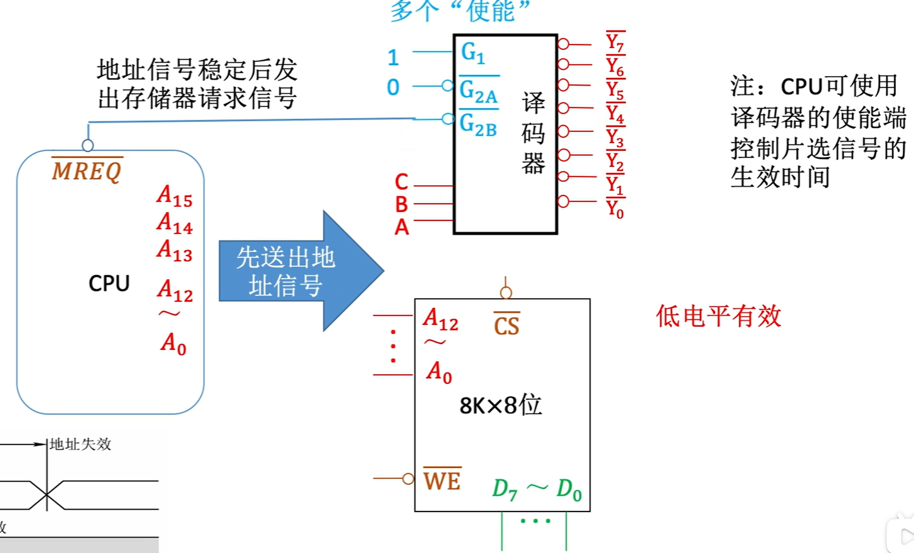{width=700}
   

### 3. 字位同时扩展法

**字位同时扩展法** 既增加存储字的数量，又增加存储字长。

- 字位同时扩展的 **连接方式**：
  - 将进行位扩展的芯片作为一组，各组的连接方式与位扩展的相同；
  - 有系统地址线高位译码产生若干片选信号，分别接到各组芯片的片选控制线。

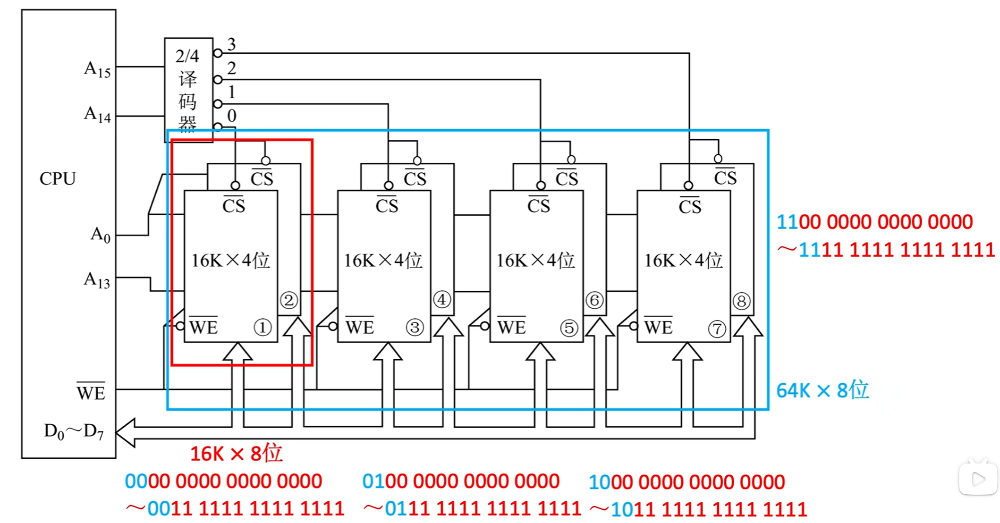{width=700}

