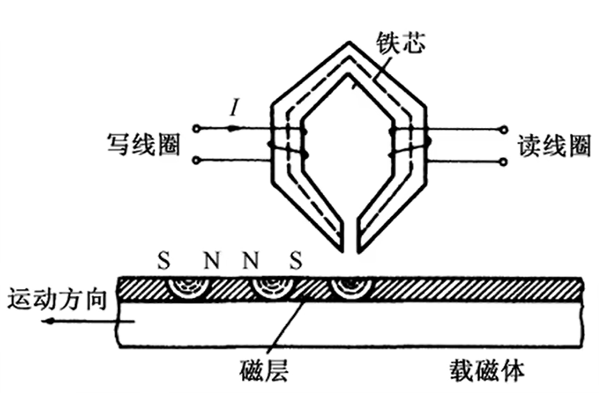
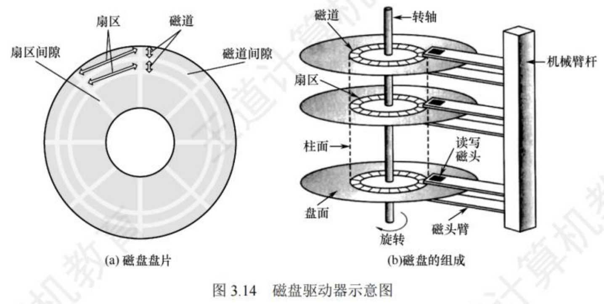
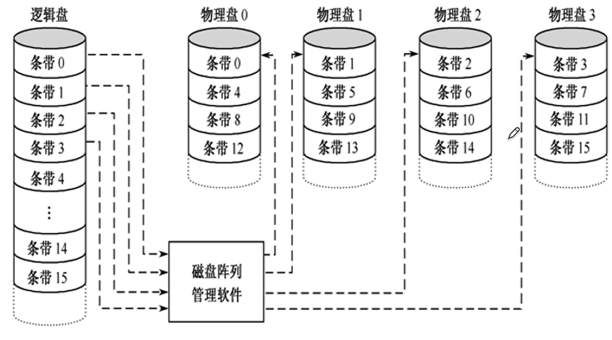
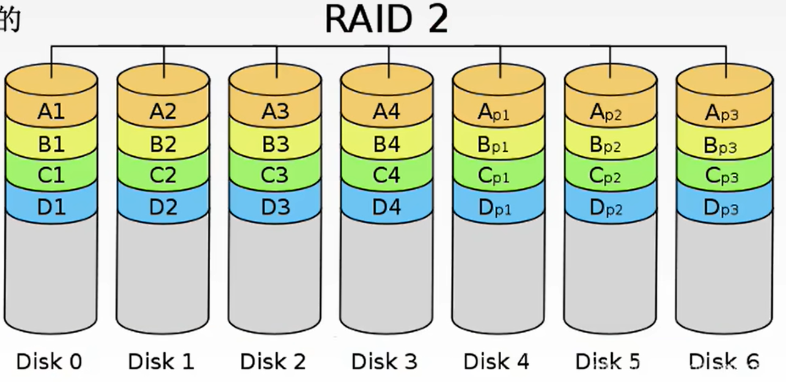
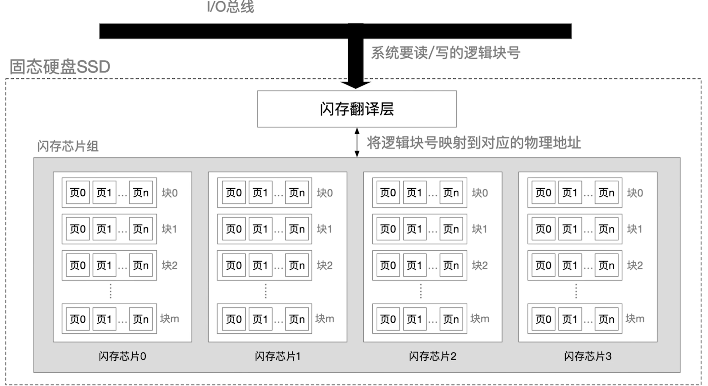

$$外部存储器$$

**辅助存储器（外存储器/外存）** 用于帮助主存存储记忆更多的信息。

- 辅助存储器中的信息必须调入主存储器后，才能为 CPU 所访问。

- 外存储器既可以作为输入设备，也可以作为输出设备。

# 一、磁盘存储器

**磁盘存储器** 是以磁盘为存储介质的存储器。

## （一）磁表面存储

**磁表面存储** 是把某些磁性材料薄薄地涂在金属铝或塑料表面上作为载磁体来存储信息。

{width=300}

- 磁盘存储器、磁带存储器、磁鼓存储器均属于 **磁表面存储器**。

- 磁表面存储器的 **优点**：
  - 存储容量大，位价低。
  - 记录介质可以重复使用。
  - 记录信息可以长期保存而不丢失，甚至可以脱机存档。
  - 非破坏性读出，读出时不需要再生。

- 磁表面存储器的 **缺点**：
  - 存取速度慢。
  - 机械结构复杂。
  - 对工作环境要求高。

## （二）磁盘存储器的组成

磁盘存储器由 **磁盘驱动器**、**磁盘控制器**、**盘片** 组成。

1. **磁盘驱动器**：核心部件是磁头组件和盘片组件。驱动磁盘转动，并在盘面上通过磁头进行读/写操作的装置。
    

    {width=600}
    

2. **磁盘控制器**：磁盘驱动器和主机的接口，负责接收并解释 CPU 发来的命令，向磁盘驱动器发出各种控制信号，并负责检测磁盘驱动器的状态。

3. **盘片（存储区域）**
一个磁盘含有若干记录面，每个记录面划分为若干条磁道，而每条磁道又划分为若干扇区（块）。
   - **磁头数（Heads）**：记录面数，表示磁盘共有多少个磁头。
     - **磁头** 用于读取盘片上记录面的信息和写入信息。
     - 一个记录面对应一个磁头。
   - **柱面数（Cylinders）**：表示磁盘每面盘片上有多少条磁道。
     - 在一个盘组中，不同记录面的相同编号（位置）的诸磁道构成一个柱面。
   - **扇区数（Sectors）**：表示每条磁道上有多少扇区。
     - **扇区（块）** 是磁盘读写的最小单位，即磁盘按块存取。
     - 扇区按固定圆心角划分，所以位密度从最外道向里道增加。
     - 磁盘的存储能力受限于最内道的最大记录密度。
   - **磁道间隙、扇区间隙**：相邻磁道及相邻扇区通过一定的间隙分隔开，以避免精度错误。

## （三）磁盘的性能指标

1. **磁盘的容量**：一个磁盘所能存储的字节总数，分为 **非格式化容量** 和 **格式化容量**。
   - **非格式化容量**：磁记录表面可以利用的磁化单元总数。
     - $非格式化容量 = 记录面数 \times 柱面数 \times 每条磁道的磁化单元数$
   - **格式化容量**：按照某种特定的记录格式所能存储信息的总量。
     - $格式化容量 = 记录面数 \times 柱面数 \times 每道扇区数 \times 每个扇区的容量$
     - 格式化后的容量比非格式化容量小。

2. **记录密度**：盘片单位面积上记录的二进制数据量，分为 **道密度**、**位密度**、**面密度**。
   - **道密度**：沿磁盘半径方向单位长度上的磁道数。
   - **位密度**：磁道单位长度上能记录的二进制代码位数。
   - **面密度**：位密度和道密度的乘积。

3. **平均存取时间**
   - **$平均存取时间 = 寻道时间 + 旋转延迟时间 + 传输时间$**
   - **寻道时间**：磁头移动到目的磁道。
     - 平均寻道时间：从最外道移动到最内道时间的一半。
   - **旋转延迟时间**：磁头定位到所在扇区。
     - 平均旋转延迟时间：旋转半周的时间。
   - **传输时间**：传输数据所花费的时间。
   - 有的可能还会有磁盘控制器延迟。

4. **数据传输速率**：磁盘存储器在单位时间内向主机传送数据的字节数。
   - 假设磁盘转数为 r（转/秒），每条磁道容量为 N 字节，则数据传输速率为 $D_r = r N$

## （四）磁盘的地址

主机向磁盘控制器发送寻址信息，磁盘的地址一般为：

{width=700}

## （五）磁盘的工作过程

磁盘的主要操作是 **寻址**、**读盘**、**写盘**。每个操作都对应一个 **控制字**。

- 磁盘工作时，
  - 第一步：取控制字。
  - 第二步：执行控制字。

- 磁盘属于机械式部件，其读写操作是串行的，即每次只能读/写 1 bit。不能同时读写。

## （六）磁盘阵列

**RAID（独立冗余磁盘阵列）**：将多个独立的物理磁盘组成一个独立的逻辑盘。数据在多个物理盘上分割交叉存储、并行访问，具有更好的存储性能、可靠性和安全性。

RAID 有多种分级：
1. **RAID0**：无冗余和无校验的磁盘阵列。
   - **条带化技术**：把逻辑上连续多个扇区（数据块）交替地存放在不同物理磁盘的扇区中，几个磁盘交叉并行读/写。
   - **优点**：
     - 扩大了存储容量
     - 提高了磁盘存取速度
   - **缺点**：RAID0 没有容错能力。
    

    {width=500}
    

2. **RAID1**：镜像磁盘阵列。
   - 两个磁盘同时进行读/写，互为备份，即存两份数据。
   - 若一个磁盘出现故障，可从另一个磁盘中读出数据。
   - **优点**：有校验。
   - **缺点**：有冗余。容量减少一半，两个磁盘当一个磁盘使用，存储空间利用率不高。

3. **RAID2**：采用纠错的海明码的磁盘阵列。
   - 逻辑上连续的几个 bit 信息，在物理上分散存储在各个盘中。
   - 4 bit 信息位 + 3 bit 海明校验位，即可纠正一位错，发现两位错。
    

    {width=500}
    

4. **RAID3**：位交叉奇偶校验的磁盘阵列。

5. **RAID4**：块交叉奇偶校验的磁盘阵列。

6. **RAID5**：无独立校验的奇偶校验磁盘阵列。

- RAID 的**优点**：
  - 通过使用多个磁盘，提高了传输速率。
  - 通过在多个磁盘上并行存取来大幅提高存储系统的数据吞吐量。
  - 通过镜像功能，提高安全可靠性。
  - 通过数据校验，提供容错能力。
  - RAID1 ~ RAID5，无论何时有磁盘损坏，都可随时拔出受损的磁盘再插入好的磁盘，而数据不会损坏，提升了系统的可靠性。

- RAID 随分级提升，冗余占比越来越少，可靠性、安全性逐步增加，成本逐步降低，传输速率逐步提高。

# 二、固态硬盘（Solid State Disk，SSD）

**固态硬盘** 是一种基于闪存技术的存储器。

1. SSD 的 **原理**：基于闪存技术 Flash Memory，属于电可擦除 ROM，即 EEPROM。

2. SSD 的 **组成**：一个 SSD 由一个或多个 **闪存芯片** 和 **闪存翻译层** 组成。
   - **闪存翻译层** 负责翻译逻辑块号，找到对应页。将来自 CPU 的逻辑块读/写请求翻译成对底层物理设备的读/写控制信号。
   - 存储介质是多个 **闪存芯片（Flash Chip）**。
     - 每个芯片包含多个块。每块由 32 ~ 128 页组成，大小为 16 KB ~ 512 KB。
     - 每个块包含多个页。每页通常为 512 B ~ 4 KB。
    

    {width="700px"}
    

3. SSD 的 **读写性能特性**
   - **以页为单位读/写**。相当于磁盘的扇区。
   - **以块为单位擦除**。擦干净的块，其中的每页都可以写一次，读无限次。
   - **读取速度快，写入速度慢**。要写的页如果有数据，则不能写入，需要将块内其他页全部复制到一个新的（擦出过的）块中，再写入新的页。
   - **支持随机访问**，系统给定一个逻辑地址，闪存翻译层可通过电路迅速定位到对应的物理地址。

4. SSD 与机械硬盘相比的特点
   - **SSD 读写速度快，随机访问性能高**，用电路控制访问位置；机械硬盘通过移动磁臂旋转磁盘控制访问位置，有寻道时间和旋转延迟。
   - **SSD 安静无噪音、抗摔抗震、能耗低、造价更贵**。
   - **闪存的擦写寿命是有限的**。SSD 的一个块被擦出次数过多（重复写同一个块）块内会坏掉，而机械硬盘的扇区不会因为写的次数太多而坏掉。

5. **磨损均衡技术**：将擦除平均分布在各个块上，以提升使用寿命。大致分为两种
   - **动态磨损均衡**：写入数据时，优先选择累计擦出次数少的新闪存块。
   - **静态磨损均衡**：SSD 监测并自动进行数据分配、迁移，让老旧的闪存块承担以读为主的存储任务，让较新的闪存块承担更多的写任务。