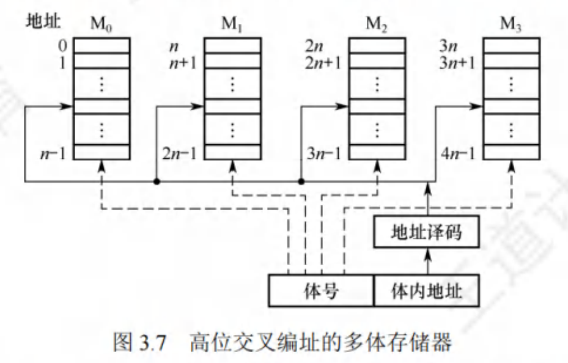
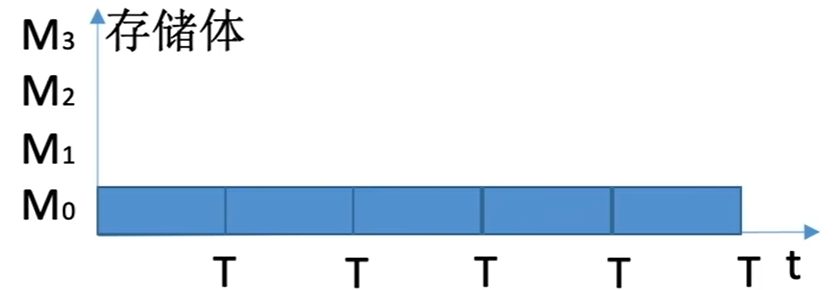
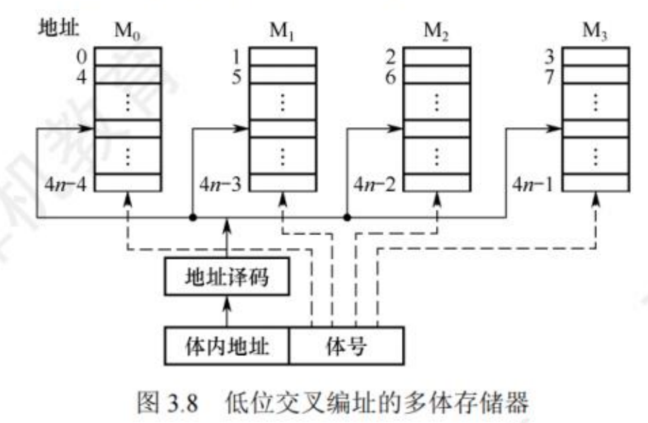
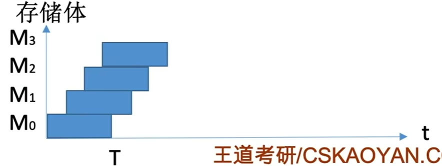
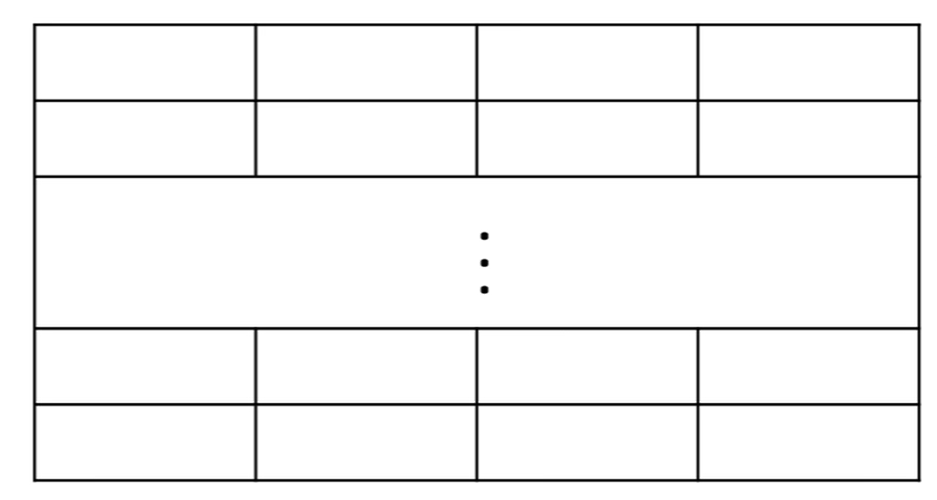

$$多模块存储器$$

CPU 速度比存储器快得多，当 CPU 读完一次数据后，需要等待一段恢复时间。若同时从存储器中取出 n 条指令，就可以充分利用 CPU 资源，提高运行速度。

**多模块存储器** 是一种空间并行技术，利用多个结构完全相同的存储模块的并行工作来提高存储器的吞吐率。

- 常用的多模块存储器有 **单体多字存储器**、**多体低位交叉存储器**。

# 一、多体并行存储器

**多体并行存储器** 由多体模块组成。每个模块都有相同的容量和存取速度，各模块都有独立的读/写控制电路、地址寄存器和数据寄存器。它们既能并行工作，又能交叉工作。

- 多体并行存储器分为 **高位交叉编址** 和 **低位交叉编址**。

## （一）高位交叉编址（顺序方式）的多体存储器

1. **编址方式**
**体号（模块号）** 为 **高位地址**，**体内地址（模块内地址）** 为 **低位地址**。
   - 所以地址是先在一个存储体内连续存放，然后再扩充到别的存储体继续依次连续存放。

{width=450}

2. **存取时间**
每个存储体的 **存储周期为 T**，**存取时间为 r**，假设 **T = 4r**。则 **连续取 n 个存储字**，需要 **耗时 n T**。

{width=400}

- 模块内的地址是连续的，存储分区仍是串行存取，所以这种存储器仍是顺序存储器。
- 理论上多个存储体可以被并行访问，但由于通常会连续访问，所以实际各模块不能被并行访问，相当于单纯的扩容，不能提高存储器的吞吐率。

## （二）低位交叉编址（交叉方式）的多体存储器

1. **编址方式**
**体号（模块号）** 为 **低位地址**，**体内地址（模块内地址）** 为 **高位地址**。
   - 若有 m 个模块，每个模块有 k 个单元。
   - 每个模块按 **模 m 交叉编址**。
   - $模块号 = 单元地址 \: \% \: m$
    

    {width=450}
    

   - **交叉存储器**：将程序连续放在相邻模块中，编址时交叉编址的存储器。

2. **存取时间**
每个存储体的存储周期为 T，存取时间为 r，假设 T = 4r。则 **连续取 n 个存储字**，需要 **耗时 T+(n-1)r**。
    

    {width=400}
    

   - 宏观上读写一个字的时间接近 r。

   - 采用 **流水线** 的方式并行存取（宏观上并行，微观上串行）。
     - 存取周期为 T，**存取时间为 r（总线传输周期为 r）**，假设 T = 4r。为了使流水线不间断，应保证 **模块数 $m \geq {T \over r}$**（等于时最佳）。
     - 每隔 $1\over m$ 个存取周期就可读出或写入一个数据，存取速度提高了 m 倍。

- **访问冲突**：若模块数 m 太少，则可能会出现相邻的 m 次访问的访存地址出现在同一个模块内，导致访存冲突。需要延迟发生冲突的服务请求。

# 二、单体多字存储器

**单体多字存储器** 每个存储单元存储 m 个字，总线宽度为 m 个字，一次并行读出 m 个字。

- **缺点**：
  - 灵活性比多体并行存储器差。
  - 每次只能同时取 m 个字，不能单独取其中某个字。
  - 指令和数据在主存内必须连续存放。

{width=450}

