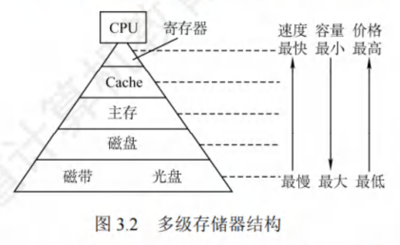
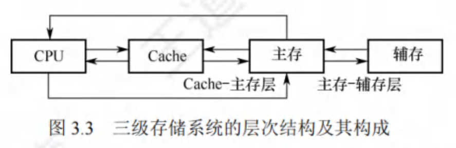
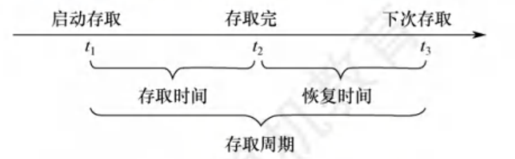

$$存储器概述$$

# 一、存储器的层次结构

存储器的层次结构的思想是 **上一层的存储器作为低一层存储器的高速缓存**。

在计算机系统中，通常采用 **多级存储器结构**。

{width=400}

**注意**：把安装在 **电脑内部的磁盘** 称为 **辅存**，把 **U 盘、磁带、光盘** 称为 **外存**。（也可以把磁盘、U 盘、磁带、光盘等 **统称为辅存或外存**）

- 在三级存储系统中，
  - **Cache、主存** 能 **与 CPU** **直接** 交换信息。
  - **辅存** 要 **通过主存** 与 CPU 交换信息。
  - **主存** 与 **CPU、Cache、辅存** 都能交换信息。

{width=400}

- **主存 - 辅存** 层：实现了 **虚拟存储系统**，**解决了主存容量不够的问题**（存储系统的容量问题）。
  - 主存和辅存之间的 **数据调动** 用是由 **硬件和操作系统** 共同完成，对 **应用程序员透明**（不可见）。

- **Cache - 主存**：**解决了 CPU 和 主存速度不匹配的问题**。
  - 主存和 Cache 之间的 **数据调动** 是由 **硬件自动完成**，对 **所有程序员透明**。

**注意**：Cache 中的内容只是主存中的内容的一部分。主存中的内容只是辅存中的内容的一部分。

# 二、存储器的分类

## （一）按在计算机中的层次（作用）分类

1. **高速缓冲存储器（Cache）**：用来存放当前 CPU 经常使用的指令和数据。
   - 可直接被 CPU 高速访问。
   - Cache 的存取速度与 CPU 的速度相匹配。
   - 通常制作在 CPU 中。
   - 存储容量小、价格高。

2. **主存储器（主存/内存储器/内存）**：用来存放计算机运行期间所需的程序和数据。
   - 可直接被 CPU 随机读写。
   - 容量小，存取速度较快，单位成本较高。

3. **辅助存储器（辅存/外存储器/外存）**：用来存放当前暂时不用的程序和数据，以及一些需要永久性保持的信息。
   - 辅存的内容需要调入主存后才能被 CPU 访问。
   - 容量大、存取速度慢、单位成本低。

## （二）按存储介质分类

1. **半导体存储器**：以半导体存储信息。如：主存、Cache。

2. **磁表面存储器**：以磁性材料存储信息。如磁盘、磁带。

3. **光存储器**：以光介质存储信息。

4. **磁芯存储器**

## （三）按存取方式分类

1. **随机存取存储器（Random Access Memory，RAM）**：读写任何一个存储单元所需时间都相同，与存储单元所在的物理位置无关。如：内存。
   - 分为 **静态 RAM（SRAM）** 和 **动态 RAM（DRAM）**。
   - DRAM 主要用作主存，SRAM 主要用于高速缓冲存储器（Cache）。
   - 读/写方便、使用灵活

2. **串行访问存储器**：读写某个存储单元所需时间与存储单元的物理位置有关。包括：
   1. **顺序存取存储器（Sequential Access Memory，SAM）**：读写一个存储单元所需时间取决于存储单元所在的物理位置。如：磁带。

   2. **直接存取存储器（Direct Access Memory，DAM）**：既有随机存取特性，也有顺序存取特性。先直接选取信息所在区域，然后按顺序方式存取。如：机械硬盘。

3. **相联存储器（Associative Memory）/ 按内容访问的存储器（Content Addressed Memory，CAM）**：可以按照内容检索到存储位置进行读写。如：快表。

## （四）按信息的可更改性分类

1. **读写存储器（Read Write Memory）**：既可读，也可写。如：磁盘、内存、Cache。

2. **只读存储器（Read Only Memory，ROM）**：只能随机读出，不能写入。
   - 其中信息即使断电，也不会丢失。
   - 通常存放固定不变的程序、常数、汉字字库等。
   - 与 RAM 共同作为主存的一部分，统一构成主存的地址域。

## （五）按信息的可保存性分类

1. **易失性存储器**：断电后，存储信息消失的存储器。如：主存、Cache、RAM。

2. **非易失性存储器**：断电后，存储信息依然保持的存储器。如：ROM、磁盘、光盘。

- **破坏性读出**：信息读出后，原存储信息被破坏。如：DRAM 芯片。
  - 读出数据后进行重写，以便恢复被破坏的信息。

- **非破坏性读出**：信息读出后，原存储信息不被破坏。如：SRAM 芯片、磁盘、光盘。

# 三、存储器的性能指标

存储器有三个主要性能指标：**存储容量**、**单位成本**、**存储速度**。

## 1. 存储容量

**$$存储容量 = 存储字数 \times 字长$$**
- 存储字数表示存储器的地址空间大小。
- MDR（存储器数据寄存器） 的位数反映存储字长。

## 2. 单位成本

**$$每位价格 = 总成本 \div 总容量$$**

## 3. 存储速度

**$$数据传输率（每秒传送信息的位数） = 数据的宽度（存储字长） \div 存储周期$$**

- **主存带宽（数据传输速率，$B_m$）**：每秒从主存进出信息的最大数量。
    - 单位为 **字/秒**、**字节/秒（B/s）**、**位/秒（b/s）**
- **存取时间与存取周期的关系**：
    

    {width=500}
    

    **$$存取周期 = 存取时间 + 恢复时间$$**

    - **存取时间（$T_a$）**：从启动溢出存储器操作到完成该操作所经历的时间。
      - 分为 **读出时间** 和 **写入时间**。
    - **存取周期（$T_m$）**：存储器进行一次完整的读/写操作所需的全部时间。
      - 即，连续两次独立访问存储器操作（读/写操作）之间所需的最小时间间隔。
    
    - **恢复时间**：任何一种存储器，在读/写操作之后，要有一端恢复内部状态的复原时间。
      - 对于破坏性读出的存储器，存取周期会比存取时间大得多。因为存储器中的信息读出后，需要马上进行再生。