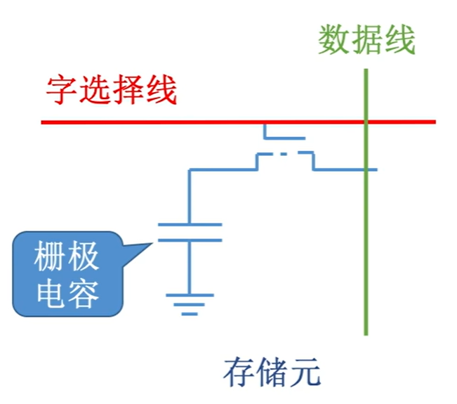
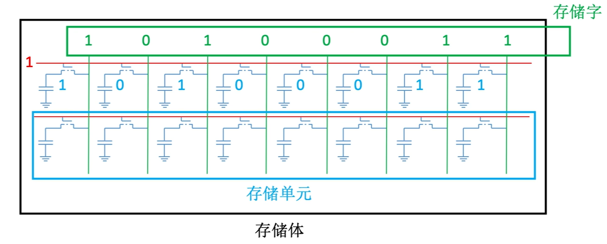
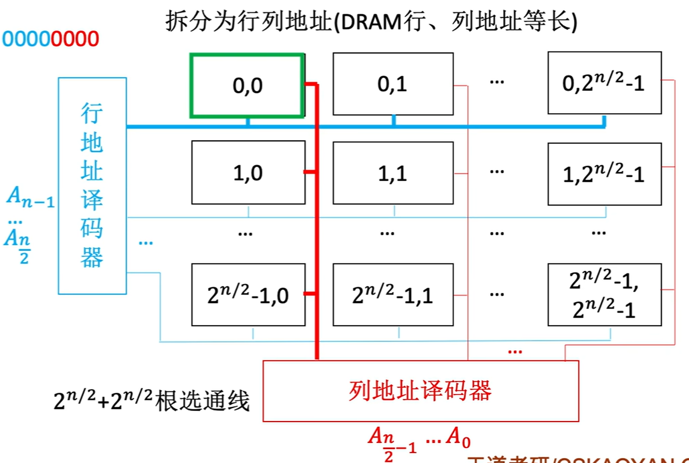
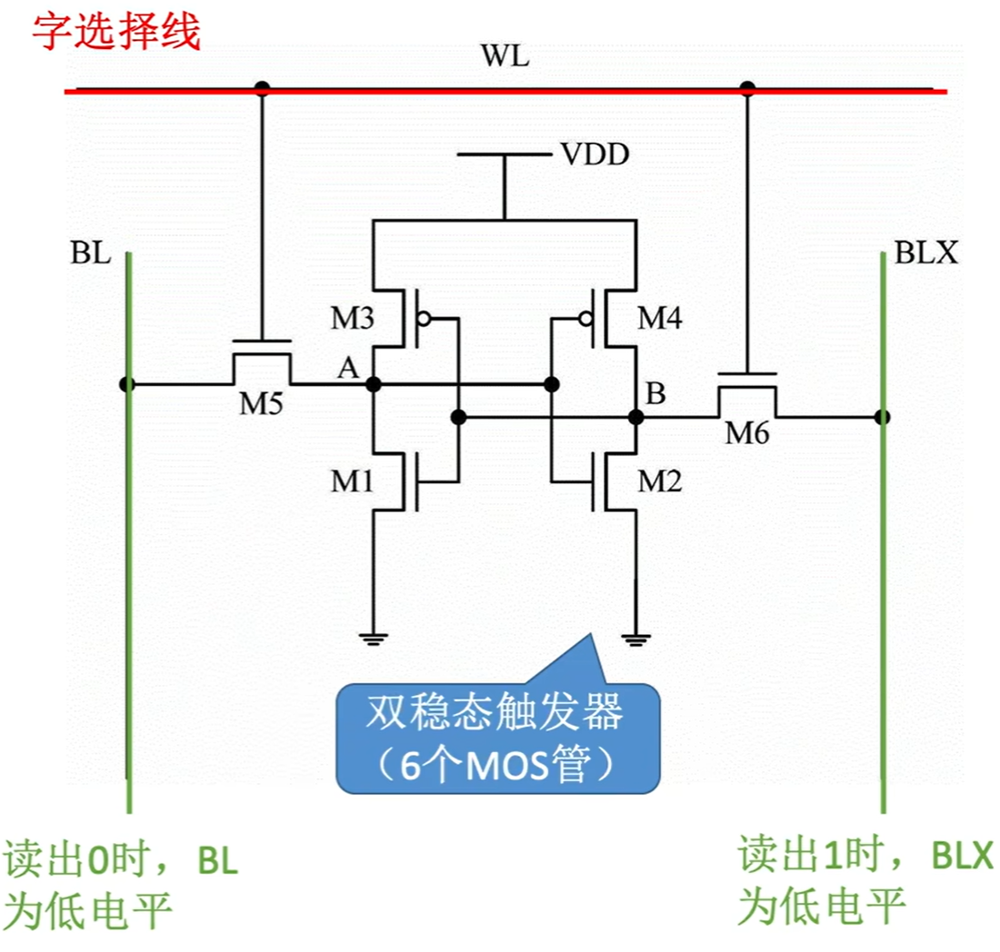

$$随机存储器 RAM$$

**随机存取存储器（Random Access Memory，RAM）**：读写任何一个存储单元所需时间都相同，与存储单元所在的物理位置无关。即支持随机访问。

- **随机存储器 RAM** 分为 **动态随机存储器（DRAM）** 和**动态随机存储器（SRAM）**。

- **DRAM** 和 **SRAM** 都是 **易失性存储器**。

# 一、动态随机存储器 DRAM

**DRAM（动态 RAM，Dynamic Random Access Memory）** 使用 **栅级电容** 存储信息。

- 主存由 DRAM 实现。

- 目前的主存通常采用 SDRAM（同步 DRAM 芯片）

## （一）DRAM 的工作原理

1. **存储元** 为 **栅级电容**。
   - **二进制 1**：电容内 **存储了电荷**。
   - **二进制 0**：电容内 **未存储电荷**。
   - **读出二进制 1**：MOS 管接通，电容放电，**数据线上产生电流**。
   - **读出二进制 0**：MOS 管接通后，**数据线上无电流**。
   - **写入二进制 1**：MOS 管接通，用 **高电平电压** 给电容充电，最后断开 MOS 管。
   - **写入二进制 0**：MOS 管接通，用 **低电平电压** 给电容充电，最后断开 MOS 管。
   

   {width=300px}
   

- 读出时，电容放电，信息被破坏，是 **破坏性读出**。读出后应进行 **重写（再生）** 操作（即 **动态**）。所以 **读写速度比 SRAM 慢**。

- **特点**：读写速度慢、位价低、集成度高、功耗低

- 常用于 **主存**。

2. **存储体**：
   

   {width=600px}
   

## （二）DRAM 的刷新

DRAM 中的栅级电容内的电荷只能维持 2 ms。即便不断点，2 ms 后信息也会消失。所以需要进行 **刷新**（给电容充电）。
- SRAM 只要不断电，双稳态触发器的状态就不会改变。所以不需要刷新。

- **刷新周期**：对同一行进行相邻两次刷新的时间间隔，通常取 2ms。

- **以行为单位**，每次刷新一行存储单元。
  - 采用 **行列地址**，减少选通线的数量。

      

      {width=600}
      

- 刷新 **由硬件（刷新电路）支持**，读出一行的信息后重新写入（即 **读后再生**）。

- **读写与刷新共占用 1 个读/写周期（存取周期）**。

- 常用的 **刷新方式** 有 3 种：**分散刷新**、**集中刷新**、**异步刷新**。
  1. **分散刷新**：将存取周期分为两部分，**前半部分** 用于正常的 **读/写操作**；**后半部分** 用于 **刷新**。
     - 即，每次写完都刷新一行。
     - **优点**：**没有死区**。
     - **缺点**：**加长了** 系统的 **存取周期**。

  2. **集中刷新**：在一个刷新周期内，**利用一段固定的时间**，依次对存储器的 **所有行进行逐一再生**，在此期间 **停止对存储器的读/写操作**。
     - 即，集中安排时间全部刷新。
     - **死区（死时间）**：有一段时间专门用于刷新，无法访问存储器。
     - **优点**：读/写操作期间不受刷新操作的影响。
     - **缺点**：在集中刷新（死区）不能访问存储器。

  3. **异步刷新**：**一个存储周期内每行刷新一次** 即可。
     - 具体做法：
       - 将刷新周期除以行数，得到相邻两行之间刷新的时间间隔 t。
       - **每隔时间 t 产生一次刷新请求**。
     - 可在译码阶段刷新，避免让 CPU 连续等待过长的时间。

**注意**：
- 刷新 **由存储器独立完成**，不需要 CPU 控制。
- 刷新时不需要选片，即整个存储器中的所有芯片同时被刷新。
- 刷新是以行为单位，逐行恢复数据；再生仅需恢复被读出的那些单元的数据。

## （三）DRAM 的地址引脚复用技术

DRAM 芯片的集成度更高，容量更大，地址位数更多。需要减少芯片的地址引脚数。

**地址引脚复用技术** 把 **行地址** 和 **列地址** 通过 **行地址译码器** 和 **列地址译码器** 来 **使用相同的引脚**，先后 **分两次输入**。

- 地址引脚复用技术可以使地址引脚数减少一半。

# 二、静态随机存储器 SRAM

**SRAM（静态 RAM，Static Random Access Memory）** 使用 **双稳态触发器（六晶体管 MOS）** 存储信息。

- Cache 由 SRAM 实现。

## SRAM 的工作原理
1. **存储元** 为 **双稳态触发器（6 个 MOS 管）**
   - 双稳态：可以呈现出两种稳定的状态。
     - **二进制 1**：**A 高 B 低**
     - **二进制 0**：**A 低 B 高**
   - **读出二进制 1**：MOS 管接通，右边的数据线 **BLX** 会 **发出低电平**，左边的 **BL 不会发出任何信号**。
   - **读出二进制 0**：MOS 管接通，左边的数据线 **BL** 会 **发出低电平**，右边的 **BLX 不会发出任何信号**。
   - **写入二进制 1**：MOS 管接通，给 **BLX 输入低电平**，**BL 输入高电平**。
   - **写入二进制 0**：MOS 管接通，给 **BL 输入低电平**，**BLX 输入高电平**。

   

   {width=400}
   

- 读出数据，触发器状态保持稳定，是 **非破坏性读出**，**无需重写**（即 **静态**）。所以 **读写速度比 DRAM 更快**。

- 传送行列地址时，是 **同时送** 的。

- **特点**：读写速度块、位价更高、集成度低、功耗较大。

- 常用于 **Cache**。