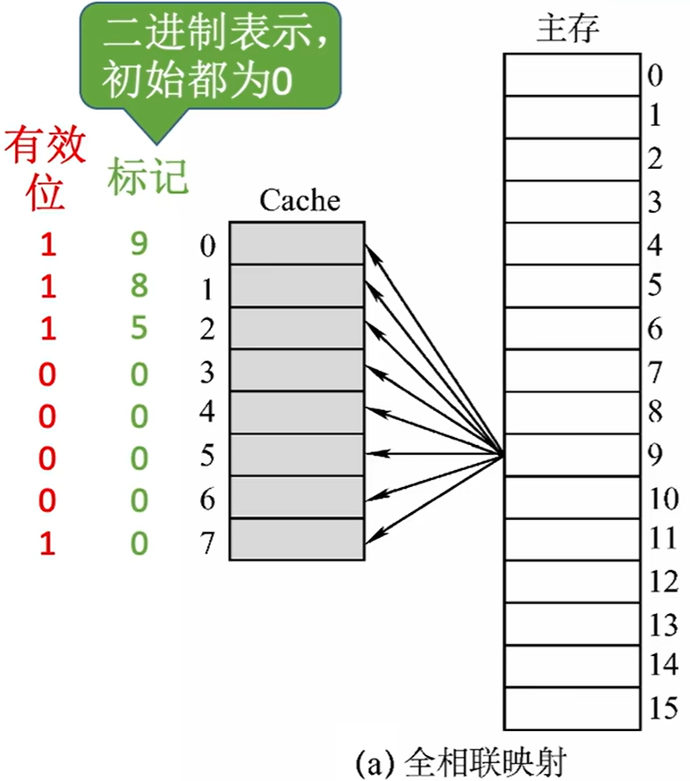
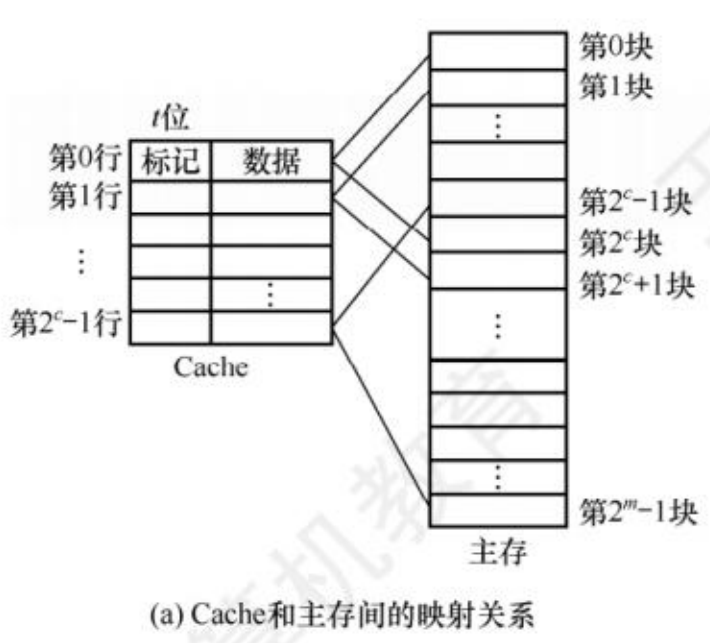
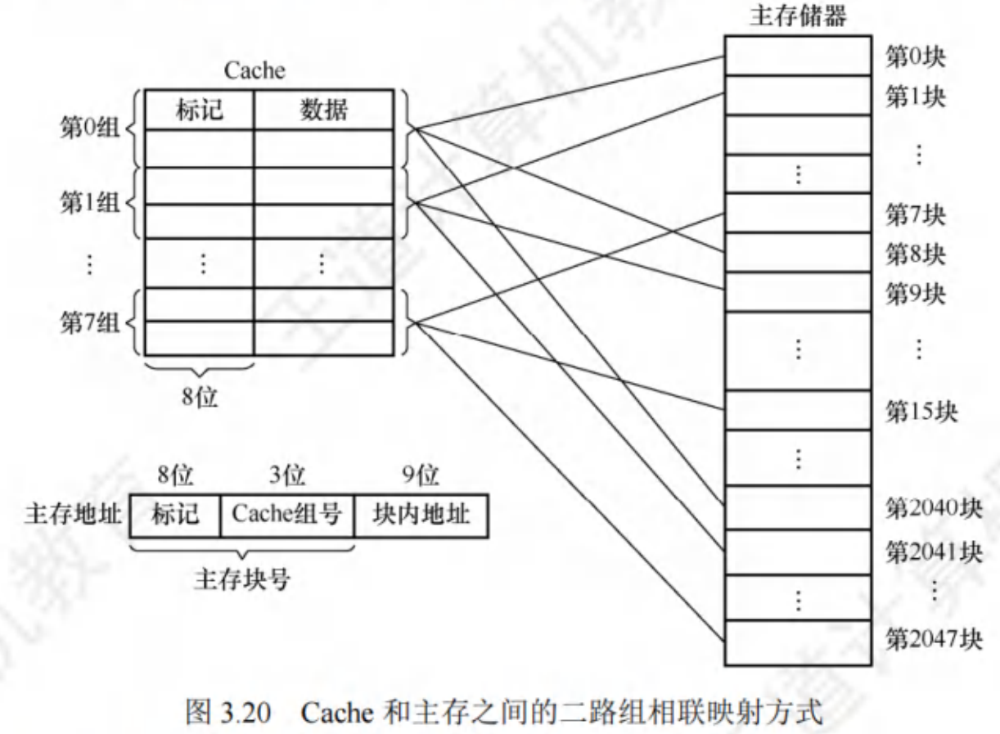
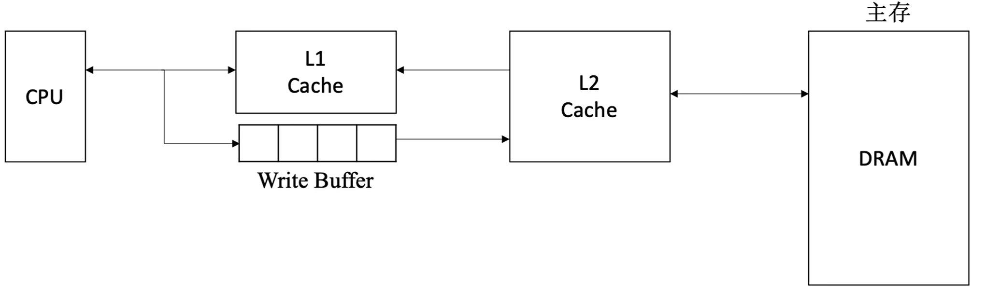

$$高速缓冲存储器$$

多模块存储器能提高存储器的工作速度，但仍与 CPU 差距很大，需要更高速的存储单元设计。可以基于 **程序访问的局部性原理**，使用 **Cache - 主存层次**，来改善存储体系，显著提高存储系统的效率。

- Cache 用 SRAM 实现，速度快，成本高，集成度低，通常集成在 CPU 内部。

# 一、程序访问的局部性原理

程序访问的局部性原理包括 **时间局部性** 和 **空间局部性**。

- **时间局部性**：在最近的未来要用到的信息，很可能是现在正在使用的信息。
  - 如：数组元素、顺序执行的指令代码

- **空间局部性**：在最近的未来要用到的信息（指令和数据），很可能与现在正在使用的信息在存储空间上是相邻的。
  - 如：循环结构的指令代码。
  - 按“列优先”访问二维数组，空间局部性更差。

# 二、Cache 的基本工作原理

Cache 和主存都被 **划分为大小相等的块**，**主存与 Cache 之间以块为单位进行数据交换**。将某些主存块复制到 Cache 中，缓和 CPU 与主存之间的速度矛盾。

- 每块由若干字节组成。

- **块长（行长）**：块的长度。

- **Cache 块（Cache 行）**：Cache 中的块（行）。

- **块（页/页面/页框）**：主存中的块。

- 分块后的 **主存地址**：**（主存块号，块内地址）**

- CPU 与 Cache 之间的数据交换以字为单位。

**注意**：**每次被访问的主存块，一定会被立即调入 Cache**。

- 通过 Cache 和主存的映射方式区分 Cache 与主存的数据块的对应关系。

- Cache 很小，主存很大，Cache 满了以后，使用替换算法解决。

- CPU 修改了 Cache 中的数据副本，通过 Cache 写策略 确保主存中数据母本的一致性。

# 三、性能分析

设 $t_c$ 为访问一次 Cache 所需时间，$t_m$ 为访问一次主存所需时间。

**命中率 H**：CPU 欲访问的信息已在 Cache 中的比率。

**缺失（未命中率）M**：**M = 1 - H**

Cache - 主存系统的 **平均访问时间 t**：
- **先访问 Cache**，**若 Cache 未命中再访问主存**。
    **$$t = H t_c + (1 - H)(t_c + t_m)$$**
- **同时访问 Cache 和主存**，若 Cache 命中则立即停止访问主存。
    **$$t = H t_c + (1 - H) t_m$$**

# 四、Cache 和主存的映射方式

**地址映射** 是把主存地址空间映射到 Cache 地址空间，即把存放在主存中的信息按照某种规则装入 Cache。

- 地址映射方式有三种：**全相联映射**、**直接映射**、**组相联映射**。

- **标记位**：指明 Cache 中存放的是哪个主存块，每个 Cache 块需要一个标记位。
  - 用二进制表示，初始都为 0。

- **有效位**：说明 Cache 行中的信息是否有效，每个 Cache 行需要一个有效位。

## （一）全相联映射

**全相联映射** 方式可以将主存中的每一块，装入 Cache 中的任何位置。

{width=300}

- **地址结构**：
    |标记|块内地址|
    |:--:|:-----:|
  - **标记** 为主存块号。
    **$$标记位数（内存块号的位数） = log_2 主存块数$$**

- **CPU 访存过程**：
  1. 将主存地址的高位标记（主存块号）与 Cache 各行的标记进行比较。
  2. 若标记匹配且对应有效位为 1，则 Cache 命中。根据块内地址从该 Cache 行中取出信息。
  3. 若未命中或有效位为 0，则正常访问主存。
     - CPU 从主存中读出该地址所在块的信息，送到 Cache 的任意一个空闲行中，将有效位置为 1，并设置标记，同时将该地址中的内容送 CPU。

- **优点**：
  - Cache 块的冲突概率低，只要有空闲 Cache 行，就不会发生冲突。
  - 空间利用率高。
  - 命中率高。

- **缺点**：
  - 标记的比较速度最慢，有可能需要对比所有行的标记。
  - 实现成本高，通常需采用按内容寻址的相联存储器。
    - 相联存储器为每个 Cache 行都设置一个比较器，比较器位数等于标记字段的位数。
    - 按内容寻址的时间开销和硬件开销都较大，不适合大容量 Cache。

## （二）直接映射

**直接映射** 方式将主存的每一块只能装入 Cache 中的唯一固定位置。
- 如果这个位置已有内容，则产生冲突，就把原来的块无条件地替换出去。

{width=400}

- **地址结构**：
    |标记（t 位）|Cache 行号（c 位）|块内地址（b 位）|
    |:-:|:--------:|:-----:|

- 主存在 Cache 中的位置：
    **$$Cache 行号 = 主存块号 \% 总行数$$**
  - 若 Cache 总块数为 $2^n$，则 **主存块号末尾 n 位直接反映它在 Cache 中的位置**。
  - 只需 **将主存块号的其余位作为标记**。

- CPU 访存过程：
  1. 根据主存块号的后 c 位确定 Cache 行。
  2. 将对应 Cache 行中的标记和主存地址的高 t 位进行比较。
  3. 若匹配且有效位为 1，则 Cache 命中，根据主存地址中低位的块内地址，在对应的 Cache 行中存取信息。
  4. 若未命中或有效位为 0，则正常访问主存。
     - CPU 从主存中读出该地址所在块的信息，送到对应的 Cache 行中，将有效位置为 1，并设置标记为地址中的高 t 位，同时将该地址中的内容送 CPU。

- **优点**：实现简单，标记对比速度最快。对于任意一个地址，只需对比一个标记。

- **缺点**：不够灵活，即使 Cache 的其他许多地址空着也不能占用。块冲突概率最高，空间利用率最低。

## （三）组相联映射

**组相联映射** 将 Cache 分成 Q 个大小相等的分组，每个主存块可以装入固定组中的任意一行。
- 即，组间采用直接映射，组内采用全相联映射。
- n 块为一组，称为 **n 路组相联映射**

{width=500}

- **地址结构**：
    |标记|组号|块内地址|
    |:-:|:--:|:------:|

- 主存在 Cache 中的所属分组：
    **$$Cache 组号 = 主存块号 \: \% \: Cache 组数（Q）$$**
  - 若 Cache 分组数为 $2^n$，则 **主存块号末尾 n 位直接反映它在 Cache 中的所属分组**。
  - 只需 **将主存块号的其余位作为标记**。

- CPU 访存过程：
  1. 根据主存块号的后 n 位确定所属分组号。
  2. 将对应 Cache 组中每个行的标记与主存地址的高位标记进行比较。
  3. 若匹配且有效位为 1，则 Cache 命中，根据主存地址中的块内地址，在对应 Cache 行中存取信息。
  4. 若未命中或有效位为 0，则正常访问主存。
     - CPU 从主存中读出该地址所在块的信息，送到对应 Cache 组的任一个空闲行中，将有效位置为 1，并设置标记，同时将该地址中的内容送 CPU。

- **优点**：是直接映射和全相联映射的折中，综合效果较好。

# 五、Cache 中主存块的替换算法

常用的替换算法有：**随机算法（RAND）**、**先进先出算法（FIFO）**、**近期最少使用算法（LRU）**、**最不经常使用算法（LFU）**。

- 采用 **全相联映射** 时，**Cache 完全满了** 才需要替换。需要 **在全局** 选择替换哪一块。

- 采用 **直接映射** 时，如果对应位置非空，则毫无条件地直接替换，不需要替换算法。

- 采用 **组相联映射** 时，**分组内满了** 才需要替换。需要 **在分组内** 选择替换哪一块。

## （一）随机算法（RAND）

**随机算法（RAND，Random）**：若 Cache 已满，则随机选择一块替换。

- **优点**：实现比较简单。

- **缺点**：命中率较低，未依据程序访问的局部性原理。

## （二）先进先出算法（FIFO）

**先进先出算法（FIFO，First In First Out）**：若 Cache 已满，则替换最先被调入 Cache 的块。

- **优点**：实现比较简单。

- **缺点**：未依据程序访问的局部性原理，最早进入的主存块也可能是目前经常要用的。可能发生 **抖动** 现象。
  - **抖动现象**：频繁地换入换出的现象。（刚被替换的块很快又被调入）

## （三）近期最少使用算法（LRU）

**近期最少使用算法（LRU，Least Recently Used）**：依据程序访问的局部性原理，选择近期内长久未访问过的 Cache 进行替换。

- 硬件实现：为每一个 Cache 块设置一个 **计数器（LRU 替换位）**，用于记录每个 Cache 块已经有多久没被访问了。当 Cache 慢后替换计数器最大的。
  - 命中时，所命中的行的计数器清零，比其低的计数器加 1，其余不变。
  - 未命中且还有空闲行时，新装入的行的计数器置 0，其余非空闲行全加 1。
  - 未命中且无空闲行时，计数值最大的行的信息块被淘汰，新装入的块的计数器置 0，其余全加 1。
  **注意**：若 $Cache 块的总数 = 2^n$，则计数器只需 n 位。且 Cache 装满后所有计数器的值一定不重复。

- **优点**：实际运行效果最优秀，Cache 命中率高。

- **缺点**：当集中访问的块数量超过 Cache 块的数量时，可能会发生抖动，命中率变得很低。

## （四）最不经常使用算法（LFU）

**最不经常使用算法（LFU，Least Frequently Used）**：将一段时间内被访问次数最少的 Cache 行换出。

- 硬件实现：为每一个 Cache 块设置一个 **计数器**，用于记录每个 Cache 块被访问过几次。当 Cache 满后 **替换计数器最小的**。
  - 新调入的块计数器置为 0，之后每被访问一次计数器加 1。
  - 需要替换时，选择计数器最小的一行。
    **注意**：若有多个计数器最小的行，可按行号递增、或 FIFO 策略进行选择。

- **缺点**：实际运行效果不如 LRU。曾经被经常访问的主存块在未来不一定会用到，没有遵循局部性原理。

# 六、Cache 写策略

Cache 中的内容是主存块的副本，当对 Cache 中的内容进行更新时，就需要选用 **写操作策略** 使 Cache 内容和主存内容保持一致。

- 写策略有两种情况：
  - **Cache 写操作命中（Write Hit）**，即CPU 要修改的块已经在 Cache 中。有两种方法：
    - **全写法（直写法、Write Trough）**
    - **写回法（Write Back）**
  - **Cache 写操作不命中**，即CPU 要修改的块不在 Cache 中。有两种方法：
    - **写分配法（Write Allocate）**
    - **非写分配法（Not - Write - Allocate）**

## （一）Cache 写操作命中

当 Cache 写操作命中时（要被修改的块在 Cache 中），有两种处理方法：**写回法**、**全写法（直写法）**。

### 1. 写回法（Write Back）

**写回法（Write Back）**：当 CPU 对 Cache 写命中时，只修改 Cache 的内容，而不立即写入主存，只有当此块被换出时才写回主存。

- 给每个 Cache 行设置一个 **修改位（脏位）**。
  - 若修改位为 1，则说明对应 Cache 行中的块被修改过，替换时须写回主存。
  - 若修改位为 0，则说明对应 Cache 行中的块未被修改过，替换时无须写回主存。

- **优点**：减少访存次数。

- **缺点**：存在数据不一致的隐患。

### 2. 全写法（直写法、Write Through）

**全写法（直写法、写直通法、Write Through）**：当 CPU 对 Cache 写命中时，必须把数据同时写入 Cache 和主存，一般使用写缓冲（write buffer）。

- **写缓冲（Write Buffer）** 是 SRAM 实现的 FIFO 队列。在专门的控制电路下逐一写回主存。可以解决速度不匹配的问题。（类似于 SPOOLing 技术）
  - CPU 写的速度很快，若写操作不频繁，则效果很好；若写操作很频繁，可能会因为写缓冲饱和而发生阻塞。

- **优点**：
  - 实现简单。
  - 能随时保持主存数据的准确性。

- **缺点**：增加了访存次数，降低了 Cache 的效率。

## （二）Cache 写操作不命中

当 Cache 写操作不命中时（要被修改的块不在 Cache 中），有两种处理方法：**写分配法**、**非写分配法**。

### 1. 写分配法（Write Allocate）

**写分配法（Write Allocate）**：当 CPU 对 Cache **写不命中时**，把主存中的块调入 Cache，在 Cache 中修改。通常 **搭配写回法** 使用。

### 2. 非写分配法（Not - Write - Allocate）

**非写分配法（Not - Write - Allocate）**：当 CPU 对 Cache **写不命中时** 只写入主存，不调入 Cache。**搭配全写法** 使用。

- 只有读未命中时，才调入 Cache。

# 七、多级 Cache

现代计算机通常采用 **多级 Cache 结构**。

- 离 CPU 越近的 Cache 速度越快，容量越小。

- 离 CPU 越远的 Cache 速度越慢，容量越小。

{width=500}

- 各级 Cache 间常采用 **全写法 + 非写分配法**。

- Cache 和主存间常采用 **写回法 + 写分配法**。