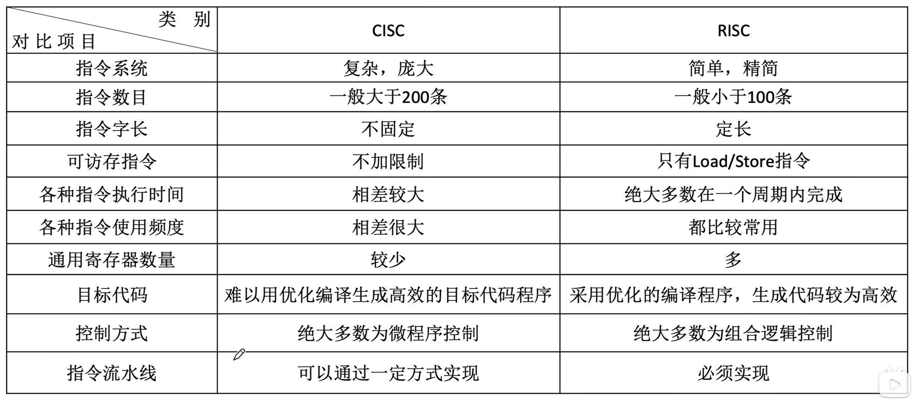

$$CISC 和 RISC$$

指令系统有两个不同的发展方向：
- **复杂指令系统计算机（CISC，Complex Instruction Set Computer）**：增强原有指令的功能，设置更为复杂的新指令实现软件功能的硬化。
  - 设计思路：一条指令完成一个复杂的基本功能。
  - 代表：x86 架构，主要用于笔记本、台式机等。

- **精简指令系统计算机（RISC，Reduced Instruction Set Computer）**：减少指令种类和简化指令功能，提高指令的执行速度。
  - 设计思路：一条指令完成一个基本动作，多条指令组合完成一个复杂的基本功能。
  - 代表：ARM 架构，主要用于手机、平板等。

# 一、复杂指令系统计算机（CISC）

**复杂指令系统计算机（CISC，Complex Instruction Set Computer）**：增强原有指令的功能，设置更为复杂的新指令实现软件功能的硬化。

- 设计思路：
  - 一条指令完成一个复杂的基本功能。
  - 一条指令可以由一个专门的电路完成。
  - 有的复杂指令用纯硬件实现困难，则采用“存储程序”的设计思想，用一个比较通用的电路配合存储部件完成一条指令。

- 代表：x86 架构，主要用于笔记本、台式机等。

- **如果乘法指令可以访存，一定是 CISC**

- **80 - 20 规律**：典型程序中 $80\%$ 的语句仅仅使用处理机中 $20 \%$ 的指令。

# 二、精简指令系统计算机（RISC）

**精简指令系统计算机（RISC，Reduced Instruction Set Computer）**：减少指令种类和简化指令功能，提高指令的执行速度。

- 设计思路：
  - 一条指令完成一个基本动作，多条指令组合完成一个复杂的基本功能。
  - 只提供整数的加减乘指令。
  - 一条指令对应一个电路，电路设计相对简单，功耗更低。

- 代表：ARM 架构，主要用于手机、平板等。

# 三、CISC 和 RISC 的比较

{width=700}

- 从指令系统兼容性看
  - CISC 大多能实现软件兼容，即高档机包含了低档机的全部指令，并可加以扩充。
  - RISC 大多不能与老机器兼容，因为简化了指令系统，指令条数少，格式也不同于老机器。