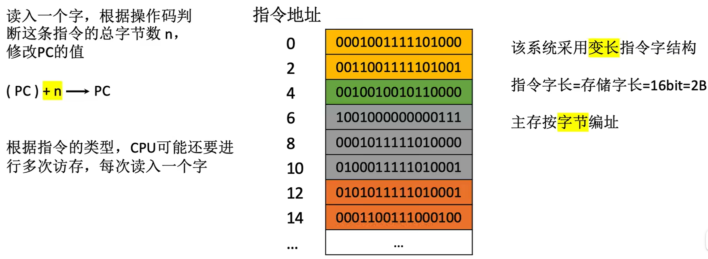
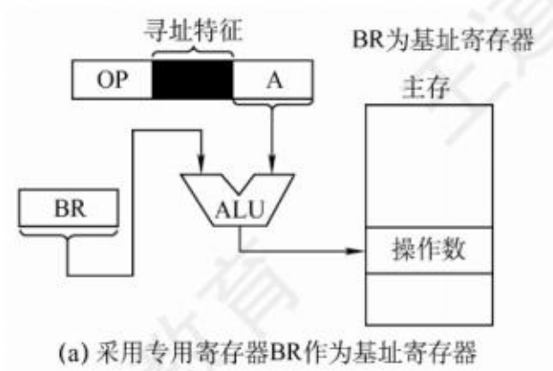

$$指令的寻址方式$$

**寻址方式** 指寻找指令或操作数有效地址的方式。即确定本条指令的数据地址和下一条待执行指令的地址的方法。

- 寻址方式分为 **指令寻址** 和 **数据寻址** 两大类。

# 一、指令寻址

**指令寻址** 指寻找 **下一条** 将要执行的 **指令** 的 **指令地址**。（始终由程序计数器 PC 给出）

- 指令寻址的方式有两种：**顺序寻址** 方式、**跳跃寻址** 方式。

## （一）顺序寻址

**顺序寻址** 通过程序计数器 **PC 加 1**（1 条指令的长度），自动形成下一条指令的地址。

- PC 自增的大小与编址方式、指令字长有关。

- **定长指令字结构**，**按字编址** 的指令寻址：
    

    {width=600}
    

- **定长指令字结构**，**按字节编址** 的指令寻址：
    

    {width=600}
    

- **变长指令字结构**，**按字节编址** 的指令寻址：
    

    {width=600}
    

## （二）跳跃寻址

**跳跃寻址** 通过 **转移类指令** 实现。

- 跳跃的方式有：
  - **绝对转移**：地址码直接指出转移目标地址。
  - **相对转移**：地址码指出转移目的地址相对于当前 PC 值的偏移量。

- 转移指令执行的结果是 **修改 PC 的值**，CPU 根据 PC 的内容去主存取指令。

# 二、数据寻址

**数据寻址** 指如何在指令中表示一个操作数的地址，或怎样计算出操作数的地址。（确定 **本条指令** 的 **地址码指明的真实地址**）

- 指令格式：

    |操作码（OP）|寻址特征|形式地址（A）|
    |:---------:|:-----:|:-----------:|

  - **寻址特征** 字段：指明属于哪种寻址方式（其位数决定了寻址方式的种类）。
  - **形式地址（A）**：指令中的地址码字段不代表操作数的真实地址。
  - **有效地址（EA）**：操作数的真实地址。
  - 形式地址结合寻址方式，可以计算除操作数在存储器中的有效地址。
  - 若是多地址指令，则每个形式地址前都要增加一个寻址特征字段。

- 常见的数据寻址方式有 **直接寻址**、**间接寻址**、**寄存器寻址**、**寄存器间接寻址**、**隐含寻址**、**立即（数）寻址**、**相对寻址**、**基址寻址**、**变址寻址**、**堆栈寻址**。
  - 相对寻址、基址寻址、变址寻址都属于 **偏移寻址**

## （一）直接寻址

**直接寻址**：指令字中的形式地址 A 就是操作数的真实地址 EA，即 EA = A。

{width=400}

- 完成一条指令需要访存两次：取指令、执行指令。

- **优点**：
  - 简单，不需要专门计算操作数的地址。
  - 指令在执行阶段仅访问一次主存。

- **缺点**：A 的位数限制了指令操作数的寻址范围，操作数的地址不易修改。

## （二）间接寻址

**间接寻址**：指令的地址字段给出的形式地址不是操作数的真正地址，而是操作数有效地址所在的存储单元的地址，也就是操作数地址的地址，即 EA = （A）。

{width=500}

- 完成一条指令需要访存三次：取指令访存一次、执行指令访存两次。

- 可以多次间接寻址。如：一次间址、两次间址。

- **优点**：
  - 可扩大寻址范围（有效地址 EA 的位数大于形式地址 A 的位数）。
  - 便于编制程序（用间接寻址可以方便地完成子程序返回）。

- **缺点**：指令在执行阶段要多次访存。（一次间址需要两次访存，多次寻址需根据存储字的最高位确定几次访存）
  - 由于执行速度慢，一般为了扩大寻址范围时，通常采用寄存器间接寻址。

## （三）寄存器寻址

**寄存器寻址**：在指令字中直接给出操作数所在的寄存器编号，即 $EA = R_i$，其操作数在由 $R_i$ 所指的寄存器内。

{width=300}

- 完成一条指令需要一次访存：取指令访存一次、执行指令访存零次。

- **优点**：
  - 指令在执行阶段不访问主存，只访问寄存器，执行速度快。
  - 指令字短且执行速度快，支持向量/矩阵运算（了解即可）。

- **缺点**：寄存器价格昂贵，计算机中寄存器个数有限。

## （四）寄存器间接寻址

**寄存器间接寻址**：寄存器 $R_i$ 中给出的不是一个操作数，而是操作数所在主存单元的地址，即 $EA = (R_i)$。

{width=400}

- 完成一条指令需要两次访存：取指令一次、执行指令一次。

- **优点**：
  - 比一般间接寻址的速度更快，
  - 扩大了寻址范围。
  - 减少了访存次数，在执行阶段仅需访存一次。

- **缺点**：与寄存器寻址相比，指令的执行阶段需要访问主存（因为操作数在主存中）。

## （五）隐含寻址

**隐含寻址**：不是明显地给出操作数的地址，而是在指令中隐含着操作数的地址。（例如 ACC）

{width=400}

- **优点**：有利于缩短指令字长。

- **缺点**：需增加存储操作数或隐含地址的硬件。

## （六）立即（数）寻址

**立即寻址**：形式地址 A 就是操作数本身，又称为 **立即数**，一般采用补码表示。

- **#** 表示立即寻址特征。

{width=300}

- 完成一条指令需要访存一次：取指令访存一次、执行指令访存零次。

- **优点**：指令执行阶段不访问主存，指令执行时间最短，速度最快。

- **缺点**：A 的位数限制了立即数的范围。
  - 如 A 的位数为 n，且立即数采用补码时，可表示的数据范围为 $-2^{n-1}$ ~ $2^{n-1} - 1$

## （七）基址寻址

**基址寻址**：以程序的起始存放地址作为“起点”。
  - 将 CPU 中 **基址寄存器（BR，Base Address Register）** 的内容加上指令格式中的形式地址 A，而形成操作数的有效地址，即 **EA = (BR) + A**。
    - 重定位寄存器就是基址寄存器。
        

        {width=400}
        

  - 有的计算机采用通用寄存器作为基址寄存器。在指令中指明，要将哪个通用寄存器作为基址寄存器使用。
    - 根据通用寄存器总数判断要用几个 bit 指明寄存器。
        

        {width=400}
        

- 完成一条指令需要两次访存：取指令、读 A。

- **优点**：
  - 可扩大寻址范围（基址寄存器的位数大于形式地址 A 的位数）。
  - 用户不必考虑自己的程序存于主存的哪一空间区域，故 **有利于多道程序设计**，以及可用于 **编制浮动程序（整个程序在内存中浮动）**。

- **缺点**：偏移量（形式地址 A）的位数较短。

**注意**：
  - 基址寄存器是 **面向操作系统** 的，其 **内容由操作系统或管理程序确定**。在程序执行过程中，基址寄存器的内容不变（作为基地址），形式地址可变（作为偏移量）。
  - 当采用通用寄存器作为基址寄存器时，可由 **用户决定哪个寄存器作为基址存储器**，但其 **内容仍由操作系统确定**。

## （八）变址寻址

**变址寻址**：程序员自己决定从哪里作为“起点”。

- 有效地址 EA 等于指令字中的形式地址 A 与 **变址寄存器 IX（Index Register）** 的内容相加之和，即 **EA = (IX) + A**。
  - IX 可为 **变址寄存器（专用）**，也可用 **通用寄存器作为变址寄存器**。

{width=300}

- 完成一条指令需要两次访存：取指令、读 A。

**注意**：变址寄存器是 **面向用户** 的，在程序执行过程中，**变址寄存器的内容可由用户改变（IX 作为偏移量）**，形式地址 **A 不变（作为基地址）**。

- **优点**：在数组处理过程中，可设定 A 为数组的首地址，不断改变变址寄存器 IX 的内容，便可很容易形成数组中任一数据的地址，特别适合 **编制循环程序**。

## （九）基址 & 变址复合寻址

先基址后变址寻址：EA = (IX) + ((BR) + A)

**注意**：实际应用中往往需要多种寻址方式复合使用。

## （十）相对寻址

**相对寻址**：以程序计数器 PC 所指地址作为“起点”。

- 把 **程序计数器 PC** 的内容加上指令格式中的形式地址 A 而形成操作数的有效地址，即 **EA = (PC) + A**。
  - **A 是相对于 PC** 所指地址的 **位移量**，可正可负，**补码表示**。

{width=600}

- 完成一条指令需要两次访存：取指令、读 A。

- **优点**：
  - 操作数的地址不是固定的，它随着 PC 值的变化而变化，并且与指令地址之间总是相差一个固定值，因此 **便于程序浮动**（一段代码在程序内部的浮动）。
  - 相对寻址 **广泛应用于转移类指令**。

**注意**：
- 取出当前指令后，PC 会指向下一条指令，相对寻址是相对于下一条指令的偏移。

- 对于转移指令 JMP A，若指令的地址为 X，且占 2B，则在取出该指令后，PC 的值会增 2，即（PC）= X + 2，这样在执行完该指令后，会自动跳转到 X + 2 + A的地址继续执行。

## （十一）堆栈寻址

**堆栈寻址**：操作数存放在堆栈中，隐含使用堆栈指针（SP，Stack Pointer）作为操作数地址。

- 堆栈可分为：
  - **硬堆栈（寄存器堆栈）**：成本高，不适合做大容量的堆栈。
  - **软堆栈**：从主存中划出一段区域来做堆栈。成本低。

- 采用堆栈结构的计算机，大部分指令都表现为无操作数指令的形式。因为操作数地址都隐含使用了 SP。因此在读/写堆栈的前后都伴有自动完成对 SP 的加减操作。

- 硬堆栈在指令执行期间不访存，软堆栈在指令执行期间访存一次。