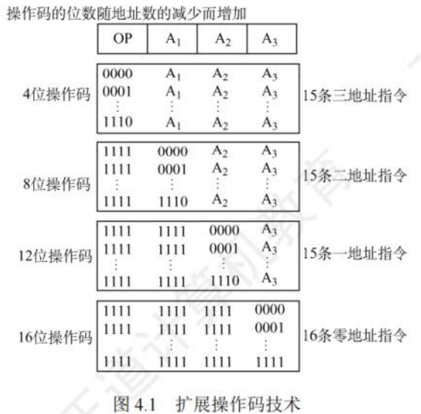
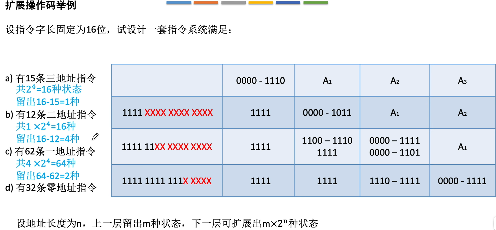

$$指令系统$$

# 一、指令的定义

**机器指令（指令）** 是计算机执行某种操作的命令，是计算机运行的最小功能单位。

**指令系统（指令集）**：一台计算机的所有指令的集合。

- 指令系统是 **指令集体系结构（ISA）** 中最核心的部分。
  - ISA 完整地定义了软件和硬件之间的接口。
  - ISA 规定的内容主要包括:
    - 指令格式、指令寻址方式、操作类型、每种操作对应的操作数的相应规定。
    - 操作数的类型、操作数寻址方式、存放方式（大端方式/小端方式）
    - 程序可访问的寄存器编号、个数、位数
    - 存储空间的大小和编码方式
    - 指令执行过程的控制方式，包括程序计数器、条件码定义等。

**注意**：一台计算机只能执行自己的指令系统中的指令，不能执行其他系统的指令。如：x86 架构（计算机的指令集）、ARM 架构（手机的指令集）。

# 二、指令的基本格式

一条指令是机器语言的一个语句，是一组有意义的二进制代码。

一条指令通常包括 **操作码** 字段和 **地址码** 字段。

|操作码（OP）字段|地址码（A）字段|
|:------------:|:-------------:|

- **操作码**：指出该指令应执行什么操作以及具有何种功能。
  - **定长操作码**：指令系统中所有指令的操作码长度都相同。
    - n 位操作码，可定义 $2^n$ 条指令。
    - 控制器的译码电路设计简单，但灵活性较低。
  - **可变长操作码**：指令系统中各指令的操作码长度可变。
    - 控制器的译码电路设计复杂，但灵活性较高。

- **地址码**：给出被操作的信息（指令或数据）的地址。
  - 包括：参加运算的一个或多个操作数的地址、运算结果的保存地址、程序的转移地址、被调用子程序的入口地址等。
  - n 位地址码的直接寻址范围为 $2^n$。
  - 若指令总长度固定不变，则地址码数量越多，每个地址码位数越少，寻址能力越差。

- **指令字长**：一条指令所包含的二进制代码的位数。取决于操作码的长度、地址码的长度、地址码的个数。
  - **单字长指令**：指令长度等于机器字长的指令。
    - 只需访存一次即可将指令完整取出。耗费一个指令周期。

  - **半字长指令**：指令长度等于半个机器字长的指令。
    - 只需访存一次即可将指令完整取出。耗费一个指令周期。

  - **双字长指令**：指令长度等于两个机器字长的指令。
    - 需要访存两次才能将指令完成取出，耗费两个存取周期。

- **定长指令字结构**：指令系统中所有指令的长度都相等。

- **变长指令字结构**：指令系统中各种指令的长度不等。

根据指令中操作数地址码的数目不同，可将指令分为 **零地址指令**、**一地址指令**、**二地址指令**、**三地址指令**、**四地址指令**。

## （一）零地址指令

**零地址指令** 只给出操作码 OP，没有显示地址。

{width=300}

- 零地址指令有两种常见使用可能：
  1. 不需要操作数的指令。如：空操作指令、停机指令、关中断指令。

  2. 堆栈计算机中才有的的零地址的运算类指令。参与运算的两个操作数隐含地从栈顶和次栈顶弹出，送到运算器进行运算，运算结果再隐含地压入堆栈。（类似用栈实现计算后缀表达式）

## （二）一地址指令

**一地址指令** 给出了操作码 OP 和一个地址 $A_1$。

{width=500}

- 一地址指令有两种常见使用可能：
  1. 只需要单操作数的指令。如：加 1、减 1、取反、求补等。
     - 指令含义：$OP(A_1) \rightarrow A_1$
       - $A_1$ 指某个主存地址。
       - $(A_1)$ 表示 $A_1$ 所指向的地址中的内容。
       - 按 $A_1$ 地址读取操作数，执行 OP 操作后，结果存回原地址。
     - 完成一条指令需要三次访存。取指、读 $A_1$、写 $A_1$。

  2. 需要两个操作数，但其中一个操作数隐含在某个寄存器（如 ACC）中。
     - 指令含义：$(ACC)OP(A_1) \rightarrow ACC$
       - 按指令地址 $A_1$ 可读取源操作数，指令可隐含约定另一个操作数由 ACC 提供，运算结果也将存放在 ACC 中。
     - 完成一条指令需要两次访存。取指、读 $A_1$。

## （三）二地址指令

**二地址指令** 给出了操作码 OP 和一个目的操作数 $A_1$ 和 一个源操作数 $A_2$。

{width=500}

二地址指令常用于两个操作数的算术运算、逻辑运算的相关指令。
- 指令含义：$(A_1)OP(A_2) \rightarrow A_1$
- 目的操作数地址 $A_1$ 还用于保存本次的运算结果。
- 完成一条指令需要访存四次。取指、读 $A_1$、读 $A_2$、写 $A_1$。

## （四）三地址指令

**三地址指令** 给出了两个操作码 $A_1$、$A_2$ 和一个运算结果 $A_3$。

{width=500}

三地址指令常用于需要两个操作数的算术运算、逻辑运算的相关指令。

- 指令含义：$(A_1)OP(A_2) \rightarrow A_3$

- 完成一条指令需要访存四次。取指、读 $A_1$、读 $A_2$、写 $A_3$。

## （五）四地址指令

**四地址指令** 给出了两个操作码 $A_1$、$A_2$ 和一个运算结果 $A_3$ 和下一条将要执行的指令的地址 $A_4$。

{width=500}

- 指令含义：$(A_1)OP(A_2) \rightarrow A_3$，$A_4 = 下一条将要执行指令的地址$
  - 正常情况：取指令后 PC + 1，指向下一条指令。
  - 四地址指令：执行指令后，将 PC 的值修改为 $A_4$ 所指的地址。

- 完成一条指令需要访存四次。取指、读 $A_1$、读 $A_2$、写 $A_3$。

# 三、定长操作码指令格式

**定长操作码指令** 在指令字的最高位部分分配定长的操作码。

- n 位操作码字段的指令系统最大能表示 $2^n$ 条指令。

- **优点**：对于简化计算机硬件设计，提高指令译码和识别速度很有利。
- **缺点**：指令数量增加时会占用更多固定位，留给表示操作数地址的位数受限。

# 四、扩展操作码指令格式

**扩展操作码指令格式** 是采用 **定长指令字结构** 和 **可变长操作码**。

- 扩展操作码使不同地址数的指令使用不同长度的操作码。

{width=400}

- 在设计扩展操作码指令格式时，必须注意两点：
  - **不允许短码是长码的前缀**，即短操作码不能与长操作码的前面部分的代码相同。
  - 各指令的操作码一定不能重复。
- 对使用频率较高的指令，分配较短的操作码；对使用频率较低的指令，分配较长的操作码，从而尽可能减少指令译码和分析的时间。

{width=700}

- **优点**：在指令字长有限的前提下仍保持比较丰富的指令种类。

- **缺点**：增加了指令译码和分析的难度，使控制器的设计复杂化。

# 三、指令的操作类型

指令操作类型按功能可分为：**数据传送类（数据传送）**、**运算类（算术和逻辑运算**、**移位操作**）、**程序控制类（转移操作）**、**输入输出类（输入输出操作）**。

1. **数据传送**：
   - **LOAD**：从内存单元读取数据到 CPU 寄存器。
   - **STORE**：从 CPU 寄存器写数据到内存单元。
   - **MOV**：寄存器之间的传送。
   - **PUSH**：进栈操作。
   - **POP**：出栈操作。

2. **算术逻辑操作**：
   - **算术**：**加（ADD）**、**减（SUB）**、**乘（MUL）**、**除（DIV）**、**加 1（INC）**、**减 1（DEC）**、**求补**、**浮点运算**、**十进制运算**。
   - **逻辑**：**与（AND）**、**或（OR）**、**取反（NOT）**、**异或（XOR）**、**位操作**、**位测试**、**位清除**、**位求反**。

3. **移位操作**：**算数移位**、**逻辑移位**、**循环移位（带进位和不带进位）**。

4. **转移操作**：
   - **无条件转移（JMP）**：在任何情况下都执行转移操作。
   - **条件转移（BRANCH）**：仅在特定条件满足时才执行转移操作。转移条件一般是某个标志位的值，或几个标志位的组合。
   - **调用（CALL）**：必须保存下一条指令的地址（返回地址），当子程序执行结束时，根据返回地址返回到主程序继续执行。
     - 转移指令不用返回执行。
   - **返回（RET）**
   - **陷阱（TRAP）**

5. **输入输出操作**：完成 CPU 与外部设备交换数据或传送控制命令及状态信息。