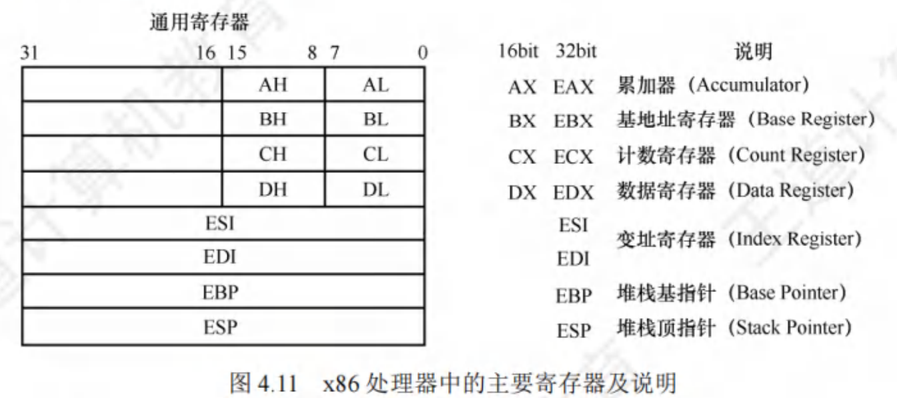

<font size = 9>$$程序的机器级代码表示$$</font>


一条 **指令** 由 **操作码** 和 **地址码** 组成。

- **操作码** 指明执行什么 **处理操作**。

- **地址码** 指明 **数据的存放位置**。
  - 在 **寄存器** 里。在汇编指令中，给出 **寄存器名**。
    - 通用寄存器：**EAX、EBX、ECX、EDX**
    - 变址寄存器：**ESI、EDI**
    - 堆栈寄存器：**EBP、ESP**
  - 在 **主存** 里。在汇编指令中，给出 **读写长度**、**主存地址**
    - **dword ptr[地址] // 32 bit**
    - **word ptr[地址] // 16 bit**
      - 32 位或 64 位体系结构都是由 16 位扩展而来，因此  word（字）表示 16 位。
    - **byte ptr[地址] // 8 bit**
  - 在 **指令** 里。在汇编指令中，直接给出 **常量**，即“立即寻址”。
    - 可用十进制表示，也可用十六进制（常以 h 结尾）。

# 一、相关寄存器

x86 处理器中有 8 个 32 位寄存器。

<div align=center>

{width=700}
</div>

- EAX、EBX、ECX、EDX 的高两位字节和低两位字节可以独立使用。
  - 如：EAX 的低两位字节称为 AX。AX 的高低字节可分别作为两个 8 位寄存器 AH 和 AL。


# 二、汇编指令格式

一般有两种不同的汇编格式：**AT&T 格式** 和 **Intel 格式**。

- **AT&T 格式**：UNIX、LINUX 的常用汇编格式。

- **Intel 格式**：Windows 的常用汇编格式。

<div align=center>

{width=700}
</div>

- AT&T 格式的指令只能用小写字母。
- Intel 格式的指令对大小写不敏感。

- AT&T 格式中，第一个为源操作数，第二个为目的操作数，方向从左到右。
- Intel 格式中，第一个为目的操作数，第二个为源操作数，方向从右到左。

- AT&T 格式中，寄存器需要加前缀 “%”，立即数需要加前缀 “$”。
- Intel 格式中，寄存器和立即数都不需要加前缀。

- AT&T 格式中，内存寻址时使用 “( )”。
- Intel 格式中，内存寻址时使用 “[ ]”。


# 三、常用的 x86 汇编指令

汇编指令通常可分为 **算术和逻辑运算指令**、**数据传送指令**、**控制流指令**。


## （一）常见的算术运算指令

<div align=center>

{width=700}
</div>

- **d 目的操作数**：destination 目的地。
  - 目的操作数 d 不可以是常量。

- **s 源操作数**：source 来源地。

- 除法运算时，需要把被除数扩展为 64 位，然后把它放在 EAX、EBX 两个寄存器中。

- 不允许两个操作数都在主存中，确保每条指令不要访存太多次。


## （二）常见的逻辑运算指令

<div align=center>

{width=700}
</div>


## （三）常见的数据传送指令

1. **mov 指令**：将第二个操作数（寄存器的内容、内存中的内容、常数值）复制到第一个操作数（寄存器或内存）。

    ```
    mov <reg>,<reg>
    mov <reg>,<mem>
    mov <mem>,<reg>
    mov <reg>,<con>
    mov <mem>,<con>
    ```

    - **\<reg>**：表示任意寄存器。若其后带有数字，则指定其位数。
    - **\<mem>**：表示内存地址。
    - **\<con>**：表示 8 位、16 位、32 位常数。

2. **push、pop 指令**
**push、pop** 指令实现入栈、出栈操作。
   - x86 默认以 **4 字节** 为单位。
   - 指令格式：
     - **Push x**：先让 esp 减 4，再将 x 压入。
       - x 可以是立即数、寄存器、主存地址。
     - **Pop y**：**栈顶元素出栈，写入到 y**，再让 **esp 加 4**。
       - y 可以是寄存器、主存地址。


## （四）控制流指令

1. **无条件转移指令 —— jmp 指令**
    ```
    jmp <地址>

    jmp 128
    jmp eax
    jmp [999]

    jmp NEXT

    NEXT：  // 用标号锚定位置。
    mov ecx,eax
    ```
   - jmp 指令控制 IP 无条件转移到<地址>
     - 在 Intel x86 处理器中，程序计数器 PC（Program Counter）通常被称为 IP（Instruction Pointer）。
     - <地址> 可以用常数、寄存器、主存给出。
     - <地址> **可以用“标号”锚定**。
       - 标号的名字可以自己取，然后后面加冒号。

2. **条件转移指令 —— jcondition 指令**
条件转移指令，依据 CPU 状态字中的一系列条件状态转移。
    <div align=center>

    {width=600}
    </div>

   - 条件转移指令一般要和 cmp 指令一起使用。
        <div align=center>

        {width=500}
        </div>

3. **cmp 指令**
    ```
    cmp a,b  // 比较 a 和 b 两个数
    ```
    - a、b 两个数可能来自寄存器、主存、常量。
    - cmp 指令的底层原理：本质上是进行 a - b 减法运算，并生成标志位 OF、ZF、CF、SF。
        <div align=center>

        {width=700}
        </div>

4. **call、ret 指令**
   - 函数 **调用** 指令：**call <函数名>**
     - 将 **IP 旧值** 压栈保存（保存在函数的栈帧顶部）
     - 设置 **IP 新值**，无条件转移至被调用函数的第一条指令。
   - 函数 **返回** 指令：**ret**
     - 从函数的栈帧顶部找到 **IP 旧值**，将其出栈并恢复 IP 寄存器。


# 四、选择语句的机器级表示

- 选择语句机器级表示（先 else 后 if）
    <div align=center>

    {width=700}
    </div>

- 选择语句机器级表示（先 if 后 else）
    <div align=center>

    {width=700}
    </div>


# 五、循环语句的机器级表示

- 用条件转移指令实现循环语句。需要四个部分构成：
  1. 循环前的初始化。
  2. 是否直接跳过循环？
  3. 循环主体。
  4. 是否继续循环。

  <div align=center>

  {width=700}
  </div>

- 用 loop 指令实现循环语句。
    <div align=center>

    {width=700}
    </div>

  - 理论上，能用 loop 指令实现的功能，一定能用条件转移指令实现。
  - 使用 loop 指令会使代码更清晰简洁。
  - loopx 指令（如：loopnz，looppz）
    - loopnz：当 ecx != 0 && ZF == 0 时，继续循环。
    - loopz：当 ecx != 0 && ZF == 1 时，继续循环。


# 六、函数（过程）调用的机器级表示

## （一）栈帧内部的内容
 - 函数的 **栈帧（Stack Frame）**：保存函数大括号内定义的 **局部变量**、保存 **函数调用相关的信息**。
   - **一个栈帧** 对应 **一层函数**，用于存储每层函数相关的一些信息。
   - **栈底** 在 **高地址** 方向、**栈顶** 在 **低地址** 方向。
   - 以 **4 字节为单位**，操作栈帧。

- 一个栈帧可能包含：
  - **栈帧最底部** 一定是 **上一层栈帧基址**（ebp 旧值）。
  - **栈帧最顶部** 一定是 **返回地址**（当前函数的栈帧除外）。
  - 通常将 **局部变量** 集中存储在 **栈帧底部区域**。
    - C 语言中越靠前定义的局部变量越靠近栈顶。
  - 通常将 **调用参数** 集中存储在 **栈帧顶部区域**。
    - 参数列表中越靠前的参数越靠近栈顶。
  - gcc 编译器将每个栈帧大小设置为 16B 的整数倍（当前函数的栈帧除外），因此栈帧内可能出现 **空闲未使用** 的区域。

<div align=center>

{width=700}
</div>


## （二）发起调用、返回
使用 **call、ret 指令** **切换栈帧**。
- 函数 **调用时** 在函数开头执行：
    ```
    push ebp  // 保存上一层函数的栈帧基址（ebp 旧值）
    mov ebp,esp  // 设置当前函数的栈帧基址（ebp 新值）
    ```
    等价于 **enter 指令**。
    - 在每个函数开头都要执行 enter 指令。
- 函数 **返回时** 执行：
    ```
    mov esp,ebp  // 让 esp 指向当前栈帧的底部
    pop ebp  // 将 esp 所指元素出栈，写入寄存器 ebp
    ```
    等价于 **leave 指令**。
    - 在每个函数 ret 之前都要执行 leave 指令。
    **注意**：每个 **栈帧底部**，用于保存 **上一层栈帧的基址**。


## （三）访问栈帧内容

<div align=center>

{width=700}
</div>

- 除了 main 函数，其他所有函数的汇编代码结构都一样。

1. 使用 **EBP、ESP 寄存器** 标记 **栈帧范围**。
   - **堆栈基指针 EBP**：指向当前栈帧的 **底部**。
   - **堆栈顶指针 ESP**：指向当前栈帧的 **顶部**。
   - 对栈帧内数据的访问，都是基于 EBP、ESP 进行的。
   - x86 系统中，默认以 **4 字节** 为栈的操作单位。

2. 使用 **push、pop 指令** 访问 **栈帧数据**。
   - **Push x**：先让 esp 减 4，再将 x 压入。
     - x 可以是立即数、寄存器、主存地址。
   - **Pop y**：**栈顶元素出栈，写入到 y**，再让 **esp 加 4**。
     - y 可以是寄存器、主存地址。

3. 使用 **mov 指令** 访问 **栈帧数据**。
   - 可以用减法/加法指令，即 sub/add 修改栈顶指针 esp 的值。

