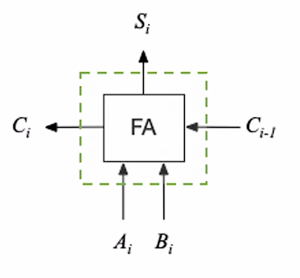
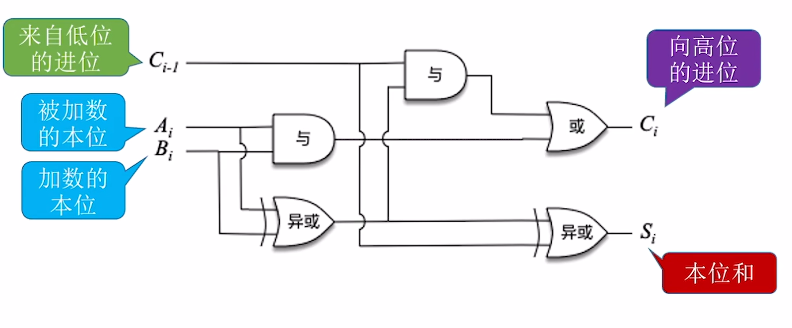
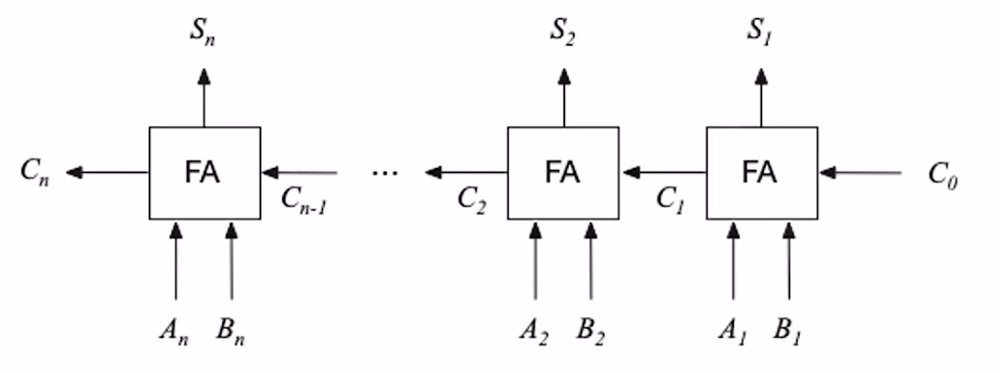
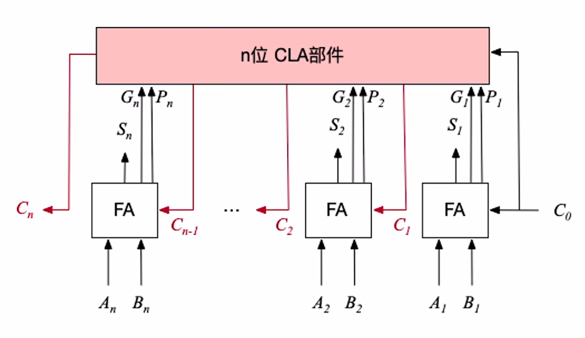
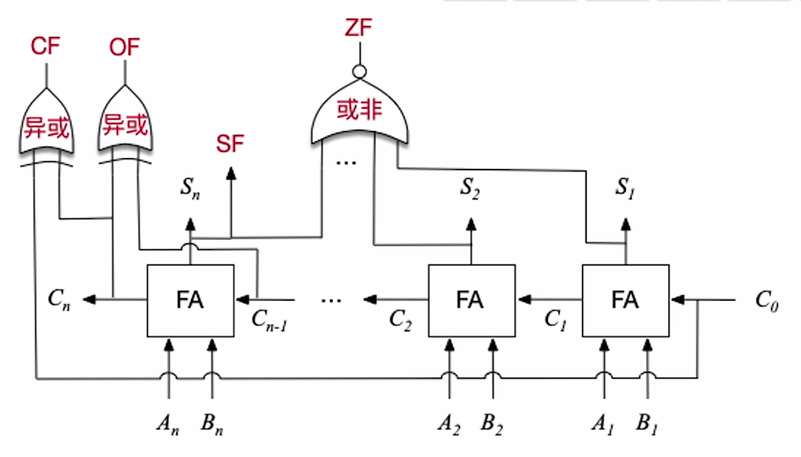
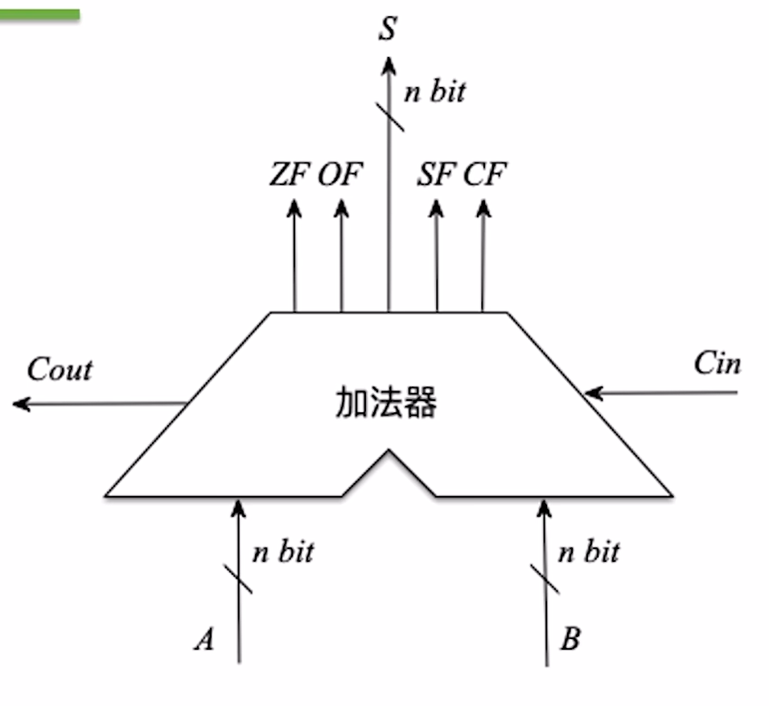
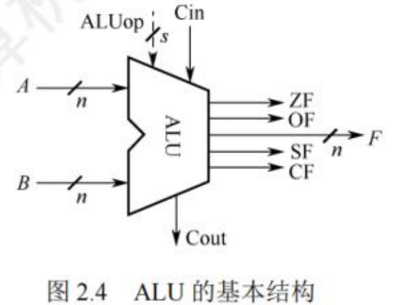

$$基本运算部件$$

**运算器** 由 **算数逻辑单元（ALU）**、**移位器**、**状态寄存器（PSW）** 和 **通用寄存器** 等组成。

- 运算器的 **基本功能** 包括：
  - **加、减、乘、除四则运算**
  - **与、或、非、异或等逻辑运算**
  - **移位、求补**

- **ALU 是运算器的核心**。ALU 的核心部件是 **加法器**。

# 一、一位全加器

**全加器（FA）** 是最基本的加法单元。只支持 1 bit 加。
- 有 **加数 $A_i$**、**加数 $B_i$**、**低位传来的进位 $C_{i-1}$** 共三个输入。
- 有 **本位和 $S_i$** 和 **向高位的进位 $C_i$** 共两个输出。

- **和表达式**：**$S_i = A_i \bigoplus B_i \bigoplus C_{i-1}$**（当 $A_i$、$B_i$、$C_{i-1}$ 中有奇数个 1 时，$S_i =1$，否则 $S_i = 0$，即异或运算的特性）

- **进位表达式**：**$C_i = A_i B_i + (A_i \bigoplus B_i)C_{i-1}$**

- 门电路图像符号为：

    

    {width="300px"}
    

- 内部实现细节：

    

    {width="600px"}
    

# 二、串行进位加法器

**串行进位加法器** 是将 n 个全加器相连得到的 n 位加法器。可支持 n bit 加。

- **串行进位（行波进位）** 指进位信息是串行产生的，每级进位直接依赖于前一级的进位。
- 计算速度取决于进位产生和传递的速度。位数越多，运算速度越慢。
- 电信号要达稳态需要一定时间，因此进位产生速度会有延迟。

{width="600px"}

# 三、并行进位加法器

**n 位并行进位加法器** 是将 **n 个一位全加器** 连接上 **n 位先行进位部分（CLA 部件）**。

- **CLA部件** 的作用是并行产生进位，即 **n 位进位信息几乎是同时产生的**。

- **并行进位（先行进位）加法器** 可以加快进位产生的速度，进而提升加法运算产生结果的速度。

{width="600px"}

# 四、带标志位加法器

**带标志加法器** 是在并行加法器的基础上，增加电路逻辑，输出 n bit 的加法结果和 OF、SF、ZF、CF 等标志位。

- 为了标志 **加法运算是否发生溢出**、**运算结果的正负性**、**运算结果是否为 0**，就需要增加相应的标志信息：**溢出标志 OF**、**进位/借位标志 CF**、**符号标志 SF**、**零标志 ZF**。

- 带标志位加法器的门电路图像符号（右）及其内部实现细节（左）
    

    {width="480px"} {width="300px"}
    

- **溢出标志 OF（Overflow Flag）**：用于判断 **有符号数** 的 **加减运算是否溢出**。
  - **OF = 0**，表示 **未溢出**。
  - **OF = 1**，表示 **溢出**。
  - $OF = C_n \bigoplus C_{n-1}$，即 $最高位的进位 \bigoplus 次高位的进位$。

- **符号标志 SF（Sign Flag）**：用于表示 **有符号数** 的 **加减运算结果的正负性**。
  - **SF = 0**，表示 **结果为正**。
  - **SF = 1**，表示 **结果为负**。
  - $SF = S_n$，即区运算结果的最高位（符号位）。

- **零标志 ZF（Zero Flag）**：用于判断 **加减运算结果是否为 0**。
  - **ZF = 1**，表示 **结果为 0**。
  - **ZF = 0**，表示 **结果为非 0**。
  - $ZF = \overline{S_n + ... + S_2 + S_1}$，仅当运算结果所有 bit 全为 0 时，ZF 才为 1，表示运算结果为 0。

- **进位/错位标志 CF（Carry Flag）**：用于判断 **无符号数** 的 **加减运算是否发生溢出**。
  - **CF = 0**，表示 **未溢出**。
  - **CF = 1**，表示 **溢出**。
  - $CF = C_{out} \bigoplus C_{in} = C_n \bigoplus C_0$

# 五、算术逻辑单元（ALU）

**算术逻辑单元（Arithmetic and Logic Unit，ALU）** 是一种功能较强的组合逻辑电路，它能进行多种算数运算和逻辑运算。

- **ALU 是运算器的核心**。

- **加法器是 ALU 的核心**。因为加减乘除等运算都要基于加法来实现。

- ALU 的 **功能**：
  - **算术运算**：加、减、乘、除等。
  - **逻辑运算**：与、或、非、异或、移位等。
  - **其他**：求补码、直送（输入后不做任何处理输出）等。

{width="300"}

- A 和 B 是两个 n 位操作数输入端。

- $C_{in}$ 是进位输入端、$C_{out}$ 是进位输出端。

- ALUop 是操作控制端（发出控制信号），用来决定 ALU 所执行的处理功能。
  - ALUop 的位数决定了操作的种类。

**注意**：
- 如果 **ALU 支持 k 中功能**，则 **控制信号位数 $m \geq \lceil log_2 k \rceil$**

- **ALU 的运算数、运算结果位数** 与计算机的 **机器字长** 相同。
  - 计算机的机器字长一般是由 ALU 的运算位数（或通用寄存器位数）来决定的。

- **ZF/OF/SF/CF 标志位**，用于表示本次运算结果的特征。
  - 这些 **标志信息通常会被送入 PSW 程序状态寄存器**（又称为 **标志寄存器 FR**）中。