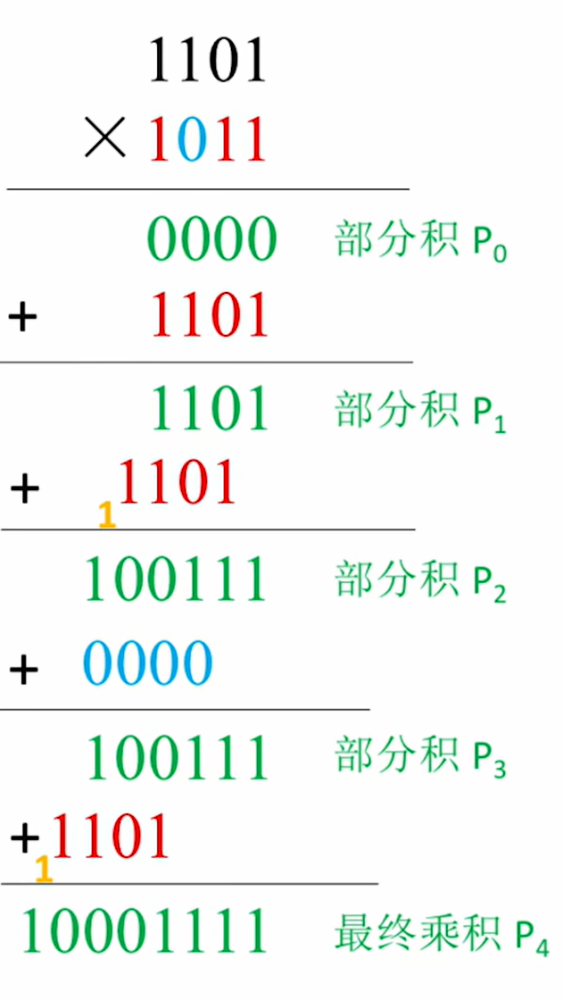
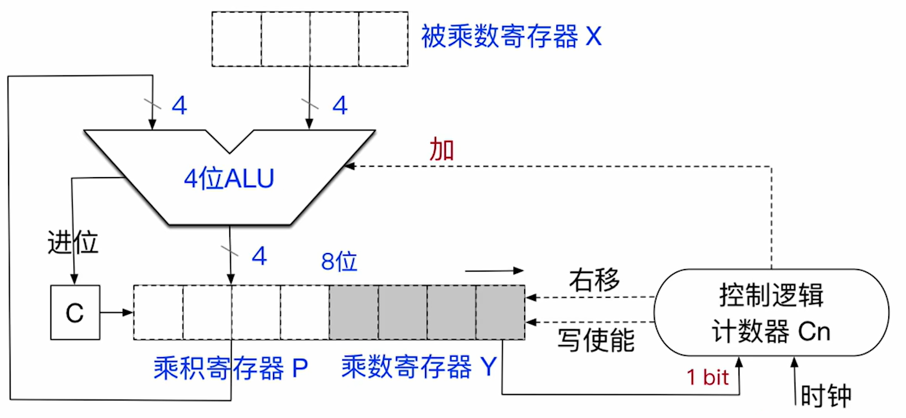
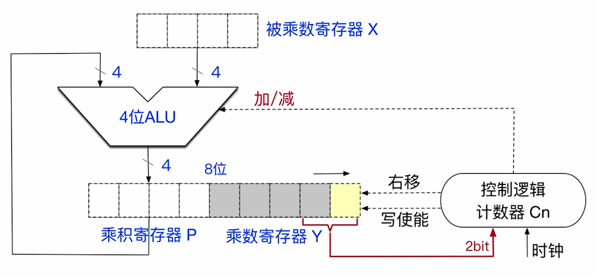
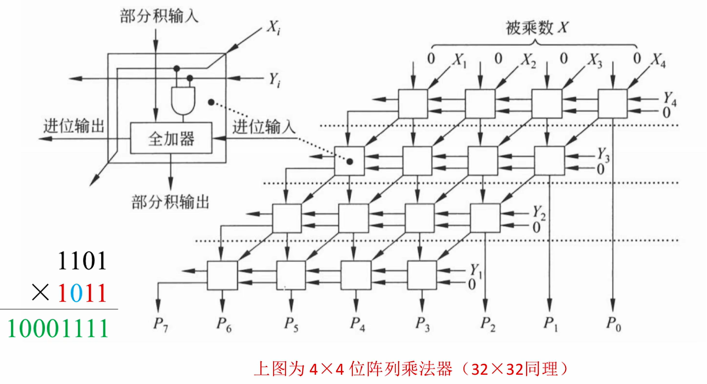

<font size = 9>$$定点数的乘法运算$$</font>


计算机实现乘法运算有三种方式：
1. **由 ALU、移位器、寄存器、控制逻辑组成的乘法电路**
2. **阵列乘法器**（快速乘法器的一种）
3. **用移位运算、加/减运算等效实现乘法**（软件方式）


# 一、无符号整数的乘法运算

计算机中无符号整数的乘法运算原理本质上是模拟无符号整数乘法的手算过程 —— **逐位相乘，错位相加**。

## （一）基本原理

无符号整数（二进制）的手算方法为 **逐位相乘，错位相加**。
- 两个 n bit 无符号数的乘法运算可 **拆解为 n 轮加法运算**。
- 根据乘数的各个 bit 的值，决定每一轮加法运算是 **加被乘数** 还是 **加全 0**。
- 注意每一轮加法运算需要与上一轮加法运算的结果 **错位相加**。
<div align=center>

{width="300px"}
</div>


## （二）无符号数的乘法运算电路

- **ALU**：是乘法器的核心部件，对 **乘积寄存器 P** 和 **被乘数寄存器 X** 的内容做 **无符号加法运算**，结果送回 **乘积寄存器 P**，进位存放在 **C** 中。

- **被乘数寄存器 X**：存放被乘数。

- **乘积寄存器 P**：保存本轮加法的结果，和乘法结果的 2n bit 中的的高 n 位。**初始置为 0**。支持移位功能。

- **进位位 C**：保存本轮加法产生的进位。

- **乘数寄存器 Y**：存放乘数，和乘法结果的 2n bit 中的低 n 位。支持移位功能。
  - **1 bit**：控制逻辑根据 1 bit（Y 的最低位）决定本轮该如何处理。

- **计数器 $C_n$**：保存剩余循环次数。初值为乘数的位数。每循环一次减 1。

- **控制逻辑**：根据乘数寄存器 Y 的最低位，发出控制信号。
  - **右移**：控制信号，控制 [C，P，Y] 实现同步逻辑右移。
  - **写使能（Write Enable）**：控制信号，控制寄存器 P 运行被写入。
  - **加**：控制信号，控制 ALU 执行加法运算。

- **时钟**：相当于给这些硬件打节奏，按一定的节奏运行。
  - **该电路实现 n bit 无符号数相乘，至少需要 n 个时钟**。
  - 由 ALU、移位器、寄存器、控制逻辑组成的乘法电路的改进方案：**可以实现“两位乘法”，每轮处理乘数寄存器 Y 的末尾的 2 bit，此时仅需 $n \over 2$ 个时钟即可完成运算**。

<div align=center>

{width=600}
</div>

## （三）计算机中无符号整数的乘法运算过程

1. **开始**：
   1. 将 **被乘数、乘数分别放入寄存器 X、Y** 中
   2. **乘积寄存器 P 置为 0**
   3. **计数器 $C_n$ 的初始值为 n**（n 为乘数的位数）。
   - **特殊情况**：当被乘数、乘数中有一个为全 0 时，结果直接得 0，不需要在进行后续的运算步骤。

2. **重复 n 轮** 加法、移位运算，直到计数器 $C_n = 0$：
   1. 将 **乘数寄存器 Y 的最低位** 送入 **控制逻辑** 进行判断
   2. - 若 Y 的 **最低位为 1**，则 **执行加法**，**运算结果写回 P**（注意加法产生的进位需保存至进位触发器 C）；
      - 若 Y 的 **最低位为 0**，则 **什么也不做**。
   3. 将 [C, P, Y] 视为整体，**逻辑右移一位**。
   4. **计数器 $C_n$ 减 1**。

3. **结束**（计数器 **$C_n = 0$**）：
   1. 乘法运算的结果 **用 2n 位暂存**（寄存器 P、寄存器 Y）
   2. 在很多计算机架构中，通常仅保留 **低 n 为作为乘积结果**（因此，运算结果可能发生 **溢出**）。


## （四）溢出判断

两个 n bit **无符号整数相乘**，运算 **结果用 2n bit 暂存**。通常仅保留低 n 位作为乘法运算结果。

- 若 **高 n 位不全为 0**，说明 **发生溢出**，此时 **将 OF 标志位（溢出标志位）置为 1**，否则 **置为 0**。
- 若 **高 n 位全为 0**，说明 **未溢出**，此时 **将 OF 标志位（溢出标志位）置为 0**。


## （五）溢出处理

无符号整数乘法的溢出处理有两种方法：

1. 程序员可以选择 **忽略溢出**，只不过这样会导致错误的运行结果。
2. 如果想要 **处理溢出** 这种 **异常**，可以在 **乘法指令之后** 执行一条 **溢出自陷指令**。
   - **溢出自陷指令** 会 **检查 OF 标志位**，若 **OF == 1**，就执行操作系统的 **异常处理程序**。


# 二、有符号整数的乘法运算

计算机中的有符号整数（补码）的乘法运算可以用 **补码一位乘法**。

- **补码一位乘法（布斯 Booth 乘法）**：每轮处理只处理乘数的一个 bit。

- 计算机中 **有符号整数** 都用 **补码** 表示。


## （一）有符号数的乘法运算电路

- 乘数寄存器 Y 的低位增加一个 **辅助位**。
  - **2 bit**：控制逻辑根据 2 bit（Y 的最低位、辅助位）决定本轮该如何处理。

- **取消了进位位 C**，不保存最高位产生的进位信息。

- **加/减**：控制信号，控制 ALU 执行加/减法运算。

<div align=center>

{width=600}
</div>


## （二）计算机中有符号整数的乘法运算过程

1. **开始**：
   1. 将 **被乘数、乘数** 分别放入 **寄存器 X、Y**
   2. **乘积寄存器置为 0**，**辅助位置为 0**
   3. **计数器 $C_n$ 的初始值置为 n**（n 为乘数的位数）
   - **特殊情况**：当被乘数、乘数中有一个为全 0 时，结果直接得 0，不需要再进行后续的运算步骤。

2. **重复 n 轮加/减法、移位** 运算，直到计数器 $C_n = 0$：
   1. 将 **乘数寄存器 Y 的最低位**、**辅助位**，**2 bit** 送入“控制逻辑”进行判断。
   2. 根据 **寄存器 Y 的最低位**、**辅助位**，决定是 **加 $[x]_补$** 还是 **减 $[x]_补$** 还是 **加 0（什么都不做）**
      - |寄存器 Y 最低位|辅助位|本轮操作|
        |:------------:|:---:|:------:|
        |0|0|加 0|
        |0|1|加 $[x]_补$|
        |1|0|减 $[x]_补$|
        |1|1|加 0|
   3. 将 [P，Y，辅助位] 视为整体，**算术右移一位**。
   4. **计数器 $C_n$ 减 1**。

3. **结束（计数器 $C_n = 0$）**：
   1. 乘法运算的结果 **用 2n 为暂存**（寄存器 P、寄存器 Y）
   2. 在很多计算机架构中，通常仅保留 **低 n 位作为乘积结果**（因此，运算结果可能发生 **溢出**）。


## （三）溢出判断

### 1. 手算判断

$n$ bit 有符号整数（补码） **表示范围为 $-2^{n-1}$ ~ $2^{n-1} -1$**，超出此范围则 **溢出**。


### 2. 计算机判断

两个 n bit **带符号整数相乘**，运算 **结果用 2n bit 暂存**。通常仅保留低 n 位作为乘法运算结果。

- 若 **高 n + 1位不完全相同**，说明 **发生溢出**，此时 **将 OF 标志位（溢出标志位）置为 1**。
- 若 **高 n + 1位完全相同**，说明 **未溢出**，此时 **将 OF 标志位（溢出标志位）置为 0**。

**注意**：无符号整数和有符号整数的乘法都是用 OF 标志位进行记录。


## （四）溢出处理

有符号整数乘法的溢出处理有两种方法：

1. 程序员可以选择 **忽略溢出**，只不过这样会导致错误的运行结果。
2. 如果想要 **处理溢出** 这种 **异常**，可以在 **乘法指令之后** 执行一条 **溢出自陷指令**。
   - **溢出自陷指令** 会 **检查 OF 标志位**，若 **OF == 1**，就执行操作系统的 **异常处理程序**。


# 三、阵列乘法器

**阵列乘法器** 是一种快速乘法器，采用硬件叠加的方式，所有部分级同时产生并组成一个阵列，在运用多操作数相加，就能得到最终的积。

- **阵列乘法器可以在 1 个时钟内完成乘法运算**。

- 很多 **快速乘法器** 都可以在 1 个时钟内完成乘法运算。

<div align=center>

{width=600px}
</div>


# 四、用逻辑运算、加/减运算等效实现乘法

用移位运算、加法运算等效实现 32 bit 无符号数乘法：
```
unsigned int multiply_unsigned(unsigned int x,unsigned int y) {
   unsigned int result = 0;
   for(int i = 0; i < 32; i ++) {
      // 提取乘数 Y 的最低位
      unsigned int bit = y & 1;

      // 如果当前位为 1，加上被乘数 x
      if(bit) {
         result += x;
      }

      // 被乘数 x 左移一位，乘数 y 右移一位
      x <<= 1;
      y >>= 1;
   }
   return result;
}
```

- **优点**：在没有乘法运算电路、不支持乘法指令的计算机中，也可以等效实现乘法效果。

- **缺点**：运算 **速度很慢**。（在非流水线计算机中，每条指令的执行都至少需要 1 个时钟）