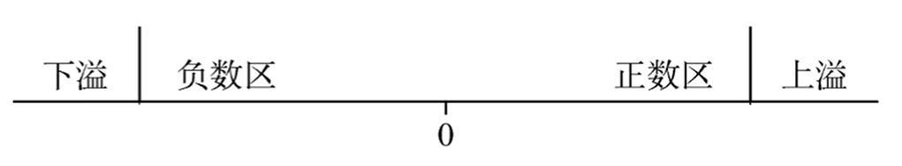
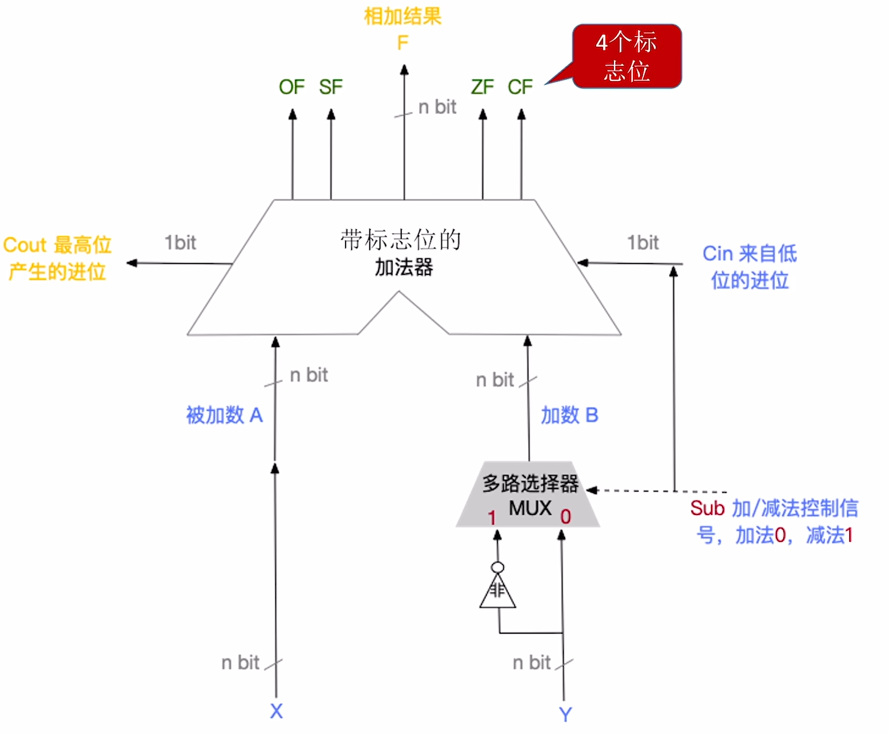

$$定点数的加减运算$$

计算机中可以 **用原码和补码** 进行 **定点数的加减运算**，**不会用反码** 进行加减运算。

# 一、原码的加减法运算

- **加法规则**：
  - 符号位 **相同**，则 **数值位相加**，结果 **符号位不变**。
    - 若最高数值位相加产生进位，则发生 **溢出**。
  - 符号位 **不同**，则 **绝对值大的减去绝对值小的**，结果 **符号位与绝对值大的数相同**。

- **减法规则**：
  - 先将 **减数** 的 **符号取反**
  - 在将 **被减数** 与 **符号取反后的减数** 按原码的 **加法** 进行运算。

**注意**：原码的加减运算规则实现较复杂，需要将符号位和数值位分开处理。所以计算机采用的是 **补码的加减运算**。

# 二、补码的加减法运算

## （一）运算规则
设 **机器字长为 $n$**

- **加法规则**：
  - **两个数的补码直接相加**。
  - $[A + B]_补 = [A]_补 + [B]_补（mod 2^n）$

- **减法规则**：
  - **被减数与减数的负数补码相加**。
  - $[A - B]_补 = [A]_补 + [-B]_补（mod 2^n）$

- 由 $[x]_补$ 快速求 $[-x]_补$ 的方法：符号位、数值位全部取反，末位加一。

- 符号位与数值位一起参加运算，最终运算结果的高位丢弃，保留 n 位，运算结果也是补码。

## （二）溢出判断

若机器字长为 n，则n位补码整数表示的范围为 $-2^{n-1}$ ~ $2^{n-1} - 1$

{width="400px"}

- 只有 $正数 + 正数$ 才会 **上溢**（超过补码正数的范围），即结果的符号位为负。
- 只有 $负数 + 负数$ 才会 **下溢**（超过补码负数的范围），即结果的符号位为正。

补码定点数加减运算溢出判断的方法有三种：**采用一位符号位**、**采用一位符号位根据数值位的进位情况判断溢出**、**采用双符号位**。

### 1. 采用一位符号位（模 2 补码）

设 **操作数 $A$** 的符号位为 **$A_s$**，**操作数 $B$** 的符号位为 **$B_s$**，**运算结果** 的符号位为 **$S_s$**，则溢出逻辑表达式为：
**$$V = A_s B_s \overline{S_s} + \overline{A_s} \: \overline{B_s} S_s$$**

- 若 **V = 0**，表示 **无溢出**。
- 若 **V = 1**，表示 **有溢出**。
- 只要参加操作的两个数的符号相同，结果又与原操作数的符号不同，则表示溢出。

### 2. 采用一位符号位根据数值位的进位情况判断溢出

根据 **符号位（最高位）的进位 $C_n$** 与 **最高数位（次高位）的进位 $C_{n-1}$** 是否相同来判断溢出，逻辑表达式为：

**$$V = C_n \bigoplus C_{n-1}$$**

- 若 **V = 0**，则 $C_n$ 与 $C_{n-1}$ **相同**，说明 **无溢出**。
- 若 **V = 1**，则 $C_n$ 与 $C_{n-1}$ **不相同**，说明 **有溢出**。

### 3. 采用双符号位（模 4 补码）

为每个数设置 **两个符号位**，记一个符号位为 **$S_{S1}$**，另一个符号位为 **$S_{S2}$**，则溢出逻辑表达式为：

**$$V = S_{S1} \bigoplus S_{S2}$$**

- 若 **V = 0**，表示 **无溢出**。
  - $S_{S1}S_{S2} = 00$，表示结果为正数，无溢出。
  - $S_{S1}S_{S2} = 11$，表示结果为负数，无溢出。
- 若 **V = 1**，表示 **有溢出**。
  - $S_{S1}S_{S2} = 01$，表示结果正溢出。
  - $S_{S1}S_{S2} = 00$，表示结果负溢出。

- 最高位符号（$S_{S1}$）代表真正的符号
- 次位符号（$S_{S2}$）代表结果得出的错误符号

- 两个符号位在实际存储时只存储一个符号位，运算前会复制另一个符号位。

# 三、无符号数的加减运算

## （一）运算规则

无符号整数的 **加法**：
- 从最低位开始，**按位相加**，并往更高位 **进位**。

无符号整数的 **减法**：
1. 被减数不变，**减数全部位按位取反，末位加一**（变为减数的补数），**减法变为加法**。
2. 从最低位开始，**按位相加**，并往更高位 **进位**。

## （二）溢出判断

### 1. 手算判断

$n$ bit 无符号整数 **表示范围 0 ~ $2^n -1$**，超出此范围则 **溢出**。

### 2. 计算机判断

无符号数 **加法** 的溢出判断：
- **最高位产生的进位 = 1 时，发生溢出，否则未溢出**。

无符号数 **减法** 的溢出判断：
- 减法变加法，**最高位产生的进位 = 0 时，发生溢出，否则未溢出**。

# 四、加减运算电路

**无符号数与有符号数加/减运算能用同一个加法器**
- **补码** 加减运算
  - n bit **补码 X + Y**，按位相加即可。
  - n bit **补码 X - Y**，将减数 **Y 全部按位取反，末位加一**，得到 $[-Y]_补$，减法变为加法。

- **无符号整数** 加减运算
  - n bit **无符号数 X + Y**，按位相加即可。
  - n bit **无符号数 X - Y**，将减数 **Y 全部按位取反，末位加一**，减法变为加法。

{width="600px"}

- **溢出标志 OF（Overflow Flag）**：用于判断 **有符号数** 加减运算是否溢出。
  - **OF = 1**，表示 **溢出**。
  - **OF = 0**，表示 **未溢出**。

- **符号标志 SF（Sign Flag）**：用于判断 **有符号数** 加减运算结果的正负性。
  - **SF = 1**，表示 **结果为负**。
  - **SF = 0**，表示 **结果为正**。

- **零标志 ZF（Zero Flag）**：用于判断 **有符号数和无符号数** 加减运算结果是否为 0。
  - **ZF = 1**，表示 **结果为 0**。
  - **ZF = 0**，表示 **结果不为 0**。

- **进/错位标志 CF（Carry Flag）**：用于判断 **无符号数** 加减运算是否溢出。
  - **CF = 1**，表示 **溢出**。
  - **CF = 0**，表示 **未溢出**。

# 五、无符号数大小的比较

假设有两个无符号数 $A$ 和 $B$，进行 **$A - B$**
  - 当 **$ZF = 1$** 时，说明 **$A = B$**。
  - 当 **$ZF = 0$ 且 $CF = 0$** 时，说明 **$A > B$**。
  - 当 **$CF = 1$** 时，说明 **$A < B$**。

# 六、有符号数大小的比较

假设两个有符号数 $A$ 和 $B$，用补码表示，执行 **$[A]_补 - [B]_补$**

- 当 **$ZF = 1$** 时，说明 **$A = B$**。
- 当 **$OF = SF$（或 $OF \bigoplus SF = 0$）且 $ZF = 0$** 时，说明 **$A > B$**。
- 当 **$OF \neq SF$（或 $OF \bigoplus SF = 1$）且 $ZF = 0$** 时，说明 **$A < B$**。