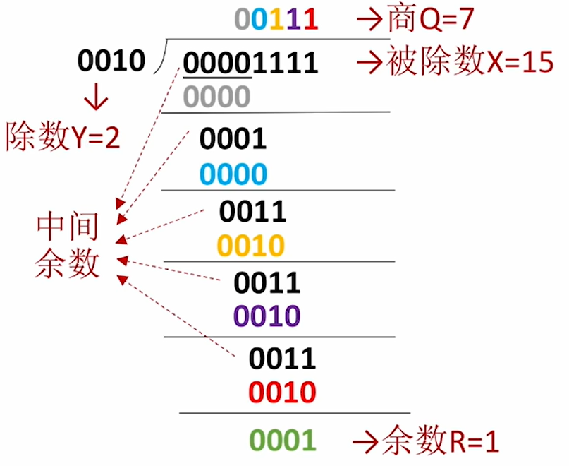
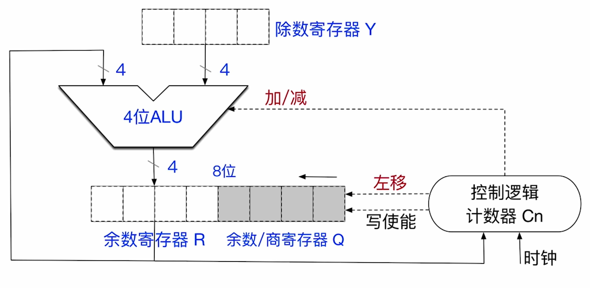

$$定点数的除法运算$$

# 一、无符号整数除法运算

计算机中无符号整数的除法运算原理本质上是模拟无符号整数除法的手算过程 —— **逐位上商，错位相减**。

## （一）基本原理

无符号整数除法（二进制）的手算方法为 **逐位上商，错位相减**。

**二进制上商规则**：商 $\times$ 除数的值，要尽可能接近“中间余数”，但又不能大于中间余数。即，**如果中间余数 $\geq$ 除数，则上商 1；否则上商 0**。

{width="300px"}

## （二）无符号数的除法运算电路

**n 位无符号数除法运算电路** 支持 **2n bit（双精度除法） 或 n bit（单精度除法） $\div$ n bit**，最终都仅保留 **n bit 商**、**n bit 余数**。

- 单精度除法需要对被除数进行 **位扩展** 为 2n bit。

- **ALU**：是除法器的核心部件，对 **余数寄存器 R** 和 **余数/商寄存器 Q** 的内容做 **无符号加/减法运算**，结果送回 **余数寄存器 R**。

- **除数寄存器 Y**：存放除数。

- **余数寄存器 R**：初始时，存放位扩展后的被除数的高 n 位；运算过程中，存放中间余数；结束时，存放 n 位的余数。

- **余数/商寄存器 Q**：初始时，存放位扩展后的被除数的低 n 位；运算过程中，存放商；结束时，存放 n 位的商。

- **计数器 $C_n$**：保存剩余循环次数。初值为除数的位数。每循环一次减 1。

- **控制逻辑**：根据 ALU 运算结果的符号来决定上商是 0 还是 1。
  - **左移**：控制信号，控制 [R，Q] 实现同步左移。
  - **写使能（Write Enable）**：控制信号，控制寄存器 R 允许被写入。
  - **加/减**：控制信号，控制 ALU 执行加/减法运算。

- **时钟**：相当于给这些硬件打节奏，按一定的节奏运行。

{width=600px}

## （三）计算机中无符号整数的除法运算过程

1. **开始**：
   1. 将数据放入寄存器
      1. **除数** 放入 **寄存器 Y**
      2. **被除数** 放入 **寄存器 [R，Q]** 并完成 **零扩展**
      3. **计数器 $C_n$ 的初始值置为 n**（除数的位数）
   2. 特殊情况检查
      1. 如果 **除数为 0** ，则发生 **“除数为 0” 异常**，停止除法运算，调出操作系统的异常处理程序。
      2. 如果 **$|被除数| < |除数|$**，则 **商 = 0**，**余数 = 被除数**，除法器不必再执行。

2. **进行 1 + n 轮处理**（计算 1 + n 位商）
   - **上商的规则**：控制逻辑会发出减法控制信号，执行 $[R] - [Y]$ 计算中间余数，然后写回余数寄存器 R
     - 如果 $[R] - [Y] \geq 0$，则上商 1；否则上商 0 
     - 如果上商 0，还需要把 R 中的中间余数恢复原样，即，执行加法 $([R] - [Y]) + [Y]$
   1. **第 1 轮特殊处理（商溢出判断）**
      1. 直接 **上商**，若 **第一位商 = 1**，发生 **“商溢出”异常**，停止除法运算。
      2. 直接 **上商**，若 **第一位商 = 0**，说明不会发生“商溢出”，**不必保存这位商，也不让 $C_n$ 减一**，除法运算继续。
         - **第一位商不保存，只用于商溢出判断**。
   2. **其余 n 轮处理**
      1. 先 **左移**，空出的位用于上商。
      2. **上商**，背后的过程可能会进行 **加法/减法**。
      3. **计数器 $C_n$ 减一**，当计数器 $C_n = 0$ 时，除法运算结束。

3. **结束**：当计数器 $C_n = 0$ 时，除法运算结束。**n bit 寄存器 [R]** 保存 **余数**、**n bit 寄存器 [Q]** 保存 **商**。

## （四）商溢出

**n 位无符号数除法运算电路** 支持 **2n bit（双精度除法） 或 n bit（单精度除法） $\div$ n bit**，最终都仅保留 **n bit 商**、**n bit 余数**。

- **2n bit $\div$ n bit（双精度除法）**，商的实际位数有可能超过 n bit，因此，**无符号整数的双精度除法可能发生“商溢出”**。

- **n bit $\div$ n bit（单精度除法）**，商的实际位数不可能超过 n bit，因此，**无符号整数单精度除法不可能发生“商溢出”**。

- **商溢出判断**：若 **第一位商 = 1**，则发生 **“商溢出”异常**，停止除法运算。

**注意**：**除数为 0**、**商溢出** 都属于 **除法错异常（除法异常）**。