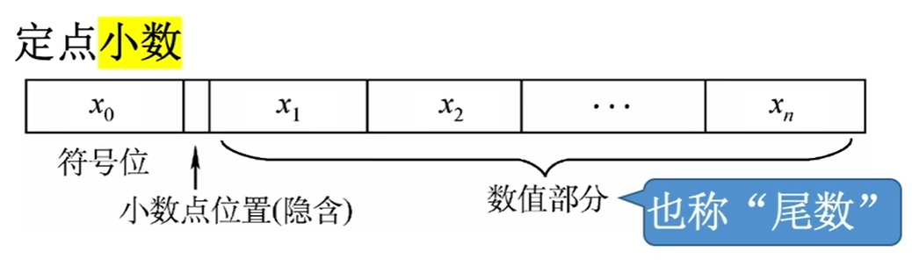
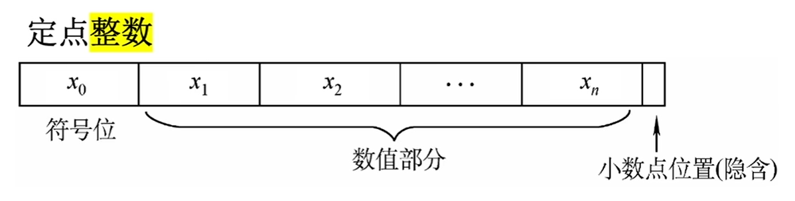

$$数制与编码$$

# 一、进位计数制

常用的进位计数制有 **十进制**、**二进制**、**八进制**、**十六进制**。

- 计算机中通常使用二进制、八进制和十六进制。

- **基数**：每个数位所用到的不同数码的个数。
  - $r$ 进制的基数为 $r$。

- **位权**：数码所在的数位的权重。

- 一个进制数的 **数值** 大小等于各位数码按权相加。
  - 一个 **$r$ 进制数 $(K_nK_{n-1}...K_0K_{-1}...K_{-m})_r$ 的数值**（**将任意进制数转换为十进制数**）可表示为
  **$$K_n r^n + K_{n-1} r^{n-1} + ... + K_0 r^0 + K_{-1} r^{-1} + ... + K_{-m} r^{-m} = \sum_{i = n}^{-m}K_i r^i$$**
    - $r$ 是基数
    - $r^i$ 是第 $i$ 位的权重
    - $K_i$ 的取指可以是 $0，1， ...，r-1$ 共 $r$ 个数码中的任意一个。

## 1. 二进制

- 用 **后缀字母 B** 标识二进制数。
- **基数为 2**，有 **0 和 1** 共两种数码。
- 计数 **逢二进一**。
- 任意数位的 **位权为 $2^i$**（$i$ 为所在位数）。
- 计算机系统内部的所有信息都是采用二进制进行编码的，因为：
  - 二进制只有两种状态，可使用两个稳定状态的物理器件就可表示。
  - 0，1 正好对应逻辑值“假”、“真”。方便实现逻辑运算。
  - 可通过逻辑门电路很方便地实现算术运算。

## 2. 八进制

- 用 **后缀字母 O** 标识八进制数。
- **基数为 8**，有 **0 ~ 7** 共八种数码。
- 计数 **逢八进一**。
- 任意数位的 **位权为 $8^i$**（$i$ 为所在位数）。
- 3 位二进制数码与 1 位八进制数码相对应。

## 3. 十进制

- 用 **后缀字母 D** 标识十进制数（通常直接省略）。
- **基数为 10**，有 **0 ~ 9** 共十种数码。
- 计数 **逢十进一**。
- 任意数位的 **位权为 $10^i$**（$i$ 为所在位数）。

## 3. 十六进制

- 用 **后缀字母 H 或 0x** 标识十六进制数。
- **基数为 16**，有 **0 ~ 9、A ~ F** 共十六种数码，其中 A ~ F 分别表示 10 ~ 15。
- 计数逢 **十六进一**。
- 任意数位的 **位权为 $16^i$**（$i$ 为所在位数）。
- 4 位二进制数码与 1 位十六进制数码相对应。

# 二、进制转换

## （一）二进制数转换为八进制数和十六进制数

1. 对于一个二进制数（包含整数部分、小数部分），在转换时以小数点为界。

2. 对于 **整数部分**，**从小数点开始往左数**，将一串二进制数分为 **三位一组（八进制）** 或 **四位一组（十六进制）**。
   - 在数的最左边可根据需要加“0”补齐。

3. 对于 **小数部分**，**从小数点开始往右数**，将一串二进制数分为 **三位一组（八进制）** 或 **四位一组（十六进制）**。
   - 在数的最右边可根据需要加“0”补齐。

4. **分别用对应的八进制数或十六进制数取代**。

## （二）八进制数或十六进制数转换为二进制数

1. 对于一个八进制数或十六进制数（包含整数部分、小数部分），在转换时以小数点为界。

2. 将八进制数或十六进制数的每一位分别用对应的 **三位（八进制）** 或 **四位（十六进制）** 的 **二进制数取代**。
   - 根据需要去掉整数最高位或小数最低位的“0”。

## （三）八进制数和十六进制数之间的转换

先将八进制数（十六进制数）转换为二进制数，再由二进制数转换为 十六进制数（八进制数）。

## （四）任意进制数转换为十进制数

采用 **按权展开相加法** 将 **$r$ 进制数 $(K_nK_{n-1}...K_0K_{-1}...K_{-m})_r$** 转换为 **十进制数**：
**$$K_n r^n + K_{n-1} r^{n-1} + ... + K_0 r^0 + K_{-1} r^{-1} + ... + K_{-m} r^{-m} = \sum_{i = n}^{-m}K_i r^i$$**

- $r$ 是基数
- $r^i$ 是第 $i$ 位的权重
- $K_i$ 的取指可以是 $0，1， ...，r-1$ 共 $r$ 个数码中的任意一个。

## （五）十进制数转换为任意进制数

采用 **基数乘除法**：

1. 对于一个十进制数（包含整数部分、小数部分），在转换时以小数点为界。

2. 对于 **整数部分** 采用 **除基取余法**。对整数部分 **除以基数** 以后 **取余数**，最先取得的余数为数的最低位，最后取得的余数为数的最高位，**商为 0 时结束**。

3. 对于 **小数部分** 采用 **乘基取整法**。对小数部分 **乘以基数** 后 **取整数**，最先取得的整数为数的最高位，最后取得的整数为数的最低位，**乘积为 1.0（或满足精度要求）时结束**。

4. 最后 **将整数部分与小数部分的转换结果拼接起来**。

- 也可采用 **拼凑法**。

**注意**：不是每个十进制小数都可以准确地用二进制小数表示，如 0.3。但任意一个二进制小数都可以用十进制小数精确表示。

# 三、真值和机器数

1. **真值** 是 **带正号“ $+$ ”或负号“ $-$ ”符号** 的数，是符合人类习惯的数字。
   - 真值是机器数所代表的 **实际值**。

2. **机器数** 是 **把符号“数字化”** 的数，是数字实际存到机器里的形式。将数的符号和数值部分一起编码，正负号需要被“数字化”。
   - 通常用 “ **0** ” 表示 “ **正** ”，用 “ **1** ” 表示 “ **负** ”。
   - 根据 **小数点的位置是否固定**，在计算机中有两种数据格式：**定点表示** 和 **浮点表示**。
     - **定点数**：定点表示的数，小数点的位置固定。
     - **浮点数**：浮点表示的数，小数点的位置不固定。

# 四、定点数的表示

**定点数的表示** 分为 **无符号数的表示** 和 **有符号数的表示**。

- 定点数的编码表示法主要有四种：**原码**、**反码**、**补码**、**移码**。

## （一）无符号数的表示

**无符号数**：整个机器字长的 **全部二进制位均为数值位**，没有符号位。（相当于数的绝对值）

- **$n$ 位** 无符号数的 **表示范围** 为：**0 ~ $2^n - 1$**。

- 通常 **只有无符号整数，没有无符号小数**。

## （二）有符号数的定点表示

定点表示法表示有符号数，分为 **定点小数** 和 **定点整数**。

- **定点小数** 是纯小数。
  - 约定小数点位置在符号位之后，有效数值部分的最高位之前。
  - 若数据 $X = x_0 . x_1 x_2 ... x_n$
    - $x_0$ 为符号位
    - $x_1$ ~ $x_n$ 是数值的有效部分（数值部分/尾数）
    - $x_1$ 是最高有效位

   

   {width="400"}
   

- **定点整数** 是纯整数。
  - 约定小数点位置在有效数值部分最低位之后。
  - 若数据 $X = x_0 . x_1 x_2 ... x_n$
    - $x_0$ 为符号位
    - $x_1$ ~ $x_n$ 是数值的有效部分（数值部分/尾数）
    - $x_n$ 是最低有效位

   

   {width="400"}
   

- 可用 **原码、反码、补码** 三种方式来表示定点整数和定点小数。还可以用 **移码** 表示定点整数。
  - 若真值为 $x$，则用 **$[x]_原、[x]_反、[x]_补、[x]_移$** 分别表示真值对应的原码、反码、补码、移码。

### 1. 原码

**原码表示法** 用机器数的 **最高位** 表示 **数的符号**，**其余各位** 表示 **数的绝对值**。

- 若机器字长为 $n + 1$ 位，则尾数占 $n$ 位。

- 若机器字长为 $n + 1$ 位，**原码整数** 的表示范围：**$-(2^n - 1) \leq x \leq 2^n - 1$**（关于原点对称）。

- 若机器字长为 $n + 1$ 位，**原码小数** 的表示范围：**$-(1 - 2^{-n}) \leq x \leq 1 - 2^{-n}$**（关于原点对称）。

**注意**：真值 0 的原码表示有正零和负零两种形式，即 **$[+0]_原 = 10000000$ 和 $[-0]_原 = 00000000$**，所以 $n + 1$ 位的机器字长，只能表示 $2^{n+1}-1$ 个真值。

- **优点**：
  - 与真值的对应关系简单、直观，与真值的转换简单。
  - 用原码实现乘除运算比较简便。

- **缺点**：
  - 0 的表示不唯一。
  - 用原码实现加减运算比较复杂。要把负数的符号位转为“0”，然后改变运算符号。需要用加法器完成加法，减法器完成减法。

### 2. 反码

**反码** 只是原码转换补码的中间表示形式，无其他作用。

**反码表示法**：若 **符号位为 0**,则 **反码与原码相同**；若 **符号位为 1**，则 **数值位全部取反**。

- 若机器字长为 $n + 1$ 位，**反码整数** 的表示范围：**$-(2^n - 1) \leq x \leq 2^n - 1$**（关于原点对称）。

- 若机器字长为 $n + 1$ 位，**反码小数** 的表示范围：**$-(1 - 2^{-n}) \leq x \leq 1 - 2^{-n}$**（关于原点对称）。

- 反码与原码一一对应。

**注意**：真值 0 的反码表示有正零和负零两种形式，即 **$[+0]_反 = 00000000$ 和 $[-0]_反 = 10000000$**，所以 $n + 1$ 位的机器字长，只能表示 $2^{n+1}-1$ 个真值。

### 3. 补码

**补码** 是原码的补数。
- $模 - a 的绝对值 = a 的补数$（机器数为 8 位时，模为 $2^8$）

**补码表示法**：**正数（真值）** 的补码等于 **原码**；**负数（真值）** 的补码等于 **反码末位加一**（要考虑进位）。

**注意**：真值 0 的补码表示只有一种表示形式，即 **$[+0]_补 = [-0]_补 = 00000000$**

- 因为 $[+0]_补 = [-0]_补 = 00000000$，所以规定 **定点整数补码 $[x]_补 = 1,0000000$** 表示 **$x = -2^7$**

- 若机器字长为 $n + 1$ 位，**补码整数** 的表示范围：**$-2^n \leq x \leq 2^n - 1$**（比原码多表示一个 **$-2^n$**）。

- 因为 $[+0]_补 = [-0]_补 = 00000000$，所以规定 **定点小数补码 $[x]_补 = 1,0000000$** 表示 **$x = -1$**

- 若机器字长为 $n + 1$ 位，**补码小数** 的表示范围：**$-1 \leq x \leq 1 - 2^{-n}$**（比原码多表示一个 **$-1$**）。

- **负数补码转换回原码**：**尾数取反，末位加一**。

- 由 $[x]_补$ 快速求 $[-x]_补$ 的方法：符号位、数值位全部取反，末位加一。

- **作用**：**让减法操作转变为等价的加法操作**，ALU 中无需集成减法器，节省硬件成本。

### 4. 移码

**移码** 是在真值 $X$ 上加上一个常数（偏置值），相当于 $X$ 在数轴上向正方向偏移了若干单位。
- 偏置值通常取 $2^n$

**移码表示法**：在 **补码的基础上** 将 **符号位取反**。

**注意：移码只能用于表示整数**。

- 若机器字长为 $n + 1$ 位，**移码整数** 的表示范围：**$-2^n \leq x \leq 2^n - 1$**（与补码相同，一一对应）。

- **作用**：移码表示的整数很方便对比大小。

# 五、零扩展和符号扩展

**零扩展**：适用于 **无符号整数**，**用 0 扩展高位**。

**符号扩展**：适用于 **带符号整数（补码）**，**用“原数字符号位”扩展高位**。

- ALU 的位数是固定的，运算前可能需要把短数据扩展为长数据。
- 通用寄存器位数是固定的，把数据存入寄存器时，可能需要进行长度扩展。
- 主存内的各种数据长度不一，有时需要把短数据扩展为长数据。

# 六、C 语言中的强制类型转换

- C 语言中定点整数使用“补码”存储的。

1. **无符号数和有符号数的转换**：保持二进制各位的位值不变，仅改变解释这些位的方式。

2. **长整数转换为短整数**：高位截断，保留地位。

3. **短整数转换为长整数**：零扩展或符号扩展。