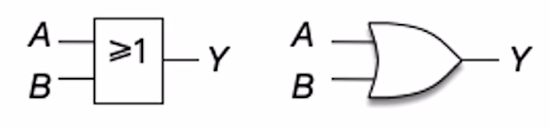
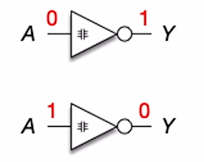

$$数字电路补充知识$$

# 一、逻辑门电路

**逻辑门电路** 是用来处理二进制的逻辑运算的。

**逻辑运算** 是对逻辑值 真/假（二进制 1/0）进行运算。

- **基本的逻辑运算** 有：**与**、**或**、**非**。

- **复杂的逻辑运算** 有（基本的逻辑运算的组合）：**与非**、**或非**、**异或**、**同或**。

## （一）基本的逻辑运算

### 1. 与运算

**与（AND）** 是一种基本逻辑运算。**当且仅当输入全为 1 时，输出才为 1**。（相当于 “&&” 运算）

- 表达式：**$Y = A · B$**（**$Y = AB$**）

- 真值表：

    |A|B|Y|
    |:-:|:-:|:-:|
    |0|0|0|
    |0|1|0|
    |1|0|0|
    |1|1|1|

- 门电路图像符号：**与门**。
  - 国标画法（左），国际常用画法（右）
    

    {width="300px"}
    

  - 与门用法
    

    {width="200"}
    

### 2. 或运算

**或（OR）** 是一种基本逻辑运算。**当且仅当输入全为 0 时，输出才为 0**。（相当于 “||” 运算）

- 表达式：**$Y = A + B$**

- 真值表：

    |A|B|Y|
    |:-:|:-:|:-:|
    |0|0|0|
    |0|1|1|
    |1|0|1|
    |1|1|1|

- 门电路图形符号：**或门**。
  - 国标画法（左），国际常用画法（右）
    

    {width="300px"}
    

  - 或门用法
    

    {width="200"}
    

### 3. 非运算

**非（NOT）**：是一种基本逻辑运算。**0 变 1，1 变 0**。（相当于取反）

- 表达式：**$Y = \overline{A}$**

- 真值表：

    |A|Y|
    |:-:|:-:|
    |0|1|
    |1|0|

- 门电路图形符号：**非门**。
  - 国标画法（左），国际常用画法（右）
    

    {width="300px"}
    

  - 非门用法
    

    {width="200"}
    

## （二）复杂的逻辑运算

### 1. 与非运算

**与非（NAND）**：是一种复合逻辑运算。**仅当输入全为 1 时，输出才为 0**。（先与后非）

- 表达式：**$Y = \overline{A · B}$**（**$Y = \overline{AB}$**）

- 真值表：

    |A|B|Y|
    |:-:|:-:|:-:|
    |0|0|1|
    |0|1|1|
    |1|0|1|
    |1|1|0|

- 门电路图形符号：**与非门**。
  - 国标画法（左），国际常用画法（右）
    

    {width="300px"}
    

  - 内部实现细节：
    

    {width="400px"}
    

### 2. 或非运算

**或非（NOR）**：是一种复合逻辑运算。**当输入全为 0 时，输出才为 1**。（先或后非）

- 表达式：**$Y = \overline{A + B}$**

- 真值表：

    |A|B|Y|
    |:-:|:-:|:-:|
    |0|0|1|
    |0|1|0|
    |1|0|0|
    |1|1|0|

- 门电路图形符号：**或非门**。
  - 国标画法（左），国际常用画法（右）
    

    {width="300px"}
    

  - 内部实现细节：
    

    {width="400px"}
    

### 3. 异或运算

**异或运算（XOR）**：是一种复合逻辑运算。**两个输入不同时，输出为 1**。

- 表达式：**$Y = A \bigoplus B = \overline {A} B + A \overline{B}$**

- 真值表：

    |A|B|Y|
    |:-:|:-:|:-:|
    |0|0|0|
    |0|1|1|
    |1|0|1|
    |1|1|0|

- 门电路图形符号：**异或门**。
  - 国标画法（左），国际常用画法（右）
    

    {width="300px"}
    

  - 内部实现细节：
    

    {width="400px"}
    

- **n bit 进行异或**，若 **有奇数个 1，则异或结果为 1**；若 **有偶数个 1，则异或结果为 0**。
  - 可用于实现奇偶校验、二进制加法。

### 4. 同或运算

**同或运算（XNOR）**：是一种复合逻辑运算。**两个输入相同时，输出为 1**。

- 表达式：**$Y = A \bigodot B = \overline{A \bigoplus B} = \overline{\overline {A} B + A \overline{B}}$**

- 真值表：

    |A|B|Y|
    |:-:|:-:|:-:|
    |0|0|1|
    |0|1|0|
    |1|0|0|
    |1|1|1|

- 门电路图形符号：**同或门（异或非门）**。
  - 国标画法（左），国际常用画法（右）
    

    {width="300px"}
    

  - 内部实现细节：
    

    {width="400px"}
    

## （三）逻辑运算的优先级

**三种基本逻辑运算的优先级：非 > 与 > 或**

- 括号会提升其内容的优先级。

- 非运算符下有多个逻辑运算符时，需先处理其下的运算。

## （四）逻辑运算的常见公式

1. **分配律**：**$A(C+D) = AC + AD$**

2. **结合律**：
   - **与运算** 的结合律：**$ABC = A(BC)$**
   - **或运算** 的结合律：**$A + B + C = A + (B + C)$**

3. **反演律**：
   - **$\overline{A + B} = \overline{A} · \overline{B}$**
   - **$\overline{A · B} = \overline{A} + \overline{B}$**

# 二、多路选择器

**多路选择器（multiplexer，MUX）** 是电路的“守门员”。**在多个输入数据中，只允许其中一个数据通过 MUX**。

- 门电路图形符号：**用“梯形”表示，有多个输入、一个输出、一个控制信号**。（梯形的更长的一边是输入端、更短的一边是输出端）

    

    {width="400"}
    

- 若有 **$k$ 个输入**，则 **控制信号的位数 $m \geq \lceil log_2k \rceil （bit）$**

**注意**：有的多路选择器可能会预留一个控制信号，用于拦截所有输入。此时控制信号的位数 $m \geq \lceil log_2(k+1) \rceil （bit）$

# 三、三态门

**三态门** 也是电路的“守门员”。**根据控制信号决定是否让输入的数据通过**。

- 门电路图形符号：**用“小三角”表示，有一个输入、一个输出、一个控制信号**。

    

    {width="400"}
    

- 三态门的 **控制信号只需要 $1 bit$**。
  - **op = 1**，表示 **允许数据通过**。
  - **op = 0**，表示 **不允许数据通过**。

- 特殊用法：

    

    {width="400"}
    

**注意**：**“非门”没有控制信号，只有输入和输出**。