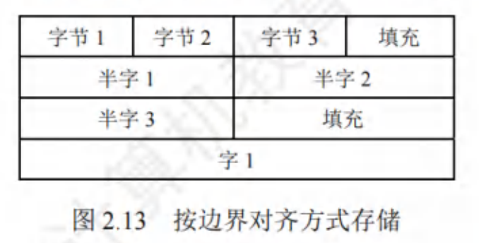
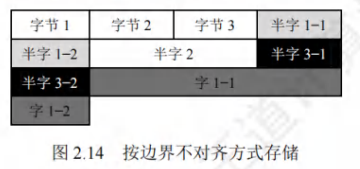

$$数据的存储和排列$$

# 一、大小端模式

在存储数据时，**多字节数据在内存里一定是占连续的几个字节**。

**最高有效字节（MSB）**：表示数据的 **高位**。

**最低有效字节（LSB）**：表示数据的 **低位**。

根据数据中各字节在连续字节序列中的排列顺序不同，可以采用 **两种排列方式**：**大端方式** 和 **小端方式**。

1. **大端方式（big endian）**：**先存储高位字节**，**后存储低位字节**。
   - 字中的 **字节顺序和原序列相同**，便于人类阅读。

2. **小端方式（little endian）**：**先存储低位字节**，**后存储高位字节**。
   - 字中的 **字节顺序和原序列的相反**，便于机器处理。

# 二、边界对齐

现代计算机通常是 **按字节编址**，即 **每个字节对应 1 个地址**。

- 通常也可支持 **按字**、**按半字**、**按字节** **寻址**。
  - 最终都要转换为相对应的字节地址，转换方法为逻辑左移。
- **每次访存只能读/写一个字**。

数据有 **两种存储方式**：**按边界对齐方式存储**、**按边界不对齐方式存储**。

1. **按边界对齐方式存储**：
   - 访问 **一个字/半字** 都 **只需一次访存**。
    

    {width=400}
    

1. **按边界不对齐方式存储**：
   - 访问 **一个字/半字** **可能要两次访存**。
    

    {width=400}
    

- 边界对齐方式相对于边界不对齐方式是一种空间换时间的思想。