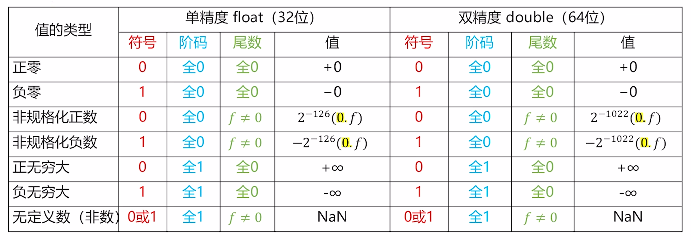
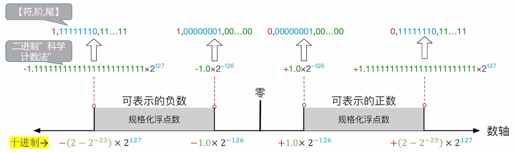
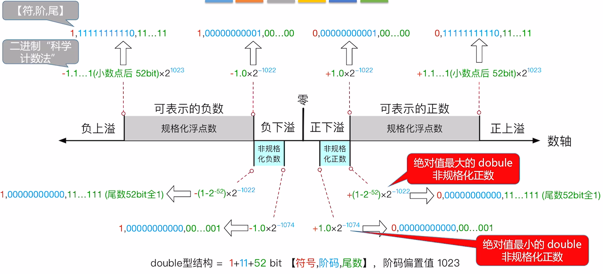
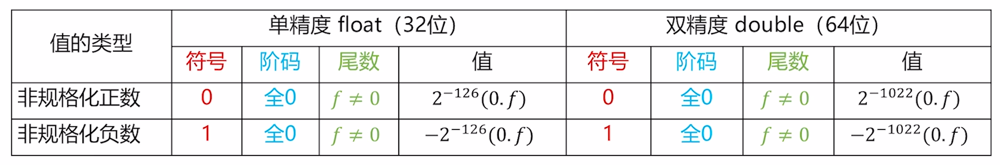
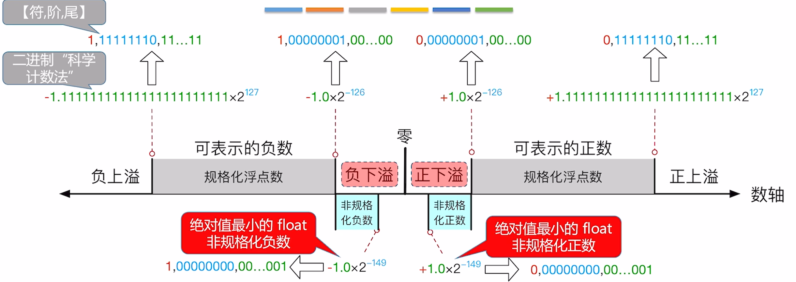
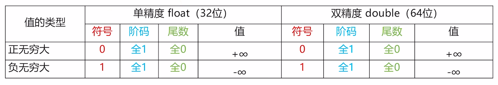
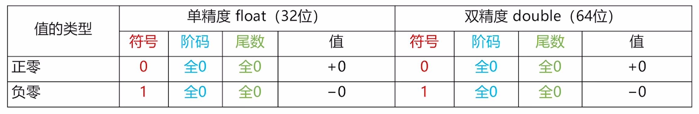

$$浮点数的表示$$

计算机的机器字长位数有限，定点数表示法不能无限制地增加数据的长度。

# 一、浮点数表示法

**浮点数表示法** 是以适当的形式将比例因子表示在数据中，让小数点的位置根据需要而浮动。

- 浮动表示法在位数有限的情况下，既扩大了数的表示范围，又保持了数的有效精度。

- 浮点数表示为：
    **$$N =(-1)^S \times M \times R^E$$**

    - **符号**：决定数值的正负性。
    - **S = 1** 时，为 **负数**。
    - **S = 0** 时，为 **正数**。
    - **尾数 M**：是一个二进制定点小数，用定点原码小数表示。
      - 尾数的位数，影响数值的精度。位数越多，精度越高。
    - **阶码（指数） E**：是一个二进制定点整数，用移码表示。
      - 阶码的值，反映小数点的实际位置。
      - 阶码的位数，反映浮点数的表示范围。
    - **基数 R**：若为 R 进制，通常默认基数为 R。
    - **规格化**：确保尾数的 **最高位非 0 数位** 刚好在小数点之前。
      - 尾数规格化便于在计算机内部存储。

- **计算机中存储的浮点数** 由 **符号**、**阶码**、**尾数** 三部分组成。
  - **基数是隐含的**。

    |符号|阶码|尾数|
    |:-:|:--:|:--:|

- **定点数表示法** 和 **浮点数表示法** 的 **区别**：
  1. **数值的表示范围**：若定点数和浮点数的 **字长相同**，则 **浮点数表示法** 所能表示的数值访问 **远大于** **定点表示法**。
  2. **精度**：对于 **字长相同** 的定点数和浮点数来说，**浮点数** 虽然扩大了数的表示范围，但 **精度降低了**。
  3. **数的运算**：浮点数包括阶码和尾数两部分，运算时不仅要做尾数的运算，还要做阶码的运算，而且运算结果要求规格化，所以 **浮点数运算比定点运算复杂**。
  4. **溢出问题**：
     - 在 **定点运算** 中，当 **运算结果超出数的表示范围** 时，发生 **溢出**。
     - 在 **浮点运算** 中，**运算结果超出表示范围却不一定溢出**，只有规格化后加码超出所能表示的范围时，才发生溢出。

# 二、IEEE 754 浮点数的表示

**IEEE 754** 是由 IEEE 制定的二进制浮点数算术标准，规定了在计算机内部，如何使用二进制表示和运算浮点数。
- 电气电子工程师学会（Institute of Electrical and Electronics Engineers，简称 **IEEE**）
- C 语言的 **float 型（32 bit，单精度浮点型）**、**double 型（64 bit，双精度浮点型）** 就是符合 IEEE 754 标准的浮点数格式。

## （一）IEEE 754 标准定义的浮点数格式

IEEE 754 标准规定常用的浮点数格式有 **32 位单精度浮点数（短浮点数、float 型）** 和 **64 位双精度浮点数（长浮点数、double 型）**。基数隐含为 2。

- IEEE 754 也定义了 80 bit 扩展精度浮点型（long double）、16 bit 半精度浮点型、128 bit 四倍精度浮点型。

### 1. float 单精度浮点型的存储

**IEEE 754 标准 32 位单精度浮点数存储格式**：

{width=300}

- **符号** 的存储：**0 正 1 负**。

- **尾数** 的存储：规定小数点位置在 23 bit 之前。即，用 **原码定点小数的形式存储**。
  - **默认存储的是规格化的尾数，小数点前的 1 省略（隐含，称为隐藏位）**。即尾数中的内容全是小数点后的内容。
  - 这样存储可以增加尾数的实际精度到 24 bit。

- **阶码** 的存储：用 **移码** 表示，规定 **偏置值为 127**。
  - 将十进制真值转换为 **偏置值为 M** 的 **n 位移码**：
    1. 将 **十进制真值 + 偏置值**
    2. **按“无符号整数”规则，转换为 n 位数**。

- **基数（隐含）**：基数不用专门存储，规定基数为 2 即可。

### 2. double 双精度浮点型的存储

**IEEE 754 标准 64 位双精度浮点数存储格式**：

{width=500}

- **符号** 的存储：**0 正 1 负**。

- **尾数** 的存储：规定小数点位置在 52 bit 之前。即，用 **原码定点小数的形式存储**。
  - **默认存储的是规格化的尾数，小数点前的 1 省略（隐含，称为隐藏位）**。即尾数中的内容全是小数点后的内容。
  - 这样存储可以增加尾数的实际精度到 53 bit。

- **阶码** 的存储：用 **移码** 表示，规定 **偏置值为 1023**。
  - 将十进制真值转换为 **偏置值为 M** 的 **n 位移码**：
    1. 将 **十进制真值 + 偏置值**
    2. **按“无符号整数”规则，转换为 n 位数**。

- **基数（隐含）**：基数不用专门存储，规定基数为 2 即可。

## （二）真值转换为 IEEE 754 标准浮点数

1. 根据题意，**确定浮点数结构**。
2. 将十进制真值 **转换为二进制普通记法**。
   - 复杂小数转换为二进制可以采用 **拼凑法**、**乘基取整法**（仅用于处理十进制真值的小数部分）
1. 转换为二进制科学计数法，**注意将尾数规格化**。
2. 将 **阶码真值 + 移码偏置值**，再按“无符号整数”规则转换为规定长度。
3. 确定符号、阶码、尾数。注意 **规格化尾数的第一个 1 隐含**。

## （三）IEEE 754 标准浮点数转换为真值

1. 根据题意，**确定浮点数结构**。
2. 确定 **符号、阶码、尾数的二进制**。
3. 1. **确定符号**（正 0 负 1）。
   2. 确定阶码真值。酰胺“无符号整数”规则解读二进制，再 **减掉移码偏置值**。
   3. 确定尾数，记作二进制科学计数法。**注意尾数小数点前隐含了一个 1**。
4. **转换为十进制真值**。

## （四）IEEE 754 特殊状态的浮点数

IEEE 754 标准中 **阶码全为 0、全为 1** 时，**有特殊意义**，需要按照 **特殊的方法解读真值**。
- 仅当 **阶码不全为 0**、也 **不全为 1** 时，表示这是一个 **规格化浮点数**。可以采用 **规格化浮点数的解读方法**。

{width=700}

- **IEEE 754：非数（NaN）**
  - 在 IEEE 754 浮点数标准中：**NaN（Not a Number）** 代表 **不是一个数**。
  - 运算结果为 NaN 的例子：
    - **0 除以 0**
    - 负数开根号
    - 无穷减无穷

**注意**：**IEEE 754 规定，非零数值除以 0，结果是无穷，0 除以 0 结果是 NaN**。提高了程序的容错性。

# 三、IEEE 754 规格化浮点数的表示范围

**规格化浮点数** 的 **阶码不全为 0、也不全为 1**。

## （一）规格化的 float 单精度浮点数的表示范围

1. **阶码** 的 **真值** 取值范围为 **-126 ~ 127**
   - 按 **无符号数解读阶码（00000001 ~ 11111110）**，则取值范围为 **1 ~ 254**
   - 移码转真值：
     1. 先按 **“无符号整数”解读** 阶码二进制串
     2. 再 **减掉偏置值**，得到真值

2. **尾数** 的取指范围为 **全 0 ~ 全 1**

- 规格化的单精度浮点数 **可表示的正数** 为：**$2^{-126}$** 至 **$(2-2^{23}) \times 2^{127}$**

- 规格化的单精度浮点数 **可表示的负数** 为：**$-(2-2^{23}) \times 2^{127}$** 至 **$-2^{-126}$**

{width=700}

## （二）规格化的 double 双精度浮点数的表示范围

1. **阶码** 的 **真值** 取值范围为 **-1022 ~ 1023**
   - 按 **无符号数解读阶码（000000000001 ~ 11111111110）**，则取值范围为 **1 ~ 2046**
   - 移码转真值：
     1. 先按 **“无符号整数”解读** 阶码二进制串
     2. 再 **减掉偏置值**，得到真值

2. **尾数** 的取指范围为 **全 0 ~ 全 1**

- 规格化的双精度浮点数 **可表示的正数** 为：**$2^{-1022}$** 至 **$(2-2^{52}) \times 2^{1023}$**

- 规格化的双精度浮点数 **可表示的负数** 为：**$-(2-2^{52}) \times 2^{1023}$** 至 **$-2^{-1022}$**

{width=800}

# 四、IEEE 754 非规格化浮点数的表示范围

**IEEE 754：非规格化浮点数的表示**：

{width=700}

- **阶码** 的真值固定解读为 **-126（单精度）** 或 **-1022（双精度）**

- **尾数** 固定解读为 **小数点前隐含的是 0，而不是 1**。

## （一）非规格化的 float 单精度浮点数的表示范围

1. **绝对值最小** 的非规格化 **正数** 为
   - 0 00000000 00000000000000000000001
   - 真值 = 0.00000000000000000000001 $\times$ $2^{-126}$ = **$2^{-149}$**

2. **绝对值最大** 的非规格化 **正数** 为
   - 0 00000000 11111111111111111111111
   - 真值 = 0.11111111111111111111111 $\times$ $2^{-126}$ = **$(1-2^{-23}) \times 2^{-126}$** = **$2^{-126} - 2^{-149}$**

3. **绝对值最小** 的非规格化 **负数** 为
   - 1 00000000 00000000000000000000001
   - 真值 = - 0.00000000000000000000001 $\times$ $2^{-126}$ = **$-2^{-149}$**

4. **绝对值最大** 的非规格化 **负数** 为
   - 1 00000000 11111111111111111111111
   - 真值 = - 0.11111111111111111111111 $\times$ $2^{-126}$ = **$- (1-2^{-23}) \times 2^{-126}$** = **$- (2^{-126} - 2^{-149})$**

- 非规格化的单精度浮点数 **可表示的正数** 为：**$2^{-149}$** 至 **$2^{-126} - 2^{-149}$**

- 非规格化的单精度浮点数 **可表示的负数** 为：**$-(2^{-126} - 2^{-149})$** 至 **$-2^{-149}$**

{width=700}

## （二）非规格化的 double 双精度浮点数的表示范围

1. **绝对值最小** 的非规格化 **正数** 为
   - 0 00000000000 00...001（尾数前 51 bit 全为 0）
   - 真值 = 0.00...001 $\times$ $2^{-1022}$ = **$2^{-1074}$**

2. **绝对值最大** 的非规格化 **正数** 为
   - 0 00000000 11...11（尾数 52 bit 全为 1）
   - 真值 = 0.11...11 $\times$ $2^{-1022}$ = $(1-2^{-52}) \times 2^{-1022}$ = **$2^{-1022} - 2^{-970}$**

3. **绝对值最小** 的非规格化 **负数** 为
   - 1 00000000 00...001（尾数前 51 bit 全为 0）
   - 真值 = - 0.00...001 $\times$ $2^{-1022}$ = **$-2^{-1074}$**

4. **绝对值最大** 的非规格化 **负数** 为
   - 1 00000000 11...11（尾数 52 bit 全为 1）
   - 真值 = - 0.11...11 $\times$ $2^{-1022}$ = $- (1-2^{-52}) \times 2^{-1022}$ = **$- (2^{-1022} - 2^{-970})$**

- 非规格化的双精度浮点数 **可表示的正数** 为：**$2^{-1074}$** 至 **$2^{-1022} - 2^{-970}$**

- 非规格化的双精度浮点数 **可表示的负数** 为：**$- (2^{-1022} - 2^{-970})$** 至 **$-2^{-1074}$**

{width=800}

# 四、IEEE 754 浮点数的上溢（Overflow）

## （一）浮点数的上溢

**上溢（溢出）**：正上溢、负上溢统称为上溢。

**正上溢**：运算结果大于最大规格化正数。

**负上溢**：运算结果小于绝对值最大的规格化负数。

## （二）浮点数上溢（溢出）的处理

浮点数上溢（溢出）有两种处理方式：

1. 浮点数运算部件将 **运算结果设置为 $+\infty$（正上溢） 或 $-\infty$（负上溢）**。
   - **IEEE 754：无穷大的表示**：

        

        {width=700}
        

2. 设置 **浮点数溢出异常标志位**。

**注意**：IEEE 754 规定，默认不响应浮点数溢出异常，不中断程序，除非程序员手动开启此类异常响应。

# 五、IEEE 754 浮点数的下溢（Underflow）

## （一）浮点数的下溢

**下溢**：正下溢和负下溢统称为下溢。

**正下溢**：浮点数运算结果为 0 至绝对值最小的规格化正数之间。

**负下溢**：浮点数运算结果在 0 至绝对值最小的规格化负数之间。

## （二）浮点数下溢的处理

浮点数下溢有两种处理方式：

1. 若结果落入非规格化区间，则用 **非规格化浮点数** 存储。
   - 如果结果太小（真值逼近于 0），则按 **机器零** 存储。
   - **IEEE 754：真值 0 的表示**：

        

        {width=700}
        

   - **IEEE 754：非规格化浮点数的表示**：

        

        {width=700}
        

2. 若下溢至 **机器零**，设置 **浮点数下溢溢出标志位**。

**注意**：IEEE 754 规定，默认不响应浮点数下溢异常，不中断程序。除非程序员手动开启此类异常响应。