<font size = 9>$$计算机系统概述$$</font>


# 一、计算机发展历程

1. 第一代计算机（1946 - 1957 年）—— **电子管时代**
   - **逻辑元件** 为 **电子管**。
   - 使用 **机器语言** 进行编程。
   - **运算速度较低**，一般只有几千次到几万次每秒。
   - **主存储器** 为 **延迟线、磁鼓**。
   - **容量极小**。
   - **体积庞大，成本高**。
   - 以世界上第一台 **电子数字** 计算机 **ENIAC**（1946）为代表。

2. 第二代计算机（1958 - 1964 年）—— **晶体管时代**
   - **逻辑元件** 为 **晶体管**。
   - 开始出现 **高级语言极其编译程序**，有了 **操作系统的雏形**。
   - **运算速度提高** 到几万次到几十万次每秒。
   - **主存储器** 为 **磁芯存储器**。
   - **体积、功耗降低**。

3. 第三代计算机（1965 - 1971 年）—— **中小规模集成电路电路时代**
   - **逻辑元件** 为 **中小规模集成电路**。
   - **运算速度较高**，一般几十万到几百万次每秒。
   - **主存储器** 为 **半导体存储器**。
   - **高级语言** 发展迅速，有了 **分时操作系统**。

4. 第四代计算机（1972 年至今）—— **超大规模集成电路时代**
   - **逻辑元件** 为 **大规模集成电路和超大规模集成电路**。
     - 产生了 **微处理器**（即 CPU）。从而产生了微型计算机，个人计算机（PC）开始萌芽。
   - **运算速度达到上千万到万亿次每秒**。
   - **产生了现代操作系统**。


# 二、计算机系统的组成

一个完整的 **计算机系统** 由 **硬件系统** 和 **软件系统** 共同构成。

- **硬件** 指有形的物理设备，是计算机系统中实际物理装置的总称。

- **软件** 指在硬件上运行的程序和相关的数据及文档。
  - 按功能分类：
    - **系统软件**：用来管理整个计算机系统。
    - **应用软件**：按任务需要编制成的各种程序。

- 计算机系统性能的好坏，取决于软、硬件功能的总和。
  - 软件的效率和作用表征着计算机系统性能的好坏，软件性能的发挥又离不开硬件的支持。

- 在计算机系统中，对于某一功能，若其即可用软件实现，又可用硬件实现，则称为 **软件和硬件在逻辑功能上是等价的**。


# 三、计算机硬件

**计算机硬件的基本组成** 有五大部分：

- **输入设备**：将信息转换成机器能识别的形式。
- **输出设备**：将结果转换成人们熟悉的形式。
- **主存储器**：存放数据和程序。
- **运算器**：算数运算、逻辑运算。
- **控制器**：指挥各部件，使程序运行。

- 一般把运算器和控制器集中在同一个芯片上，称为 **中央处理器（CPU）**。
- CPU 和主存储器构成了 **主机**。
- 除主机外的其他硬件装置（外存、I/O 设备等）统称为 **外部设备（外设）**。

## （一）冯·诺依曼计算机
以“存储程序”为基础的各类计算机统称为 **冯·诺依曼机**。

- **“存储程序”** 的基本思想是指，将事先编制好的程序和原始数据，以二进制代码的形式，送入主存储器后才能执行，一旦程序被启动执行，就无需操作人员的干预，然后按其在存储器中的首地址执行程序的第一条指令，计算机会按该程序的规定，自动逐条执行指令，直至程序执行结束。

**冯·诺依曼计算机的特点**：
1. **采用“存储程序”的工作方式**。
2. **计算机硬件系统由运算器、存储器、控制器、输入设备和输出设备五大部件组成**。
3. **指令和数据以同等地位存储在存储器中**，形式上没有区别，但计算机应能区分它们，**可按地址访存**。
4. **指令和数据均用二进制代码表示**。
5. **指令由操作码和地址码组成。操作码指出操作的类型，地址码指出操作数的地址**。
6. **以运算器为中心**。
   - 输入输出设备与存储器之间的数据传送通过运算器完成。会导致数据计算的效率降低。
   - 现代计算机 **以存储器为中心**。

<div align=center>

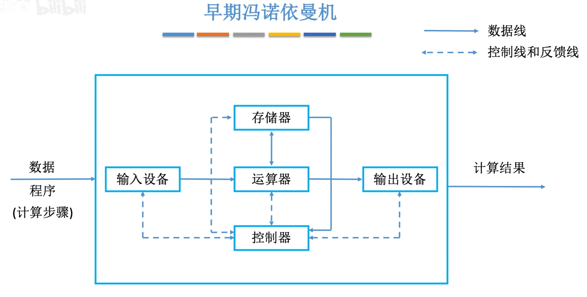{width="700px"}
</div>


## （二）现代计算机

- 现代计算机 **以存储器为中心**。

    <div align=center>

    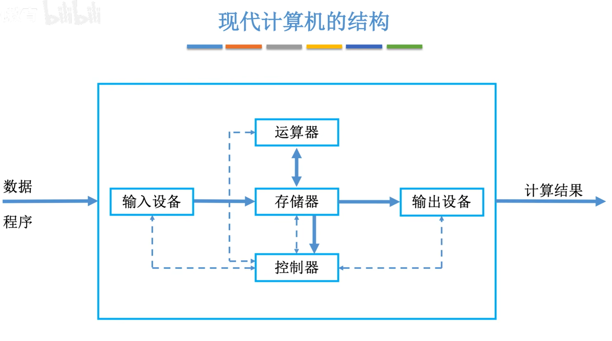{width="700px"}
    </div>

- **现代计算机的硬件组成**
  - CPU 由运算器和控制器组成。

    <div align=center>

    ```mermaid
    graph RL
        1(硬件)
        2(主机)
        3(I/O 设备)
        4(CPU)
        5(主存)
        6(辅存)
        7(运算器)
        8(控制器)
        9(存储器)
        10(输入设备)
        11(输出设备)

        1 --- 2 & 3
        2 --- 4 & 5
        3 --- 6 & 10 & 11
        4 --- 7 & 8
        5 & 6 --- 9

        linkStyle 0,1,2,3,4,5,6,7,8,9,10 stroke:LightSkyBlue
    ```
    </div>


<div align=center>

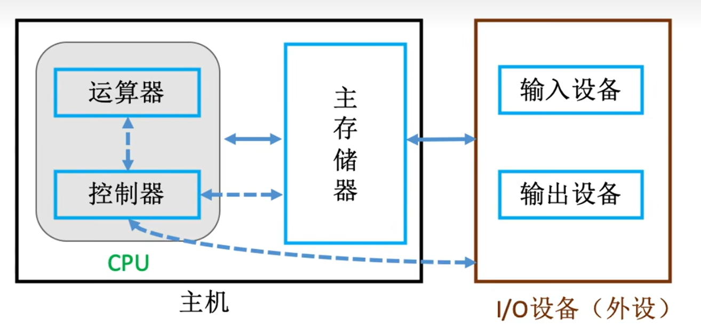{width="600px"}
</div>


## （三）存储器

**存储器** 分为 **主存储器（内存储器/主存）** 和 **辅助存储器（外存储器/外存）**。

### 1. 主存储器

**主存储器（内存储器/主存）** 是 CPU 能够直接访问的存储器。

- 主存储器的 **工作方式** 是按存储单元的地址进行存取，这种存取方式称为 **按地址存取方式**。

- 主存储器的 **基本组成**：
  1. **存储体**：由许多存储单元组成，用来存放二进制信息。
     - 每个 **存储单元** 包含若干个存储元件。
     - 每个 **存储元件（存储元）** 可以存储一位二进制代码“0”或“1”。
     - **存储字（word）**：存储单元存储的一串二进制代码。
     - **存储字长**：存储单元存储的这串二进制代码的位数。
     - 存储字长可以是 1B（8 bit）或是字节的偶数倍。
     - 数据在存储体内按地址存储。

  2. **存储器地址寄存器（MAR）**：存放访存地址。经过地址译码后找到所选的存储单元。
     - MAR 用于寻址，其位数反映最多可寻址的存储单元的个数。
     - MAR 的长度与 PC 的长度相等。

  3. **存储器数据寄存器（MDR）**：暂存要从存储器中读或写的信息。
     - MDR 的位数通常等于存储字长。一般为字节的 2 次幂的整数倍。

  4. **时序控制逻辑**：用于产生存储器操作所需的各种时序信号。

**注意**：MAR 与 MDR 虽然是存储器的一部分，但在现代计算机中 MAR 与 MDR 存在于 CPU 中。

<div align=center>

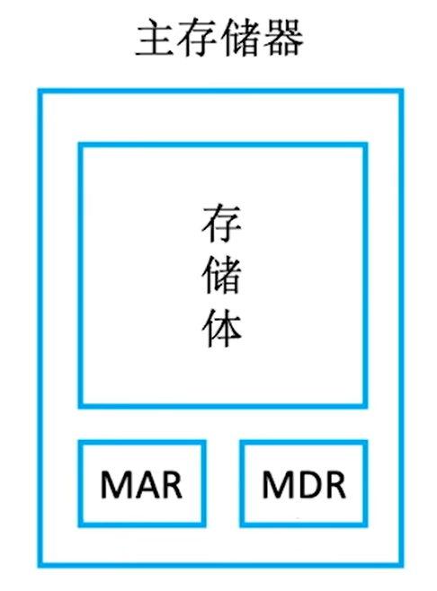{width="300"}
</div>


### 2. 辅助存储器

**辅助存储器（外存储器/外存）** 用于帮助主存存储记忆更多的信息。

- 辅助存储器中的信息必须调入主存储器后，才能为 CPU 所访问。


## （四）运算器

**运算器** 是计算机的执行部件，用于实现算术运算、逻辑运算。

- **算术运算**：按算数运算规则进行的运算，如加、减、乘、除。

- **逻辑运算**：包括与、或、非、异或、比较、移位等运算。

运算器的 **基本组成** 为算数逻辑单元和若干通用寄存器（用于暂存操作数和中间结果）。
- **算数逻辑单元（ALU）**：通过内部复杂的电路实现算术运算、逻辑运算。是运算器的核心。
- **累加器（ACC）**：用于存放操作数，或运算结果。
- **乘商寄存器（MQ）**：在乘、除运算时，用于存放操作数或运算结果。
- **操作数寄存器（X）**：通用的操作数寄存器，用于存放操作数。

<div align=center>

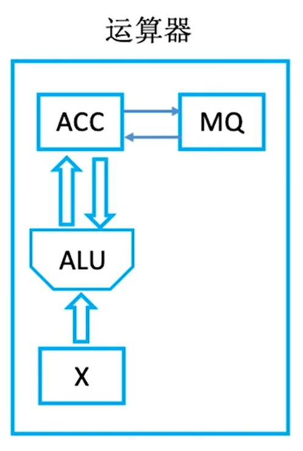{width="300px"}
</div>


## （五）控制器

**控制器** 是计算机的指挥中心，指挥各部件自动协调地进行工作。

控制器由 **控制单元（CU）**、**指令寄存器（IR）**、**程序计数器（PC）** 组成。

- **控制单元（CU）**：控制单元，用来分析指令，给出控制信号。
- **指令寄存器（IR）**：用来存放当前执行的指令。
- **程序计数器（PC）**：用来存放下一条指令的地址，具有自动加 1 的功能。

- 完成一条指令时，由 PC 取指令，IR 分析指令，CU 执行指令。
  - 取指令和分析指令可统称为取指阶段。
  - 执行指令可称为执行阶段。

<div align=center>

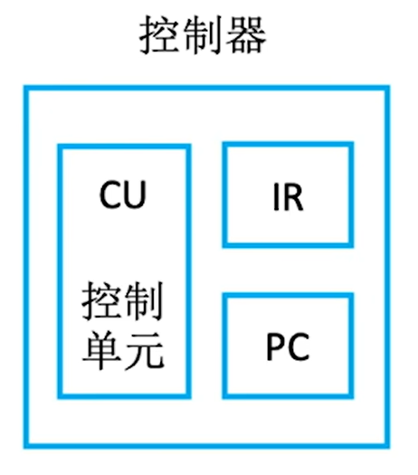{width="300px"}
</div>


## （六）输入设备

**输入设备** 主要是将程序和数据以机器所能识别和接受的信息形式输入计算机。


## （七）输出设备

**输出设备** 将计算机处理的结果以人们所能接受的形式或其他系统所要求的信息形式输出。


# 四、计算机工作过程

- **模型机**：
   <div align=center>

   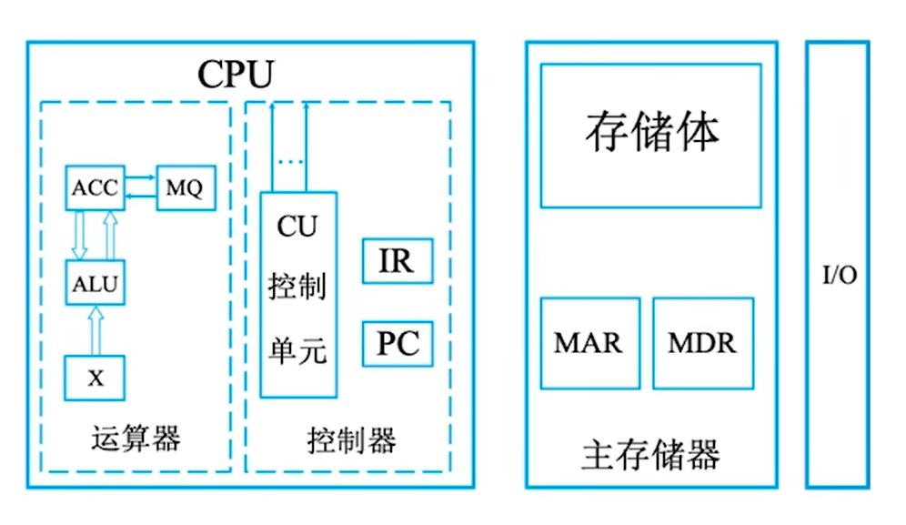{width="600px"}
   </div>

- **计算机工作过程**：
   <div align=center>

   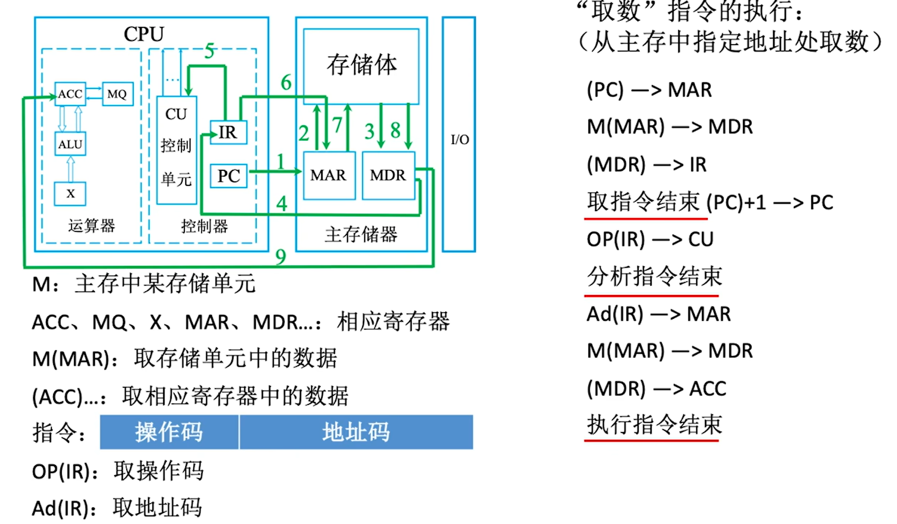{width="700px"}
   </div>


# 五、计算机软件

## （一）软件的分类

**软件** 按其功能分类，可以分为 **系统软件** 和 **应用软件**。

- **系统软件** 是一组保证计算机系统高效、正确运行的基础软件，通常作为系统资源提供给用户使用。
  - 负责管理硬件资源，并向上层应用程序提供基础服务。
  - 主要有：
    - 操作系统（OS）
    - 数据库管理系统（DBMS）
    - 标准库程序
    - 网络软件系统
    - 语言处理程序
    - 服务性程序
    - 分布式软件系统

- **应用软件** 是用户为解决某个应用领域中的各类问题而编制的程序。比如：
  - 各种科学计算类程序
  - 工程设计类程序
  - 数据统计与处理程序

- **系统程序员**：编写各种系统软件的人员。

- **应用程序员**：利用计算机及所支持的系统软件来编写解决具体应用问题的人员。


## （二）翻译程序

**翻译程序** 是将高级语言程序转换为机器语言程序的系统软件。主要有：
- **编译程序（编译器）**：将高级语言程序翻译成汇编语言或机器语言程序。
- **汇编程序（汇编器）**：将汇编语言程序翻译成机器语言程序。
- **解释程序（解释器）**：将源程序中的语句按执行顺序逐条翻译成机器指令并立即执行。

主要有三种级别的语言，**高级语言**、**汇编语言**、**机器语言**。
- **机器语言（二进制代码语言）** 是计算机 **唯一** 可以直接识别和执行的语言。
  - 需要编程人员记忆每条指令的二进制代码。
- **汇编语言** 使用英文单词或其缩写代替二进制的指令代码，更容易人们记忆和理解。
  - 使用汇编语言编写的程序，必须经过 **汇编程序** 的翻译，将其转换为机器语言程序后，才能在计算机的硬件系统上执行。
  - 汇编语言指令和机器语言指令一一对应。
- **高级语言** 可以方便程序设计人员写出解决问题的处理方案和解题过程的程序。
  - 高级语言需要经过 **编译程序** 编译成 **汇编语言程序**，然后经过 **汇编程序** 得到 **机器语言程序**。
  - 或者直接由 **编译程序** 翻译成 **机器语言程序**。
  - 或者由 **解释程序** 逐条翻译成 **机器指令**，并立即执行。然后再翻译下一句。


# 六、软件和硬件的逻辑功能等价性

**软件和硬件的逻辑功能等价性**：同一个功能，既可以用硬件实现（性能高成本也高），也可以用软件实现（性能低成本也低）。

- **指令集体系结构（ISA）** 表明了软件和硬件的功能分配及其界面的确定。
  - ISA 定义一台计算机可以支持哪些指令，以及每条指令的作用和用法。


# 七、计算机系统的层次结构

**计算机系统的多级层次结构** 根据从各种角度所看到的机器之间的有机联系，来分清彼此之间的界面，明确各自的功能，以便构成合理、高效的计算机系统。

<div align=center>

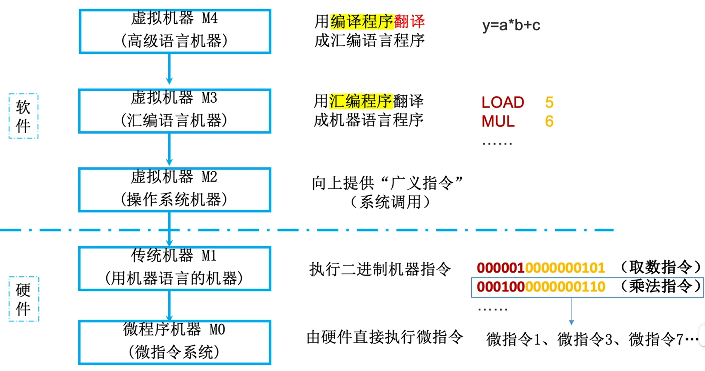{width="700px"}
</div>

1. 第 1 级是 **微程序机器层**。由机器硬件直接执行微指令。

2. 第 2 级是 **传统机器语言层**。执行机器语言指令，由微程序解释机器指令系统。

3. 第 3 级是 **操作系统层（混合层）**。由操作系统程序实现。向上提供广义指令。
   - 操作系统程序由机器指令和广义指令组成。
   - 广义指令是由操作系统定义和解释的软件指令。是为了扩展机器功能而设置的，

4. 第 4 级是 **汇编语言层**。由汇编程序支持和执行，可以编写汇编语言的源程序。

5. 第 5 级是 **高级语言层**。是面向用户的，方便用户编写应用程序。由各种高级语言编译程序支持和执行。

- **裸机**：没有配备软件的纯硬件系统。

- **虚拟机器**：第 3 级到第 5 级，是软件实现的机器。

- 下层是上层的基础，上层是下层的扩展。

- **系列机**：具有基本相同的体系结构，使用相同基本指令系统的多个不同型号的计算机组成的一个产品系列。

- **兼容**：软件或硬件的通用性。

- **固件**：将程序固化在 ROM 中组成的部件。

**注意**：
- **计算机体系结构** 是指机器语言程序员所见到的计算机系统的属性概念性的结构与功能特性。即 **如何设计硬件与软件之间的接口**。
- **计算机组成原理** 是实现计算机体系结构所体现的属性，对程序员透明（看不见）。即 **如何用硬件实现所定义的接口**。


# 八、计算机系统的工作原理

## （一）源程序转换为可执行文件的过程

源程序转换为可执行文件的过程可分为四个阶段：
<div align=center>

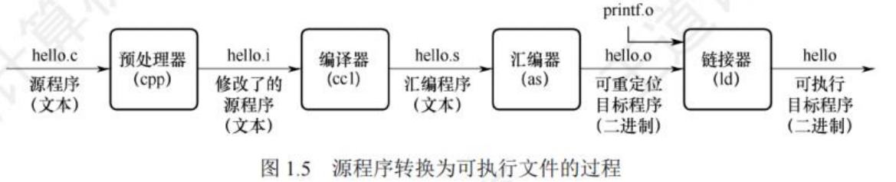{width="700px"}
</div>

1. **预处理阶段**：**预处理器（cpp）** 对源程序中以字符 # 开头的命令进行处理。输出结果是一个以 .i 为扩展名的源程序。

2. **编译阶段**：**编译器（ccl）** 对预处理后的源程序进行编译，生成一个以 .s 为扩展名的汇编语言的源程序。
   - 汇编语言源程序中的每条语句都以一种文本格式描述了一条低级机器语言指令。

3. **汇编阶段**：**汇编器（as）** 将汇编语言程序翻译成机器语言指令（二进制机器语言），把这些指令打包成一个 **可重定位目标代码文件**。

4. **链接阶段**：**链接器（ld）** 将多个可重定位目标代码文件和其他被引用的目标模块合并为一个 **可执行目标文件（可执行文件）**。
   - 可执行目标文件以二进制磁盘文件的形式存放在磁盘上。


## （二）指令的执行过程

每条指令的执行过程包括：
- **根据 PC 从主存储器中取指令**
- **对指令进行译码**
- **计算下一条指令地址**
- **取操作数并执行**
- **将结果送回存储器**

<div align=center>

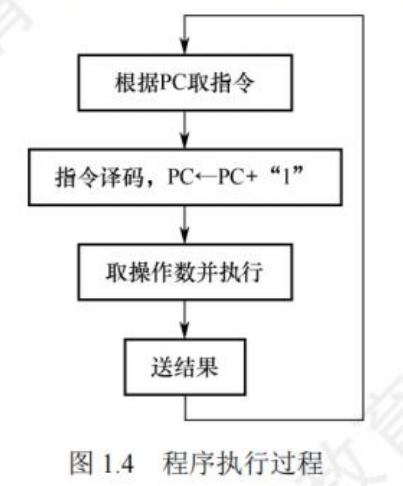{width="300"}
</div>


# 九、计算机的性能指标

## （一）存储器的性能指标

**主存容量** 是主存储器所能存储信息的最大容量。

- 主存容量通常以 $字节（B/Byte）$ 或 $字数 \times 字长$（如512K X 16位） 来衡量。
  - **机器字长（字长）**：计算机进行一次整数运算（顶点整数运算）所能处理的二进制数据的位数。
  - 字长一般等于 **通用寄存器的位数** 或 **ALU 的宽度**。
  - 字长越长，数的表示越大，范围越大，计算精度越高。
  - 字长通常选定为 1 字节（8 位）的整数倍。

**$$主存容量 = 存储单元个数 \times 存储字长（bit）= {存储单元个数 \times 存储字长 \over 8}（Byte）$$**

- **$MAR 位数 = 存储单元个数$**

- **$MDR 位数 = 存储字长 = 每个存储单元的大小$**

**注意**：**描述存储器容量或文件的大小时，$1K = 2^{10}，1M = 2^{20}，1G = 2^{30}，1T = 2^{40}$**。


## （二）CPU 的性能指标

1. **CPU 时钟周期**：机器内部主时钟脉冲信号的宽度，是 CPU 工作的最小时间单位（单位：ms、ns）。（CPU 内数字脉冲信号震荡的一个周期）

2. **主频（时钟频率）**：CPU 内数字脉冲信号震荡的频率。（单位：赫兹，Hz）
   - 即，每秒有多少个时钟周期。
   - 主频越高，完成指令的一个执行步骤所用的时间越短，执行指令的速度越快。

   **$$主频（时钟频率）= {1 \over CPU 时钟周期}（赫兹，Hz）$$**

3. **CPI（Cycle Per Instruction）**：执行一条指令所需的时钟周期数。
   - 不同的指令，CPI 不同。甚至相同的指令，CPI 也有可能发生变化。
   - 一般 CPI 指该程序或该机器指令集中所有指令执行所需的平均时钟周期数，即 **平均 CPI**。

   **$$执行一条指令的耗时 = CPI \times CPU 时钟周期$$**

4. **CPU 执行时间**：运行一个程序所花费的时间。
   - CPU 性能（CPU 执行时间）取决于 **主频、CPI、指令条数**。三者相互制约。
   **$$CPU 执行时间（整个程序的耗时）= {CPU 时钟周期数 \over 主频} = {{指令条数 \times CPI} \over 主频}$$**

5. **IPS（Instructions Per Second）**：每秒执行多少条指令。
   - KIPS（Kilo IPS）：每秒执行多少千（$10^{6}$）条指令。
   - **MIPS（Million IPS）**：**每秒执行多少百万（$10^{3}$）条指令**。

   **$$IPS = {主频 \over 平均 CPI}$$**
   **$$MIPS = {主频 \over {平均 CPI \times 10^{6}}}$$**

6. **FLOPS（Floating-Point Operations Per Second）**：每秒执行多少次浮点运算。
   - **KFLOPS（Kilo FLOPS）**：每秒执行多少千（$10^{3}$）次浮点运算。
   - **MFLOPS（Million FLOPS）**：每秒执行多少百万（$10^{6}$）次浮点运算。
   - **GFLOPS（Giga FLOPS）**：每秒执行多少十亿次（$10^{9}$）浮点运算。
   - **TFLOPS（Tera FLOPS）**：每秒执行多少万亿次（$10^{12}$）浮点运算。
   - **PFLOPS（Peta FLOPS）**：每秒执行多少千万亿次（$10^{15}$）浮点运算。
   - **EFLOPS（Exa FLOPS）**：每秒执行多少百京次（$10^{18}$）浮点运算。
   - **ZFLOPS（Zetta FLOPS）**：每秒执行多少十万京次（$10^{21}$）浮点运算。

**注意：描述数据的处理速率、频率时，$1k = 一千（Kilo） = 10^{3}，1M = 一百万（Million）= 10^{6}，1G = 十亿（Giga）= 10^{9}，1T = 一万亿（Tera）=  10^{12}，1E = 一京（Exa）= 一亿亿 = 10^{16}$**


## （三）度量系统整体性能的指标

1. **数据通路带宽**：数据总线一次所能并行传送信息的位数。（各硬件部件通过数据总线传输数据）
   - 数据总线：各个子系统通过数据总线连接形成的数据传输路径。

2. **吞吐量**：系统在单位时间内可以处理请求的数量。
   - 系统吞吐量主要取决于主存储器的存取周期。

3. **响应时间**：从用户向计算机发送一个请求，到系统对该请求做出响应并获得所需结果的等待时间。
   - 通常包括 CPU 时间（运行一个程序所花费的时间）和等待时间（用于磁盘访问、存储器访问、I/O 操作、操作系统开销等时间）

4. **基准程序**：是专门用来进行性能评价的一组程序，能够很好地反映机器在运行实际负载时的性能，可以通过在不同机器上运行相同的基准程序来比较在不同机器上的运行时间，从而评测其性能。
   - 对于不同场合，应该选择不同的基准程序。
   - 是对系统整体性能的动态测试。
   - 基准程序中的语句存在频度差异，运行结果也不能完全说明问题。